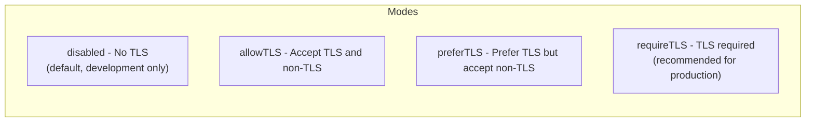

# How to Configure MongoDB net.tls Settings for Secure Connections

Author: [nawazdhandala](https://www.github.com/nawazdhandala)

Tags: MongoDB, TLS, Security, Configuration, Encryption

Description: Learn how to configure MongoDB net.tls settings to encrypt connections between clients and servers, enforce certificate validation, and manage TLS certificates.

---

## Introduction

Transport Layer Security (TLS) encrypts data in transit between MongoDB clients, drivers, mongos routers, and mongod servers. MongoDB 4.2+ uses `net.tls` configuration (replacing the older `net.ssl` parameters). Configuring TLS properly prevents eavesdropping and man-in-the-middle attacks on your database traffic.

## TLS Configuration Modes



## Generating Test Certificates (Self-Signed)

For testing, generate a CA and server certificate:

```bash
# Create CA key and cert
openssl genrsa -out ca.key 4096
openssl req -new -x509 -days 3650 -key ca.key -out ca.crt \
  -subj "/CN=MongoDB-CA/O=MyOrg"

# Create server key and CSR
openssl genrsa -out server.key 4096
openssl req -new -key server.key -out server.csr \
  -subj "/CN=mongodb.example.com/O=MyOrg"

# Sign the server cert with the CA
openssl x509 -req -days 365 -in server.csr \
  -CA ca.crt -CAkey ca.key -CAcreateserial \
  -out server.crt

# Combine into PEM file (required by MongoDB)
cat server.crt server.key > server.pem
```

## Configuring TLS on mongod

```yaml
# /etc/mongod.conf
net:
  port: 27017
  bindIp: 0.0.0.0
  tls:
    mode: requireTLS
    certificateKeyFile: /etc/ssl/mongodb/server.pem
    CAFile: /etc/ssl/mongodb/ca.crt
    allowConnectionsWithoutCertificates: true   # Allow clients without certs
    # Set to false for mutual TLS (mTLS)
    disabledProtocols: TLS1_0,TLS1_1            # Disable old protocols
    allowInvalidHostnames: false
    allowInvalidCertificates: false
```

Restart:

```bash
sudo systemctl restart mongod
```

## Configuring Mutual TLS (mTLS)

For mutual TLS, both server and client present certificates:

```yaml
net:
  tls:
    mode: requireTLS
    certificateKeyFile: /etc/ssl/mongodb/server.pem
    CAFile: /etc/ssl/mongodb/ca.crt
    allowConnectionsWithoutCertificates: false   # Require client certs
```

Generate a client certificate:

```bash
openssl genrsa -out client.key 4096
openssl req -new -key client.key -out client.csr \
  -subj "/CN=mongo-client/O=MyOrg"
openssl x509 -req -days 365 -in client.csr \
  -CA ca.crt -CAkey ca.key -CAcreateserial \
  -out client.crt
cat client.crt client.key > client.pem
```

## Connecting with TLS from mongosh

```bash
# Connect with server TLS verification
mongosh --tls \
  --tlsCAFile /etc/ssl/mongodb/ca.crt \
  --host mongodb.example.com:27017 \
  --username admin --password secret

# Connect with mutual TLS (client cert required)
mongosh --tls \
  --tlsCAFile /etc/ssl/mongodb/ca.crt \
  --tlsCertificateKeyFile /etc/ssl/mongodb/client.pem \
  --host mongodb.example.com:27017
```

## Connecting with TLS from Application Driver

```javascript
// Node.js driver
const { MongoClient } = require("mongodb")
const fs = require("fs")

const client = new MongoClient("mongodb://mongodb.example.com:27017/", {
  tls: true,
  tlsCAFile: "/etc/ssl/mongodb/ca.crt",
  tlsCertificateKeyFile: "/etc/ssl/mongodb/client.pem",
  // For self-signed certs in dev: tlsAllowInvalidCertificates: true
})

await client.connect()
```

Connection string form:

```javascript
const uri = "mongodb://mongodb.example.com:27017/?tls=true&tlsCAFile=/etc/ssl/mongodb/ca.crt"
```

## Configuring TLS for Replica Set Internal Communication

Members of a replica set also communicate over TLS. Use the same certificate or a separate internal cert:

```yaml
net:
  tls:
    mode: requireTLS
    certificateKeyFile: /etc/ssl/mongodb/server.pem
    CAFile: /etc/ssl/mongodb/ca.crt
    clusterAuthX509:
      attributes: "O=MyOrg"   # Match attribute for member authentication
```

Alternatively, use `clusterAuthMode: x509` for certificate-based member authentication:

```yaml
security:
  clusterAuthMode: x509
```

## Verifying TLS Is Active

```javascript
db.adminCommand({ serverStatus: 1 }).security
// Look for: "SSLServerSubjectName" and "SSLServerHasCertificateAuthority": true
```

From the shell:

```bash
openssl s_client -connect mongodb.example.com:27017 \
  -CAfile /etc/ssl/mongodb/ca.crt \
  -servername mongodb.example.com 2>&1 | grep -E "Verify|subject|issuer"
```

## Certificate Rotation Without Downtime

To rotate certificates on a running server:

```javascript
// Load new certificate files without restarting (MongoDB 4.4+)
db.adminCommand({
  rotateCertificates: 1,
  message: "Rotating to new cert expiring 2027"
})
```

Pre-requisite: Replace the PEM files on disk before running the command.

## Common TLS Errors

```bash
# Error: certificate verify failed
# Cause: CA cert not trusted or expired
openssl verify -CAfile ca.crt server.crt

# Error: SSL peer certificate or SSH remote key was not OK
# Cause: Hostname mismatch in certificate CN or SAN
openssl x509 -in server.crt -noout -text | grep -A1 "Subject Alternative Name"

# Error: no certificate or key provided
# Cause: certificateKeyFile path is wrong or file permissions
ls -la /etc/ssl/mongodb/server.pem
```

## Summary

Configure MongoDB TLS using the `net.tls` section in `mongod.conf`. Use `mode: requireTLS` in production and set `allowConnectionsWithoutCertificates: false` for mutual TLS. Provide a PEM file combining the certificate and private key via `certificateKeyFile`, and specify your CA with `CAFile`. Disable TLS 1.0 and 1.1 with `disabledProtocols`. Use `rotateCertificates` for zero-downtime certificate rotation on MongoDB 4.4+. Always verify TLS is active with `serverStatus` and external tools like `openssl s_client`.
