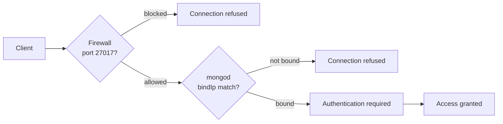

# How to Configure MongoDB Network Access and Firewall Rules

Author: [nawazdhandala](https://www.github.com/nawazdhandala)

Tags: MongoDB, Security, Network, Firewall, Configuration

Description: Learn how to configure MongoDB network access controls including bind IP, port settings, firewall rules, and Atlas IP access lists to restrict unauthorized connections.

---

## Overview

Securing MongoDB at the network layer involves two complementary controls:

1. **MongoDB configuration** - restrict which interfaces and ports mongod listens on
2. **Firewall rules** - block connections at the OS or cloud level before they reach mongod



## MongoDB Binding Configuration

By default, MongoDB 3.6+ binds to `127.0.0.1` (localhost only), which is safe for local development. For production, bind only the interfaces that should accept connections.

### Edit /etc/mongod.conf

```yaml
net:
  port: 27017
  bindIp: 127.0.0.1,10.0.1.10   # localhost + private interface only
  # bindIpAll: false             # never bind to all interfaces in production
  tls:
    mode: requireTLS
    certificateKeyFile: /etc/ssl/mongodb/server.pem
    CAFile: /etc/ssl/mongodb/ca.pem
```

Restart after changes:

```bash
sudo systemctl restart mongod
```

### Bind to All Interfaces (Development Only)

```yaml
net:
  bindIpAll: true   # ONLY for isolated development environments
```

Never use `bindIpAll: true` on a publicly accessible server.

## Linux Firewall with ufw

Allow connections only from a specific application server IP:

```bash
# Allow MongoDB port from a single trusted IP
sudo ufw allow from 10.0.1.20 to any port 27017

# Deny all other access to port 27017
sudo ufw deny 27017

# Enable firewall if not already active
sudo ufw enable

# Verify rules
sudo ufw status verbose
```

## Linux Firewall with firewalld (RHEL/CentOS)

```bash
# Create a rich rule allowing only a specific source
sudo firewall-cmd --zone=public \
  --add-rich-rule='rule family="ipv4" source address="10.0.1.20/32" port port="27017" protocol="tcp" accept' \
  --permanent

# Reload to apply
sudo firewall-cmd --reload

# Verify
sudo firewall-cmd --list-rich-rules
```

## iptables Rules

```bash
# Allow MongoDB from the application server subnet
iptables -A INPUT -p tcp -s 10.0.1.0/24 --dport 27017 -j ACCEPT

# Drop all other connections to port 27017
iptables -A INPUT -p tcp --dport 27017 -j DROP

# Save rules (Debian/Ubuntu)
iptables-save > /etc/iptables/rules.v4
```

## AWS Security Group Rules

When running MongoDB on EC2, configure security group rules through the AWS console or CLI:

```bash
# Allow port 27017 only from app server security group
aws ec2 authorize-security-group-ingress \
  --group-id sg-0123456789abcdef0 \
  --protocol tcp \
  --port 27017 \
  --source-group sg-app-server-id

# Revoke any existing open rule
aws ec2 revoke-security-group-ingress \
  --group-id sg-0123456789abcdef0 \
  --protocol tcp \
  --port 27017 \
  --cidr 0.0.0.0/0
```

## MongoDB Atlas IP Access List

Atlas enforces an IP access list at the cluster level. All connections from unlisted IPs are rejected before reaching the database.

### Add an IP via Atlas UI

1. Navigate to your Atlas project
2. Click **Security** then **Network Access**
3. Click **Add IP Address**
4. Enter a specific IP or CIDR block (e.g., `203.0.113.50/32`)
5. Optionally add a comment for the entry
6. Click **Confirm**

### Add an IP via Atlas CLI

```bash
atlas accessLists create \
  --projectId <PROJECT_ID> \
  --type ipAddress \
  --entry 203.0.113.50 \
  --comment "App server prod-1"
```

### Add a CIDR Block

```bash
atlas accessLists create \
  --projectId <PROJECT_ID> \
  --type cidrBlock \
  --entry 10.0.0.0/16 \
  --comment "VPC private range"
```

### Temporary Access (expires automatically)

```bash
atlas accessLists create \
  --projectId <PROJECT_ID> \
  --type ipAddress \
  --entry 198.51.100.5 \
  --deleteAfterDate "2024-12-31T23:59:59Z" \
  --comment "Temp access for migration"
```

## VPC Peering and Private Endpoints

For production Atlas deployments, prefer private connectivity over IP allowlisting:

| Method | Description |
|---|---|
| VPC Peering | Direct network route between Atlas VPC and your cloud VPC |
| AWS PrivateLink | Private endpoint in your VPC that routes to Atlas without public internet |
| Azure Private Link | Same concept for Azure |
| GCP Private Service Connect | Same concept for GCP |

Private endpoints eliminate the need to expose Atlas to any public IPs.

## Verifying Connectivity

```bash
# Test if port is reachable from app server
nc -zv mongo-host 27017

# Or using mongosh
mongosh "mongodb://mongo-host:27017" --eval "db.runCommand({ping:1})"
```

## Network Security Checklist

- MongoDB binds to private IPs only (not `0.0.0.0`)
- Firewall allows port 27017 only from known application server IPs or subnets
- TLS is required for all connections
- Authentication is enabled
- No direct MongoDB port exposure to the public internet
- Atlas clusters use VPC Peering or Private Endpoints where possible

## Summary

Securing MongoDB at the network layer starts with restricting `bindIp` in `mongod.conf` to only the interfaces that should accept connections, then enforcing firewall rules (ufw, firewalld, iptables, or cloud security groups) to allow port 27017 only from trusted source addresses. For Atlas, maintain a minimal IP access list and prefer VPC Peering or Private Endpoints over public IP allowlisting to eliminate internet exposure entirely.
