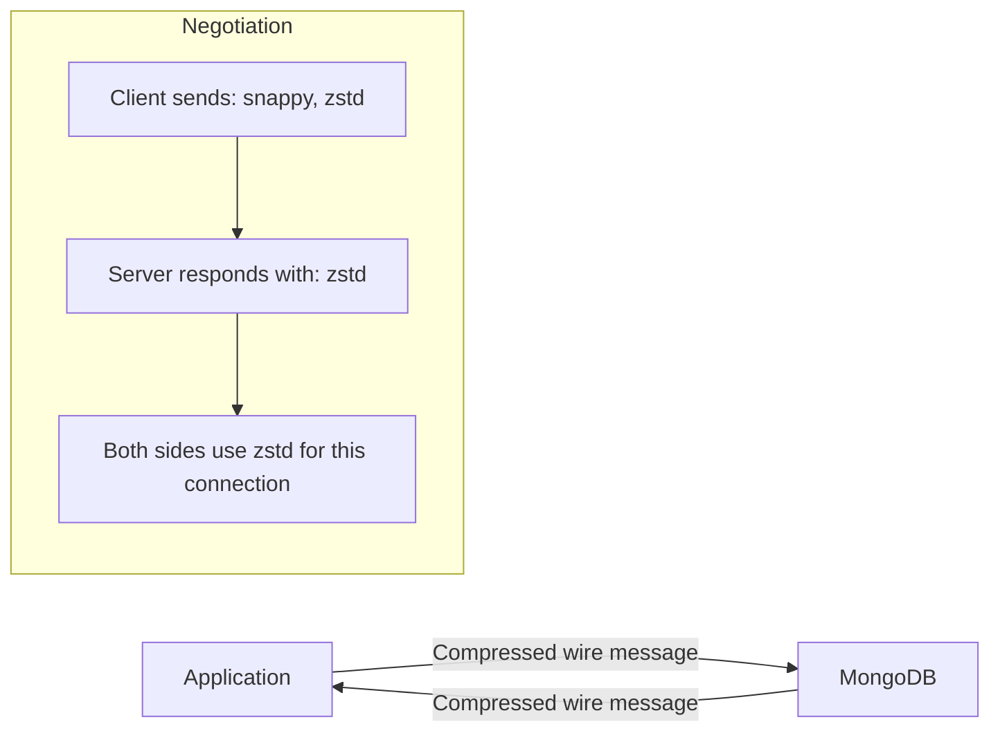

# How to Configure Network Compression in MongoDB

Author: [nawazdhandala](https://www.github.com/nawazdhandala)

Tags: MongoDB, Performance, Network, Configuration, Operation

Description: Learn how to enable and configure wire protocol compression in MongoDB to reduce network bandwidth, improve throughput, and lower latency for large result sets.

---

## How MongoDB Network Compression Works

MongoDB's wire protocol supports message compression between clients and servers. When compression is enabled on both sides, MongoDB compresses the data before sending it over the network. This reduces bandwidth usage and can significantly improve performance for workloads that transfer large documents or query results.

MongoDB supports three compression algorithms:

- **snappy** - fast compression with moderate ratio; best for CPU-limited environments
- **zstd** - better compression ratio than snappy with similar speed; available in MongoDB 4.2+
- **zlib** - highest compression ratio but slower; best when bandwidth is more expensive than CPU



## How Compression is Negotiated

Compression is negotiated during the MongoDB handshake. The client sends a list of supported compressors ordered by preference. The server responds with the first compressor from the client's list that it also supports. If no common compressor is found, the connection proceeds without compression.

## Configuring Compression on the Server

Edit `/etc/mongod.conf` to enable compression. The `compressors` setting accepts a comma-separated list ordered by preference:

```yaml
net:
  port: 27017
  bindIp: 127.0.0.1
  compression:
    compressors: zstd,snappy,zlib
```

Restart MongoDB:

```bash
sudo systemctl restart mongod
```

For a sharded cluster, configure compression on all mongos, config servers, and shard members.

## Configuring Compression in mongosh

Connect with compression enabled in mongosh:

```bash
mongosh "mongodb://127.0.0.1:27017/?compressors=zstd,snappy"
```

Verify the negotiated compressor for the current connection:

```javascript
db.adminCommand({ isMaster: 1 }).compression
```

## Configuring Compression in the Node.js Driver

```javascript
const { MongoClient } = require("mongodb");

const client = new MongoClient("mongodb://127.0.0.1:27017/myapp", {
  compressors: ["zstd", "snappy"],
});

async function main() {
  await client.connect();
  const db = client.db("myapp");
  const result = await db.collection("orders").find({}).toArray();
  console.log(`Fetched ${result.length} orders`);
  await client.close();
}

main().catch(console.error);
```

## Configuring Compression in Python (PyMongo)

```python
from pymongo import MongoClient

client = MongoClient(
    "mongodb://127.0.0.1:27017/myapp",
    compressors="zstd,snappy"
)

db = client["myapp"]
result = list(db["orders"].find({}))
print(f"Fetched {len(result)} orders")
```

## Configuring Compression in the Java Driver

```java
import com.mongodb.MongoClientSettings;
import com.mongodb.MongoCompressor;
import com.mongodb.client.MongoClients;

import java.util.Arrays;

MongoClientSettings settings = MongoClientSettings.builder()
    .compressorList(Arrays.asList(
        MongoCompressor.createZstdCompressor(),
        MongoCompressor.createSnappyCompressor()
    ))
    .build();

var client = MongoClients.create(settings);
```

## Compression for Replica Sets

For replica set replication traffic, add the `--networkMessageCompressors` option in the mongod configuration. The same `net.compression.compressors` setting covers both client-to-server and server-to-server (replication) traffic.

Example for a replica set member:

```yaml
net:
  port: 27017
  bindIp: 127.0.0.1
  compression:
    compressors: snappy,zstd

replication:
  replSetName: rs0
```

## Measuring Compression Impact

Before enabling compression, measure baseline network throughput with a representative workload. After enabling compression, compare:

Check network bytes in/out using `serverStatus`:

```javascript
db.adminCommand({ serverStatus: 1 }).network
```

The output includes:

```text
{
  bytesIn: NumberLong(1234567890),
  bytesOut: NumberLong(9876543210),
  physicalBytesIn: NumberLong(456789012),   // compressed bytes received
  physicalBytesOut: NumberLong(789012345),  // compressed bytes sent
  numRequests: NumberLong(5000000)
}
```

The ratio of `bytesIn/physicalBytesIn` shows the effective compression ratio for incoming messages.

## When to Use Each Compressor

Choose `zstd` as the default for new deployments on MongoDB 4.2+ - it offers the best balance of speed and compression ratio.

Use `snappy` when:
- Clients include older MongoDB drivers that do not support zstd.
- You are on MongoDB 3.6 or 4.0.
- CPU usage is a concern and your data is not highly compressible.

Use `zlib` when:
- You have a very slow network link and abundant CPU.
- You are sending large text or JSON payloads that compress well.

## Storage vs. Network Compression

Note that network compression is separate from storage compression. Network compression affects data in transit; storage compression (configured in `storage.wiredTiger.collectionConfig.blockCompressor`) affects how data is stored on disk. Both can be enabled simultaneously.

## Best Practices

- Enable `zstd,snappy` on all new MongoDB 4.2+ deployments.
- Test compression in a staging environment before production rollout.
- Monitor `serverStatus().network` before and after enabling compression to quantify the benefit.
- Use the same compressor list on all cluster members for consistent negotiation.
- Compression helps most for large documents and query results; small queries with tiny payloads see minimal benefit.

## Summary

MongoDB network compression reduces bandwidth and can improve performance for data-intensive workloads. Enable it by setting `net.compression.compressors` in `mongod.conf` and specifying the same compressors in your client connection string or driver configuration. `zstd` is the recommended choice for MongoDB 4.2+ due to its superior compression ratio, while `snappy` is a good fallback for broader compatibility.
