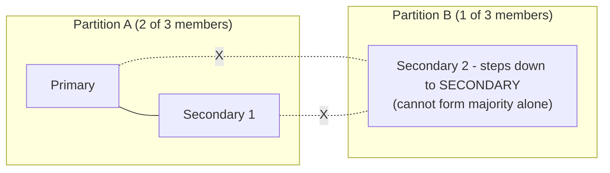

# How to Handle Network Partitions in MongoDB Replica Set

Author: [OneUptime](https://www.github.com/oneuptime)

Tags: MongoDB, Replica Set, Network, Fault Tolerance, High Availability

Description: Learn how MongoDB replica sets behave during network partitions, how to detect split-brain scenarios, and how to safely recover after connectivity is restored.

---

## Introduction

A network partition occurs when members of a replica set cannot communicate with each other, even though the mongod processes are still running. MongoDB uses a majority-based election protocol (based on Raft) to prevent split-brain, but you still need to understand what happens and how to recover cleanly.

## How MongoDB Handles Partitions

MongoDB requires a majority of voting members to elect a primary and to process writes with `w: majority`. If a partition isolates fewer than a majority of members, those members step down or refuse to become primary.



With 3 members: Partition A keeps the primary (2/3 majority). Partition B member becomes read-only secondary (or RECOVERING if it falls behind).

## Detecting a Network Partition

Signs of a partition:

```javascript
// rs.status() shows members as UNKNOWN or with errors
rs.status().members.forEach(m => {
  if (m.stateStr === "UNKNOWN" || m.health === 0) {
    print("Problem member:", m.name, m.stateStr, m.lastHeartbeatMessage)
  }
})
```

Check connectivity from the primary to all members:

```bash
# From the primary host
for host in secondary1.example.com secondary2.example.com; do
  echo -n "$host: "
  nc -zv $host 27017 2>&1 | tail -1
done
```

Monitor heartbeat errors in the logs:

```bash
grep -i "heartbeat" /var/log/mongodb/mongod.log | tail -20
```

## Behavior During Partition

| Scenario | Behavior |
|---|---|
| Primary isolated (minority) | Primary steps down, minority partition goes read-only |
| Secondary isolated | Isolated secondary becomes read-only or RECOVERING |
| Even split (2 of 4) | Both partitions lose quorum, all members become secondaries |
| Even split with arbiter | Partition with arbiter wins election |

### Majority Partition: Writes Continue

```javascript
// Writes to w:majority succeed on the majority partition
db.orders.insertOne(
  { status: "pending" },
  { writeConcern: { w: "majority", wtimeout: 5000 } }
)
```

### Minority Partition: Writes Fail

```javascript
// On the minority side, writes with w:majority time out
// Error: MongoServerError: waiting for replication timed out
```

## Preventing Data Loss with Write Concern

The safest write concern during possible network instability:

```javascript
db.runCommand({
  insert: "transactions",
  documents: [{ amount: 1000, status: "committed" }],
  writeConcern: { w: "majority", j: true, wtimeout: 10000 }
})
```

Setting `j: true` ensures the write is journaled before acknowledgment.

## Handling a Minority Primary (Split-Brain Edge Case)

In very rare scenarios a primary may not detect that it has lost majority (brief election window). To verify:

```javascript
// On any suspected primary
db.adminCommand({ isMaster: 1 })
// Check: "ismaster": true and "primary" field matches this host
```

If you discover two nodes both think they are primary, force a step-down on the one with fewer or stale oplog:

```javascript
// On the stale primary
rs.stepDown(300)
```

## Recovering After the Partition Heals

When network connectivity is restored, MongoDB handles recovery automatically:

1. The isolated member(s) receive heartbeats
2. They apply any missing oplog entries from the primary
3. Their state transitions from RECOVERING to SECONDARY

Monitor recovery progress:

```javascript
// Check that the formerly isolated member is catching up
rs.status().members.find(m => m.name === "secondary2.example.com:27017")
// Watch stateStr change from RECOVERING to SECONDARY
// Watch optimeDate approach the primary's optimeDate
```

Check oplog replay progress:

```javascript
// Connect to the recovering member
db.adminCommand({ replSetGetStatus: 1 }).initialSyncStatus
```

## Rollback After Partition (Minority Writes)

If a minority partition accepted writes that conflict with the majority partition, MongoDB performs a rollback on the member that diverged:

```bash
# Rollback files are written to the rollback directory
ls /var/lib/mongodb/rollback/
```

Review rolled-back documents:

```javascript
// Rollback files are BSON - convert with bsondump
// bsondump /var/lib/mongodb/rollback/mydb.orders.2024-01-15T10-00-00.0.bson
```

To replay rolled-back writes manually (if needed):

```bash
mongorestore --collection orders_rollback --db mydb \
  /var/lib/mongodb/rollback/mydb.orders.2024-01-15T10-00-00.0.bson
```

## Configuring Heartbeat and Election Timeouts

Tune these settings to detect partitions faster or avoid false positives on flaky networks:

```javascript
cfg = rs.conf()
cfg.settings = {
  heartbeatIntervalMillis: 2000,    // How often to send heartbeats (default: 2000)
  heartbeatTimeoutSecs: 10,         // Time before member declared unreachable (default: 10)
  electionTimeoutMillis: 10000,     // Time before election starts (default: 10000)
  catchUpTimeoutMillis: 2000        // Time for new primary to catch up before stepping down
}
rs.reconfig(cfg)
```

## Testing Partition Tolerance

Use `iptables` to simulate a network partition in a test environment:

```bash
# Block traffic from secondary2 to primary and secondary1
sudo iptables -A INPUT -s primary.example.com -j DROP
sudo iptables -A INPUT -s secondary1.example.com -j DROP

# Watch rs.status() from secondary2 - it should enter RECOVERING/SECONDARY (read-only)

# Remove rules to restore connectivity
sudo iptables -D INPUT -s primary.example.com -j DROP
sudo iptables -D INPUT -s secondary1.example.com -j DROP
```

## Summary

MongoDB replica sets use majority quorum to handle network partitions safely. The minority side becomes read-only or steps down automatically, preventing split-brain. After a partition heals, isolated members re-sync via the oplog. Ensure you use `w: majority` write concern for critical data, tune heartbeat timeouts to match your network environment, and always inspect rollback directories after a partition to identify any writes that were not replicated to the majority.
