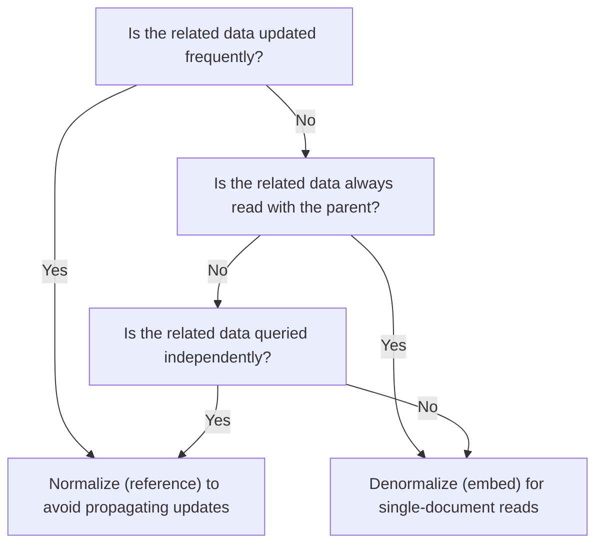

# How to Normalize vs Denormalize Data in MongoDB

Normalization separates data into distinct collections to eliminate redundancy. Denormalization embeds related data together to reduce query complexity. In MongoDB, the right choice depends on your query patterns, update frequency, data volatility, and consistency requirements.

## Normalization: Separate Collections with References

Normalization stores each entity in its own collection and links them by ObjectId reference.

```javascript
// authors collection (normalized)
db.authors.insertOne({
  _id: ObjectId("64a1b2c3d4e5f6789abc0001"),
  name: "Alice Johnson",
  bio: "Software engineer and technical writer.",
  avatarUrl: "https://cdn.example.com/alice.jpg",
  email: "alice@example.com"
});

// posts collection references the author by ID
db.posts.insertOne({
  _id: ObjectId("64a1b2c3d4e5f6789abc2001"),
  title: "Introduction to MongoDB",
  body: "...",
  authorId: ObjectId("64a1b2c3d4e5f6789abc0001"),
  publishedAt: new Date()
});
```

Reading a post with its author requires a `$lookup`:

```javascript
const post = await db.collection("posts").aggregate([
  { $match: { _id: postId } },
  {
    $lookup: {
      from: "authors",
      localField: "authorId",
      foreignField: "_id",
      as: "author"
    }
  },
  { $unwind: "$author" }
]).toArray();
```

**Advantages of normalization:**
- Single source of truth: updating the author's name updates it everywhere
- Smaller documents
- No risk of stale embedded data

**Disadvantages:**
- Every read requires a join (`$lookup`)
- Higher latency on read-heavy workloads

## Denormalization: Embedding Data

Denormalization copies data into the document where it is needed.

```javascript
// posts collection with embedded author summary
db.posts.insertOne({
  _id: ObjectId("64a1b2c3d4e5f6789abc2001"),
  title: "Introduction to MongoDB",
  body: "...",
  author: {
    _id: ObjectId("64a1b2c3d4e5f6789abc0001"),
    name: "Alice Johnson",
    avatarUrl: "https://cdn.example.com/alice.jpg"
  },
  publishedAt: new Date()
});
```

Reading the post gives you the author data immediately -- no join needed.

**Advantages of denormalization:**
- Single document read for related data
- Better read performance
- No `$lookup` required

**Disadvantages:**
- Data duplication: if the author's name changes, all posts must be updated
- Larger documents
- Risk of stale data if updates are not propagated

## Decision Framework



## Partial Denormalization: The Best of Both Worlds

Embed only the fields you need for display, and reference the full entity for detailed views.

```javascript
// Embed only the author fields needed for post list view
db.posts.insertOne({
  _id: ObjectId("64a1b2c3d4e5f6789abc2001"),
  title: "Introduction to MongoDB",
  authorId: ObjectId("64a1b2c3d4e5f6789abc0001"),   // reference
  authorName: "Alice Johnson",                          // denormalized display name
  authorAvatarUrl: "https://cdn.example.com/alice.jpg" // denormalized avatar
});
```

The full author profile is loaded only on the author detail page, reducing the join burden on high-traffic list endpoints.

## Update Propagation

When you denormalize, you must keep copies in sync when the source changes.

```javascript
// When an author updates their display name
async function updateAuthorName(db, authorId, newName) {
  // Update the source
  await db.collection("authors").updateOne(
    { _id: authorId },
    { $set: { name: newName } }
  );

  // Propagate to all denormalized copies
  await db.collection("posts").updateMany(
    { authorId },
    { $set: { authorName: newName } }
  );
}
```

If update propagation is complex or unreliable, normalization is safer.

## Arrays of Embedded vs. Referenced Documents

For one-to-many relationships, the same principle applies:

```javascript
// Denormalized: embed tags as strings (no separate collection needed)
db.articles.insertOne({
  _id: ObjectId(),
  title: "...",
  tags: ["mongodb", "schema", "nosql"]   // simple values -- always embed
});

// Normalized: reference complex tag objects
db.articles.insertOne({
  _id: ObjectId(),
  title: "...",
  tagIds: [ObjectId("..."), ObjectId("...")]  // complex objects -- reference
});
```

## Practical Examples

| Data | Strategy | Reason |
|---|---|---|
| Order shipping address | Embed | Historical record, never changes after order |
| Product price in cart | Embed | Price at purchase time should not change |
| User display name in comments | Partial embed | Rarely changes, avoid join on read |
| Author's full bio | Reference | Only needed on author page, not comment list |
| Product inventory count | Reference | Changes constantly, cannot risk stale reads |
| Role permissions | Reference | Applies to many users, must update atomically |

## Measuring the Trade-off

```javascript
// Normalized: measure $lookup cost
const start = Date.now();
await db.collection("posts").aggregate([
  { $match: { publishedAt: { $gte: oneMonthAgo } } },
  { $lookup: { from: "authors", localField: "authorId", foreignField: "_id", as: "author" } }
]).toArray();
console.log("Normalized read time:", Date.now() - start, "ms");

// Denormalized: measure embedded read cost
const start2 = Date.now();
await db.collection("posts")
  .find({ publishedAt: { $gte: oneMonthAgo } })
  .toArray();
console.log("Denormalized read time:", Date.now() - start2, "ms");
```

## Summary

Normalize data into separate collections when the related data changes frequently, is queried independently, or needs to be the single source of truth. Denormalize (embed) when the related data is always read with the parent, changes rarely, and you want to avoid joins. Use partial denormalization to embed only the fields needed for high-frequency views while referencing the full entity for detail pages. Always implement update propagation logic when denormalizing mutable fields, and test whether the write overhead of propagation outweighs the read benefit of embedding.
