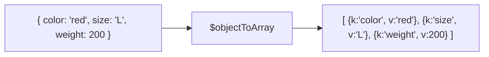

# How to Use $objectToArray in MongoDB Aggregation

Author: [nawazdhandala](https://www.github.com/nawazdhandala)

Tags: MongoDB, Aggregation, $objectToArray, Array, Pipeline

Description: Learn how to use $objectToArray in MongoDB aggregation to convert a document's fields into an array of key-value pair objects for flexible processing.

---

## How $objectToArray Works

`$objectToArray` converts an embedded document (object) into an array of `{ k: <fieldName>, v: <fieldValue> }` pairs - one pair per field. This is the inverse of `$arrayToObject` and is useful when you need to iterate over, filter, or aggregate a document's fields dynamically.



## Syntax

```javascript
{ $objectToArray: <object expression> }
```

The expression must evaluate to a document. If the value is `null` or missing, the result is `null`.

## Examples

### Example 1 - Convert Fields to an Array

Convert the entire document (minus `_id`) to a key-value array:

```javascript
// Input: { _id: 1, color: "red", size: "L", weight: 200 }
db.products.aggregate([
  {
    $project: {
      fieldsArray: { $objectToArray: "$$ROOT" }
    }
  }
])
```

Output:

```javascript
[
  {
    _id: 1,
    fieldsArray: [
      { k: "_id",    v: 1     },
      { k: "color",  v: "red" },
      { k: "size",   v: "L"   },
      { k: "weight", v: 200   }
    ]
  }
]
```

`$$ROOT` refers to the entire input document.

### Example 2 - Convert a Nested Object

Convert an embedded subdocument's fields:

```javascript
// Input: { _id: 1, metrics: { clicks: 100, views: 500, conversions: 20 } }
db.analytics.aggregate([
  {
    $project: {
      metricList: { $objectToArray: "$metrics" }
    }
  }
])
```

Output:

```javascript
[
  {
    _id: 1,
    metricList: [
      { k: "clicks",      v: 100 },
      { k: "views",       v: 500 },
      { k: "conversions", v: 20  }
    ]
  }
]
```

### Example 3 - Filter Fields by Value

Use `$objectToArray` + `$filter` to keep only fields with values above a threshold:

```javascript
// Input: { _id: 1, metrics: { clicks: 100, views: 500, bounces: 5 } }
db.analytics.aggregate([
  {
    $project: {
      highMetrics: {
        $filter: {
          input: { $objectToArray: "$metrics" },
          as: "field",
          cond: { $gt: ["$$field.v", 50] }
        }
      }
    }
  }
])
```

Output:

```javascript
[
  {
    _id: 1,
    highMetrics: [
      { k: "clicks", v: 100 },
      { k: "views",  v: 500 }
    ]
  }
]
```

### Example 4 - Sum All Values in a Dynamic Object

Compute the total of all numeric values in an embedded document:

```javascript
// Input: { _id: 1, scores: { math: 90, english: 85, science: 92 } }
db.results.aggregate([
  {
    $project: {
      totalScore: {
        $sum: {
          $map: {
            input: { $objectToArray: "$scores" },
            as: "field",
            in: "$$field.v"
          }
        }
      }
    }
  }
])
```

Output:

```javascript
[
  { _id: 1, totalScore: 267 }
]
```

### Example 5 - Get Field Names Only

Extract only the key names (field names) from a subdocument:

```javascript
db.analytics.aggregate([
  {
    $project: {
      fieldNames: {
        $map: {
          input: { $objectToArray: "$metrics" },
          as: "field",
          in: "$$field.k"
        }
      }
    }
  }
])
```

Output:

```javascript
[
  { _id: 1, fieldNames: ["clicks", "views", "conversions"] }
]
```

### Example 6 - $objectToArray + $unwind + $group

Count how many documents have each field name present in a dynamic object:

```javascript
db.analytics.aggregate([
  {
    $project: {
      metricPairs: { $objectToArray: "$metrics" }
    }
  },
  { $unwind: "$metricPairs" },
  {
    $group: {
      _id: "$metricPairs.k",
      count: { $sum: 1 },
      avgValue: { $avg: "$metricPairs.v" }
    }
  }
])
```

Output:

```javascript
[
  { _id: "clicks",      count: 10, avgValue: 250 },
  { _id: "views",       count: 10, avgValue: 800 },
  { _id: "conversions", count: 8,  avgValue: 35  }
]
```

### Example 7 - Round-Trip with $arrayToObject

Transform and then reconstruct a document:

```javascript
// Input: { _id: 1, scores: { math: 90, english: 85 } }
db.results.aggregate([
  {
    $project: {
      scaledScores: {
        $arrayToObject: {
          $map: {
            input: { $objectToArray: "$scores" },
            as: "field",
            in: {
              k: "$$field.k",
              v: { $multiply: ["$$field.v", 1.1] }  // apply 10% curve
            }
          }
        }
      }
    }
  }
])
```

Output:

```javascript
[
  { _id: 1, scaledScores: { math: 99, english: 93.5 } }
]
```

## Use Cases

- Iterating over all fields in a schemaless or semi-structured embedded document
- Computing aggregates (sum, avg) over all values in a dynamic object
- Filtering a document's fields based on their values
- Schema discovery: finding which field names exist across documents
- Transforming all values in an object and reconstructing it with `$arrayToObject`

## Summary

`$objectToArray` converts an embedded document into an array of `{ k, v }` pairs. This unlocks array operators (`$filter`, `$map`, `$reduce`, `$unwind`) for use with document fields. Combine it with `$arrayToObject` for round-trip transformations: convert to array, transform the array, and convert back to an object.
