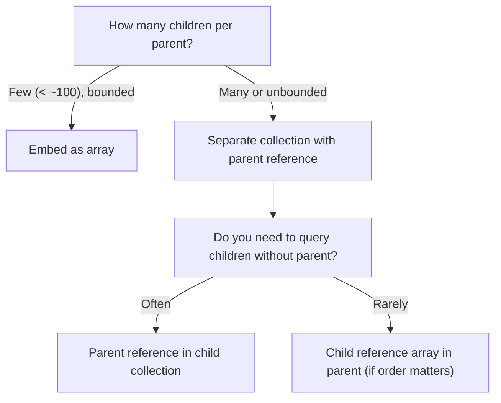

# How to Design One-to-Many Relationships in MongoDB

A one-to-many relationship exists when one entity is associated with multiple instances of another entity. Examples include a blog post with many comments, a customer with many orders, or a product with many reviews. MongoDB offers three main approaches: embedding an array of child documents, using parent references in the child collection, or using child references in the parent document.

## Approach 1: Embed the Array (One Contains Many)

Embed the child documents as an array field when the children are always accessed with the parent and the array is bounded in size.

```javascript
// Blog post with embedded comments
db.posts.insertOne({
  _id: ObjectId("64a1b2c3d4e5f6789abc0001"),
  title: "Getting Started with MongoDB",
  body: "...",
  author: "alice",
  comments: [
    {
      _id: ObjectId(),
      author: "bob",
      body: "Great post!",
      createdAt: new Date("2024-06-01")
    },
    {
      _id: ObjectId(),
      author: "carol",
      body: "Very helpful.",
      createdAt: new Date("2024-06-02")
    }
  ],
  createdAt: new Date("2024-05-30")
});
```

Read the post and all its comments in a single query:

```javascript
const post = await db.collection("posts").findOne(
  { _id: ObjectId("64a1b2c3d4e5f6789abc0001") }
);
post.comments.forEach((c) => console.log(c.body));
```

Add a new comment atomically:

```javascript
await db.collection("posts").updateOne(
  { _id: ObjectId("64a1b2c3d4e5f6789abc0001") },
  {
    $push: {
      comments: {
        _id: ObjectId(),
        author: "dave",
        body: "Bookmarked!",
        createdAt: new Date()
      }
    }
  }
);
```

## When Embedding Arrays Is Appropriate

Embedding is best when:
- The number of children is small and bounded (typically fewer than a few hundred)
- Children are always read with the parent
- Children are not queried independently

Documents in MongoDB have a 16 MB size limit. An ever-growing array (like a post with thousands of comments) will eventually hit this limit. For unbounded arrays, use a separate collection.

## Approach 2: Parent Reference (Child Has a Foreign Key)

Store the parent's `_id` in each child document. This is the relational database model.

```javascript
// orders collection
db.orders.insertMany([
  {
    _id: ObjectId("64a1b2c3d4e5f6789abc1001"),
    customerId: ObjectId("64a1b2c3d4e5f6789abc0001"),
    total: 99.99,
    status: "shipped",
    placedAt: new Date("2024-06-01")
  },
  {
    _id: ObjectId("64a1b2c3d4e5f6789abc1002"),
    customerId: ObjectId("64a1b2c3d4e5f6789abc0001"),
    total: 49.50,
    status: "delivered",
    placedAt: new Date("2024-07-15")
  }
]);

// Index on customerId for efficient lookup
db.orders.createIndex({ customerId: 1 });
```

Find all orders for a customer:

```javascript
const orders = await db.collection("orders")
  .find({ customerId: ObjectId("64a1b2c3d4e5f6789abc0001") })
  .sort({ placedAt: -1 })
  .toArray();
```

## Approach 3: Child Reference Array (Parent Holds Array of IDs)

Store an array of child `_id` values in the parent document. This is less common but useful when you need to preserve child ordering in the parent or when you frequently read the parent without the children.

```javascript
// Course with ordered module references
db.courses.insertOne({
  _id: ObjectId("64a1b2c3d4e5f6789abc2001"),
  title: "MongoDB Fundamentals",
  moduleIds: [
    ObjectId("64a1b2c3d4e5f6789abc3001"),
    ObjectId("64a1b2c3d4e5f6789abc3002"),
    ObjectId("64a1b2c3d4e5f6789abc3003")
  ]
});
```

Retrieve all modules in order using `$lookup`:

```javascript
const course = await db.collection("courses").aggregate([
  { $match: { _id: ObjectId("64a1b2c3d4e5f6789abc2001") } },
  {
    $lookup: {
      from: "modules",
      localField: "moduleIds",
      foreignField: "_id",
      as: "modules"
    }
  }
]).toArray();
```

Note: `$lookup` does not preserve the order of the source array. To restore ordering, use `$addFields` with `$map` to reorder by the original `moduleIds` array.

## Comparison of Approaches



## Indexing for Parent Reference Queries

Always index the parent reference field in the child collection:

```javascript
db.comments.createIndex({ postId: 1, createdAt: -1 });
db.orders.createIndex({ customerId: 1, placedAt: -1 });
db.reviews.createIndex({ productId: 1, rating: -1 });
```

## Practical Example: Customer Orders with $lookup

```javascript
const customerWithOrders = await db.collection("customers").aggregate([
  { $match: { email: "alice@example.com" } },
  {
    $lookup: {
      from: "orders",
      localField: "_id",
      foreignField: "customerId",
      as: "orders",
      pipeline: [
        { $sort: { placedAt: -1 } },
        { $limit: 10 }
      ]
    }
  }
]).toArray();
```

## Summary

For one-to-many relationships in MongoDB, embed child documents as an array when the array is small, bounded, and always read with the parent. Use a parent reference in the child collection when the number of children is unbounded or when children are frequently queried independently. Use a child reference array in the parent when the ordering of children matters and the total number of children stays manageable. Always index the parent reference field in the child collection to avoid collection scans when looking up children by parent.
