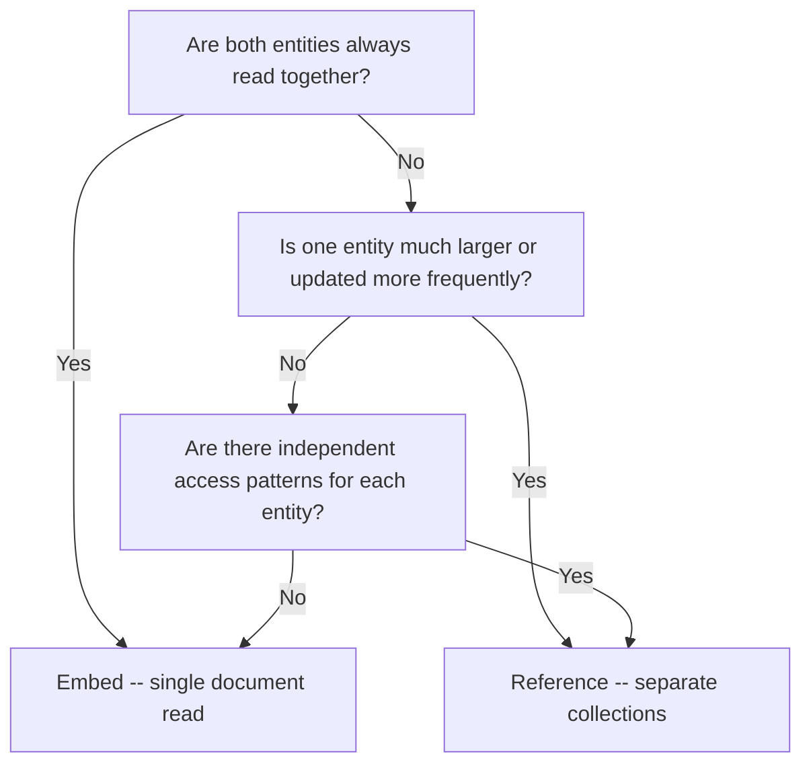

# How to Design One-to-One Relationships in MongoDB

A one-to-one relationship exists when exactly one instance of entity A is associated with exactly one instance of entity B, and vice versa. Common examples include a user and their profile, an order and its shipping address, or a product and its inventory record. MongoDB gives you two main approaches: embedding the related data in the same document, or storing each entity in its own collection and linking them by reference.

## Option 1: Embedding

Embed the related entity as a subdocument when both sides are always accessed together and the embedded data belongs to the parent's lifecycle.

```javascript
// User document with embedded profile
{
  _id: ObjectId("64a1b2c3d4e5f6789abc0001"),
  email: "alice@example.com",
  passwordHash: "...",
  profile: {
    displayName: "Alice",
    bio: "Software engineer",
    avatarUrl: "https://cdn.example.com/avatars/alice.jpg",
    location: "San Francisco, CA"
  },
  createdAt: new Date("2024-01-15")
}
```

With embedding, reading the user and their profile is a single document fetch.

```javascript
// One query retrieves both user and profile
const user = await db.collection("users").findOne(
  { email: "alice@example.com" },
  { projection: { passwordHash: 0 } }
);
console.log(user.profile.displayName);
```

## Option 2: Referencing

Store the related entity in a separate collection and link by ObjectId when the entities have different access patterns, different update frequencies, or need to be managed independently.

```javascript
// users collection
{
  _id: ObjectId("64a1b2c3d4e5f6789abc0001"),
  email: "alice@example.com",
  passwordHash: "...",
  profileId: ObjectId("64a1b2c3d4e5f6789abc0002"),
  createdAt: new Date("2024-01-15")
}

// profiles collection
{
  _id: ObjectId("64a1b2c3d4e5f6789abc0002"),
  userId: ObjectId("64a1b2c3d4e5f6789abc0001"),
  displayName: "Alice",
  bio: "Software engineer",
  avatarUrl: "https://cdn.example.com/avatars/alice.jpg",
  location: "San Francisco, CA"
}
```

Fetch both together using `$lookup`:

```javascript
const result = await db.collection("users").aggregate([
  { $match: { email: "alice@example.com" } },
  {
    $lookup: {
      from: "profiles",
      localField: "_id",
      foreignField: "userId",
      as: "profile"
    }
  },
  { $unwind: "$profile" }
]).toArray();
```

## Decision Framework



## Embedding: Practical Example (Order + Shipping Address)

Shipping addresses in an order context are almost always read with the order and never updated independently. Embedding is the natural choice.

```javascript
db.orders.insertOne({
  _id: ObjectId(),
  customerId: ObjectId("64a1b2c3d4e5f6789abc0001"),
  status: "pending",
  total: 149.99,
  shippingAddress: {
    line1: "123 Main St",
    line2: "Apt 4B",
    city: "San Francisco",
    state: "CA",
    postalCode: "94102",
    country: "US"
  },
  placedAt: new Date()
});
```

## Referencing: Practical Example (User + Payment Method)

A user's payment method may be updated independently (card renewal), may be used across multiple orders, and often has PCI compliance implications that favor storing it in isolation.

```javascript
// paymentMethods collection
db.paymentMethods.insertOne({
  _id: ObjectId(),
  userId: ObjectId("64a1b2c3d4e5f6789abc0001"),
  type: "card",
  last4: "4242",
  brand: "Visa",
  expiryMonth: 12,
  expiryYear: 2027,
  isDefault: true
});

// users collection stores a reference
db.users.updateOne(
  { _id: ObjectId("64a1b2c3d4e5f6789abc0001") },
  { $set: { defaultPaymentMethodId: ObjectId("...") } }
);
```

## Indexes for Referenced One-to-One

When using references, index the foreign key to make lookups efficient.

```javascript
// Index on userId in profiles collection for fast lookup
db.profiles.createIndex({ userId: 1 }, { unique: true });

// Index on userId in paymentMethods for fast lookup
db.paymentMethods.createIndex({ userId: 1 }, { unique: true });
```

The `unique: true` constraint enforces the one-to-one nature of the relationship at the database level.

## Partial Embedding Pattern

A common hybrid: embed frequently accessed fields and reference the rest. This avoids both the overhead of a join and the document bloat of embedding rarely-used data.

```javascript
// Embed summary, reference full profile for detail page
{
  _id: ObjectId("64a1b2c3d4e5f6789abc0001"),
  email: "alice@example.com",
  // Embedded summary (used on every page)
  displayName: "Alice",
  avatarUrl: "https://cdn.example.com/avatars/alice.jpg",
  // Reference to full profile (used only on profile page)
  profileId: ObjectId("64a1b2c3d4e5f6789abc0002")
}
```

## Summary

For one-to-one relationships in MongoDB, prefer embedding when the two entities are always accessed together and have a shared lifecycle. Use referencing when the entities have different access patterns, different update frequencies, or need to be managed independently. Enforce the one-to-one constraint at the database level with a unique index on the foreign key when using references. The partial embedding pattern (embedding a summary and referencing the full document) is effective when only a subset of the related data is needed on most requests.
