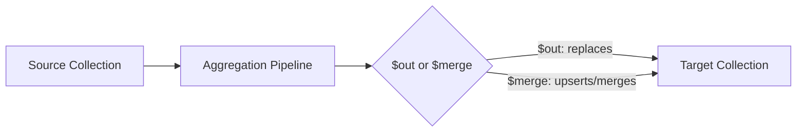

# How to Use $out and $merge in MongoDB Aggregation

Author: [nawazdhandala](https://www.github.com/nawazdhandala)

Tags: MongoDB, Aggregation, $out, $merge, Pipeline, Stage

Description: Learn how to use $out and $merge in MongoDB aggregation to write pipeline results to a collection, enabling materialized views and ETL workflows.

---

## How $out and $merge Work

Both `$out` and `$merge` write the output of an aggregation pipeline to a MongoDB collection instead of returning it to the client.

- `$out` replaces the entire target collection with the pipeline results.
- `$merge` (MongoDB 4.2+) provides fine-grained control: it can insert, replace, update, or keep existing documents and can write to a different database.

Both stages must be the last stage in a pipeline.



## Syntax

### $out

```javascript
// Short form (same database)
{ $out: "<collectionName>" }

// Long form (with database)
{
  $out: {
    db: "<database>",
    coll: "<collectionName>"
  }
}
```

### $merge

```javascript
{
  $merge: {
    into: "<collectionName>" | { db: "<db>", coll: "<coll>" },
    on: "<field>" | ["<field>", ...],  // merge key (default: _id)
    whenMatched: "replace" | "keepExisting" | "merge" | "fail" | [<pipeline>],
    whenNotMatched: "insert" | "discard" | "fail"
  }
}
```

## Examples

### Example 1 - $out: Create a Materialized View

Aggregate orders into a daily summary and store the results in `dailySummary`:

```javascript
db.orders.aggregate([
  {
    $group: {
      _id: {
        year:  { $year: "$orderDate" },
        month: { $month: "$orderDate" },
        day:   { $dayOfMonth: "$orderDate" }
      },
      totalRevenue: { $sum: "$amount" },
      orderCount:   { $sum: 1 }
    }
  },
  { $sort: { "_id.year": 1, "_id.month": 1, "_id.day": 1 } },
  { $out: "dailySummary" }
])
```

After this runs, `db.dailySummary.find()` returns the aggregated results. Every time this pipeline runs, the entire `dailySummary` collection is replaced.

### Example 2 - $out to a Different Database

Write results to a reporting database:

```javascript
db.orders.aggregate([
  { $match: { status: "completed" } },
  { $group: { _id: "$product", revenue: { $sum: "$amount" } } },
  {
    $out: {
      db: "reporting",
      coll: "productRevenue"
    }
  }
])
```

### Example 3 - $merge: Insert New, Keep Existing

Upsert daily summaries - insert new dates, keep existing records unchanged:

```javascript
db.orders.aggregate([
  {
    $group: {
      _id: {
        $dateToString: { format: "%Y-%m-%d", date: "$orderDate" }
      },
      totalRevenue: { $sum: "$amount" },
      orderCount: { $sum: 1 }
    }
  },
  {
    $merge: {
      into: "dailySummary",
      on: "_id",
      whenMatched: "keepExisting",
      whenNotMatched: "insert"
    }
  }
])
```

### Example 4 - $merge: Replace Matched Documents

Replace existing records with newly computed values:

```javascript
db.orders.aggregate([
  {
    $group: {
      _id: "$customerId",
      totalSpent: { $sum: "$amount" },
      orderCount: { $sum: 1 }
    }
  },
  {
    $merge: {
      into: "customerStats",
      on: "_id",
      whenMatched: "replace",
      whenNotMatched: "insert"
    }
  }
])
```

### Example 5 - $merge: Merge Fields (Partial Update)

Use `"merge"` to combine fields from the aggregation result with existing fields - existing fields not present in the pipeline result are retained:

```javascript
db.newSales.aggregate([
  {
    $group: {
      _id: "$productId",
      newRevenue: { $sum: "$amount" }
    }
  },
  {
    $merge: {
      into: "productStats",
      on: "_id",
      whenMatched: "merge",    // merges new fields into existing doc
      whenNotMatched: "insert"
    }
  }
])
```

### Example 6 - $merge with a Pipeline for whenMatched

Use a custom pipeline when a document matches - here, increment the existing count:

```javascript
db.orders.aggregate([
  {
    $group: {
      _id: "$customerId",
      newOrders: { $sum: 1 }
    }
  },
  {
    $merge: {
      into: "customerStats",
      on: "_id",
      whenMatched: [
        {
          $set: {
            totalOrders: { $add: ["$totalOrders", "$$new.newOrders"] }
          }
        }
      ],
      whenNotMatched: "insert"
    }
  }
])
```

`$$new` refers to the incoming document from the pipeline.

## $out vs $merge

| Feature | $out | $merge |
|---|---|---|
| MongoDB version | All versions | 4.2+ |
| Target collection handling | Replaces entirely | Flexible (insert/replace/merge/keep) |
| Write to different database | 4.4+ | Yes |
| Incremental updates | No | Yes |
| Atomic operation | Yes (within limits) | Per-document |
| Continues on match conflict | N/A | Configurable |

## Use Cases

- Creating materialized views refreshed on a schedule
- ETL pipelines that load processed data into a reporting collection
- Incrementally updating summary statistics without full recompute
- Archiving aggregated data to a separate database for analytics

## Summary

`$out` and `$merge` turn aggregation pipelines into write operations. `$out` is the simpler option that fully replaces a target collection on every run. `$merge` provides incremental update capabilities, letting you insert new records, replace matches, merge fields, or keep existing data. Use `$merge` for ongoing refresh jobs that update only the changed data.
