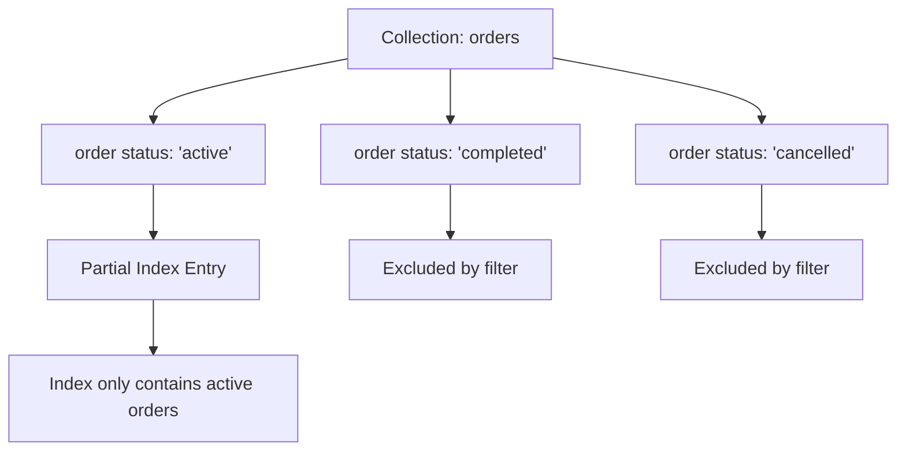

# How to Create a Partial Index in MongoDB with filterExpression

Author: [nawazdhandala](https://www.github.com/nawazdhandala)

Tags: MongoDB, Index, Partial Index, Filter Expression, Storage Optimization

Description: Learn how to create partial indexes in MongoDB using partialFilterExpression to index only documents matching a condition, reducing index size and improving write performance.

---

## How Partial Indexes Work

A partial index only includes documents that satisfy a specified filter expression. Documents that do not match the filter are excluded from the index entirely. This reduces the size of the index, speeds up index maintenance, and allows targeted unique constraints.

Partial indexes were introduced in MongoDB 3.2 and are the preferred alternative to sparse indexes for complex filtering conditions.



## Syntax

```javascript
db.collection.createIndex(
  { field: 1 },
  { partialFilterExpression: { condition } }
)
```

Supported operators in `partialFilterExpression`:
- Equality (`$eq`)
- `$exists`
- Comparison: `$gt`, `$gte`, `$lt`, `$lte`
- `$type`
- `$and` (top-level only)

## Examples

### Index Only Active Orders

```javascript
db.orders.createIndex(
  { customerId: 1, createdAt: -1 },
  {
    partialFilterExpression: { status: "active" },
    name: "idx_active_orders"
  }
)
```

This index is only populated with orders where `status` is `"active"`. Completed or cancelled orders are not indexed, keeping the index small.

For the query planner to use this index, the query must include the filter condition:

```javascript
// Uses the partial index
db.orders.find({ customerId: "cust_001", status: "active" })

// Does NOT use the partial index (missing status: "active" filter)
db.orders.find({ customerId: "cust_001" })
```

### Partial Unique Index

A partial unique index enforces uniqueness only for documents matching the filter. This allows multiple documents outside the filter to coexist with the same field value.

Enforce unique email only for active users:

```javascript
db.users.createIndex(
  { email: 1 },
  {
    unique: true,
    partialFilterExpression: {
      status: "active",
      email: { $exists: true }
    },
    name: "idx_active_user_email_unique"
  }
)
```

This allows:
- Multiple inactive users with the same email (or no email).
- Only one active user per email address.

### Filter on Field Existence

Equivalent to a sparse index but expressed as a partial index:

```javascript
db.users.createIndex(
  { phoneNumber: 1 },
  {
    partialFilterExpression: { phoneNumber: { $exists: true } },
    name: "idx_phoneNumber_exists"
  }
)
```

### Filter Using $gt (Range Condition)

Index only high-value orders to speed up premium customer queries:

```javascript
db.orders.createIndex(
  { customerId: 1 },
  {
    partialFilterExpression: { amount: { $gt: 1000 } },
    name: "idx_highvalue_orders"
  }
)
```

### Filter Using $type

Index only documents where a field is a string (useful for heterogeneous collections):

```javascript
db.events.createIndex(
  { payload: 1 },
  {
    partialFilterExpression: { payload: { $type: "string" } }
  }
)
```

### Node.js Example

```javascript
const { MongoClient } = require("mongodb");

async function main() {
  const client = new MongoClient("mongodb://localhost:27017");
  await client.connect();

  const orders = client.db("shop").collection("orders");

  // Create partial index for active orders only
  await orders.createIndex(
    { customerId: 1, createdAt: -1 },
    {
      partialFilterExpression: { status: "active" },
      name: "idx_active_orders_by_customer"
    }
  );

  // Insert sample orders
  await orders.insertMany([
    { customerId: "c1", status: "active", amount: 250, createdAt: new Date("2026-01-01") },
    { customerId: "c1", status: "active", amount: 150, createdAt: new Date("2026-02-01") },
    { customerId: "c1", status: "completed", amount: 400, createdAt: new Date("2025-12-01") },
    { customerId: "c2", status: "active", amount: 75, createdAt: new Date("2026-03-01") }
  ]);

  // Query that uses the partial index (includes status: "active")
  const activeOrders = await orders.find({
    customerId: "c1",
    status: "active"
  }).sort({ createdAt: -1 }).toArray();

  console.log(`Active orders for c1: ${activeOrders.length}`);

  // Verify index usage
  const plan = await orders.find({
    customerId: "c1",
    status: "active"
  }).explain("executionStats");

  const winningStage = plan.queryPlanner.winningPlan.inputStage;
  console.log("Index used:", winningStage.indexName);

  await client.close();
}

main().catch(console.error);
```

## Query Must Include the Filter Condition

The query planner can only use a partial index when the query predicates guarantee that documents outside the filter are not needed. The query must include the `partialFilterExpression` conditions.

```javascript
// Partial index with: { partialFilterExpression: { status: "active" } }

// USES the index - query includes status: "active"
db.orders.find({ customerId: "c1", status: "active" })

// DOES NOT USE the index - could return completed orders too
db.orders.find({ customerId: "c1" })

// DOES NOT USE the index - returns cancelled which are excluded from index
db.orders.find({ customerId: "c1", status: { $in: ["active", "cancelled"] } })
```

## Best Practices

- **Use partial indexes when only a subset of documents need fast queries** - for example, only active, open, or recent records.
- **Combine with unique constraints** to enforce uniqueness only within a subset.
- **Always include the filter expression in queries** that should use the index - the query planner will not use the partial index otherwise.
- **Partial indexes are preferred over sparse indexes** for new code since they support richer filter conditions.
- **Reduce index maintenance cost** by filtering out large volumes of low-query-frequency documents (e.g., completed orders that are rarely re-queried).

## Summary

A partial index in MongoDB uses `partialFilterExpression` to include only documents matching a filter condition. Create it with `createIndex({ field: 1 }, { partialFilterExpression: { condition } })`. Queries must include the filter condition for the index to be used. Partial indexes reduce index size and write overhead by excluding documents you rarely query, and they support unique constraints scoped to a document subset.
