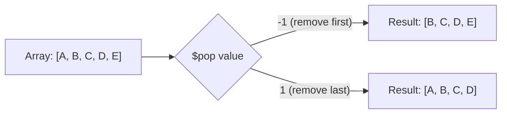

# How to Use $pop in MongoDB to Remove First or Last Array Element

Author: [nawazdhandala](https://www.github.com/nawazdhandala)

Tags: MongoDB, $pop, Array, Update, Operator

Description: Learn how to use MongoDB's $pop operator to remove the first or last element from an array field, ideal for implementing queue and stack data structures.

---

## How $pop Works

The `$pop` operator removes either the first or the last element of an array. It takes a value of `-1` to remove the first element and `1` to remove the last element. `$pop` does not return the removed element - it only removes it.



## Syntax

```javascript
// Remove the last element
{ $pop: { arrayField: 1 } }

// Remove the first element
{ $pop: { arrayField: -1 } }
```

## Removing the Last Element

```javascript
// Before: { _id: 1, queue: ["task1", "task2", "task3"] }

db.jobs.updateOne(
  { _id: 1 },
  { $pop: { queue: 1 } }
)

// After: { _id: 1, queue: ["task1", "task2"] }
```

## Removing the First Element (FIFO Queue)

Remove the first element to dequeue from the front:

```javascript
// Before: { _id: 2, queue: ["task1", "task2", "task3"] }

db.jobs.updateOne(
  { _id: 2 },
  { $pop: { queue: -1 } }
)

// After: { _id: 2, queue: ["task2", "task3"] }
```

## Stack Pattern (LIFO - Last In, First Out)

Use `$push` to add to the end and `$pop: 1` to remove from the end:

```javascript
// Push a new item onto the stack
db.stacks.updateOne(
  { _id: "nav-stack" },
  { $push: { pages: "/products/123" } }
)

// Pop from the stack (remove last element)
db.stacks.updateOne(
  { _id: "nav-stack" },
  { $pop: { pages: 1 } }
)
```

## Queue Pattern (FIFO - First In, First Out)

Use `$push` to add to the end and `$pop: -1` to remove from the front:

```javascript
// Enqueue a new job
db.queues.updateOne(
  { _id: "email-queue" },
  { $push: { jobs: { id: "job-001", type: "welcome-email" } } }
)

// Dequeue the oldest job
db.queues.updateOne(
  { _id: "email-queue" },
  { $pop: { jobs: -1 } }
)
```

## $pop on an Empty Array

If the array is empty, `$pop` does not throw an error - the array remains empty:

```javascript
// Before: { _id: 3, items: [] }

db.collection.updateOne(
  { _id: 3 },
  { $pop: { items: 1 } }
)

// After: { _id: 3, items: [] }  (no change)
```

## $pop on a Non-Existent Field

If the field does not exist, `$pop` is a no-op - no error is thrown:

```javascript
db.collection.updateOne(
  { _id: 4 },
  { $pop: { nonExistentArray: 1 } }
)
// No change, no error
```

## Retrieving the Element Before Removing It

`$pop` alone does not return the removed element. To both retrieve and remove, use `findOneAndUpdate()`:

```javascript
const result = db.queues.findOneAndUpdate(
  { _id: "task-queue", tasks: { $exists: true, $ne: [] } },
  { $pop: { tasks: -1 } },
  { returnDocument: "before" }  // returns document BEFORE the update
)

const removedTask = result.tasks[0]  // first element that was removed
print("Processing task:", removedTask)
```

## $pop vs $pull

```text
$pop                           $pull
-----------------------------  --------------------------------
Removes by position (first/last)  Removes by value or condition
Always removes exactly 1 element  Removes all matching elements
Simple positional removal      Value-based or condition-based removal
No arguments needed beyond -1/1   Requires a value or query condition
```

## Use Cases

- Implementing a simple FIFO task queue within a document
- Maintaining a navigation history stack (back button)
- Trimming the oldest entry from a bounded history array
- Popping the most recently added item in undo/redo functionality
- Removing the next pending item in a priority queue

## Summary

`$pop` is a simple positional array removal operator. Use `$pop: 1` to remove the last element (stack pop) and `$pop: -1` to remove the first element (queue dequeue). It operates safely on empty arrays and non-existent fields without errors. Since `$pop` does not return the removed element, use `findOneAndUpdate()` with `returnDocument: "before"` to retrieve the element being removed. For removing specific values by content rather than position, use `$pull` instead.
