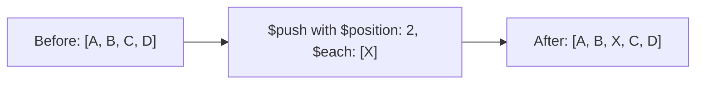

# How to Use $position with $push in MongoDB for Ordered Array Inserts

Author: [nawazdhandala](https://www.github.com/nawazdhandala)

Tags: MongoDB, $position, $push, Array, Update, Operator

Description: Learn how to use MongoDB's $position modifier with $push to insert array elements at a specific index rather than always appending to the end.

---

## How $position Works

By default, `$push` appends elements to the end of an array. The `$position` modifier overrides this behavior and inserts elements at a specified index. `$position` must be used alongside `$each` - even if you are inserting just one element.



## Syntax

```javascript
{
  $push: {
    arrayField: {
      $each: [value1, value2, ...],
      $position: <index>
    }
  }
}
```

- Positive index: inserts at that position from the beginning (0-based)
- Negative index: inserts from the end of the array

## Inserting at the Beginning (Prepend)

Use `$position: 0` to prepend elements to the array:

```javascript
// Before: { _id: 1, steps: ["step2", "step3", "step4"] }

db.tutorials.updateOne(
  { _id: 1 },
  {
    $push: {
      steps: {
        $each: ["step0", "step1"],
        $position: 0
      }
    }
  }
)

// After: { _id: 1, steps: ["step0", "step1", "step2", "step3", "step4"] }
```

## Inserting in the Middle

Insert at any position:

```javascript
// Before: { _id: 2, tasks: ["design", "deploy", "monitor"] }

// Insert "develop" and "test" after "design" (at index 1)
db.projects.updateOne(
  { _id: 2 },
  {
    $push: {
      tasks: {
        $each: ["develop", "test"],
        $position: 1
      }
    }
  }
)

// After: { _id: 2, tasks: ["design", "develop", "test", "deploy", "monitor"] }
```

## Inserting with a Negative Index

Negative index positions count from the end of the array before the insert:

```javascript
// Before: { _id: 3, items: ["A", "B", "C", "D"] }

// $position: -2 inserts before the last 2 elements
db.lists.updateOne(
  { _id: 3 },
  {
    $push: {
      items: {
        $each: ["X"],
        $position: -2
      }
    }
  }
)

// After: { _id: 3, items: ["A", "B", "X", "C", "D"] }
```

## Inserting a Single Element at a Position

Even for a single element, `$each` is required when using `$position`:

```javascript
// Insert a "featured" tag at position 0
db.articles.updateOne(
  { _id: 4 },
  {
    $push: {
      tags: {
        $each: ["featured"],
        $position: 0
      }
    }
  }
)
```

## Combining $position with $slice

Insert at a specific position and then trim the array:

```javascript
// Before: { _id: 5, recentSearches: ["python", "mongodb", "redis"] }

// Prepend newest search and keep only last 5
db.users.updateOne(
  { _id: 5 },
  {
    $push: {
      recentSearches: {
        $each: ["elasticsearch"],
        $position: 0,
        $slice: 5
      }
    }
  }
)

// After: { recentSearches: ["elasticsearch", "python", "mongodb", "redis"] }
```

## Combining $position with $sort

When `$position` and `$sort` are both specified, elements are inserted at the given position first, then the entire array is sorted. The position effectively determines insertion before sorting happens:

```javascript
db.scores.updateOne(
  { _id: 6 },
  {
    $push: {
      history: {
        $each: [{ round: 5, score: 88 }],
        $position: 0,        // insert at beginning
        $sort: { round: 1 }  // then sort by round ascending
      }
    }
  }
)
```

## Index Out of Range

If `$position` exceeds the array length, elements are appended to the end (no error):

```javascript
// Before: { items: ["A", "B"] }  (length 2)

db.collection.updateOne(
  {},
  { $push: { items: { $each: ["C"], $position: 100 } } }
)

// After: { items: ["A", "B", "C"] }  (appended since 100 > length)
```

## Use Cases

- Prepending a "pinned" or "featured" item to the top of a list
- Inserting a step into the middle of a workflow array
- Adding a priority item to the front of a task queue
- Building ordered menus or navigation items
- Inserting recent searches at the beginning of a history array

## Summary

`$position` gives you precise control over where new elements are inserted in an array, overriding the default append behavior of `$push`. Always pair `$position` with `$each` even for single-element inserts. Use `$position: 0` to prepend, a positive index to insert in the middle, and a negative index to count from the end. If the index exceeds the array bounds, MongoDB falls back to appending. Combine `$position` with `$slice` and `$sort` for advanced array management in a single atomic operation.
