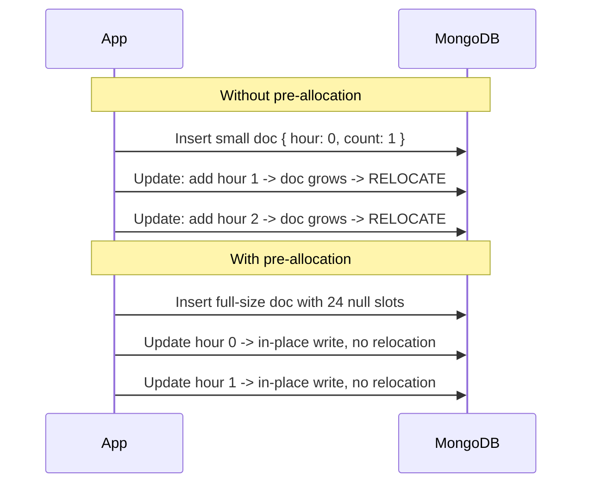

# How to Use the Pre-Allocation Pattern in MongoDB

Author: OneUptime Team

Tags: MongoDB, Data modeling, Pre-allocation, Performance, Pattern

Description: Learn how to use the MongoDB pre-allocation pattern to reserve document space upfront, reducing document growth, fragmentation, and write amplification in high-write workloads.

---

The pre-allocation pattern initializes a document with placeholder or empty values for fields that will be written incrementally over time. This prevents repeated document moves due to growth, reduces WiredTiger internal fragmentation, and can dramatically improve write throughput for time-bucketed or slot-based data.

## Why Pre-Allocation Matters

In MongoDB's WiredTiger storage engine, when a document grows beyond its current allocated space, it must be relocated. For documents that are written to many times per second -- such as time-series buckets or daily counters -- this relocation overhead adds up. Pre-allocating the expected final shape upfront avoids this entirely.



## Classic Use Case: Hourly Buckets

Pre-allocate a document with slots for all 24 hours of a day:

```javascript
// Create the pre-allocated daily document at midnight
async function createDailyBucket(date, metricName) {
  const hours = {};
  for (let h = 0; h < 24; h++) {
    hours[`h${String(h).padStart(2, "0")}`] = null;  // null placeholder
  }

  return db.collection("dailyMetrics").insertOne({
    date: new Date(date.toDateString()),
    metric: metricName,
    hours,
    total: 0,
    createdAt: new Date()
  });
}

await createDailyBucket(new Date("2026-03-31"), "page_views");
```

The resulting document:

```javascript
{
  _id: ObjectId("..."),
  date: ISODate("2026-03-31T00:00:00Z"),
  metric: "page_views",
  hours: {
    h00: null, h01: null, h02: null, h03: null,
    h04: null, h05: null, h06: null, h07: null,
    h08: null, h09: null, h10: null, h11: null,
    h12: null, h13: null, h14: null, h15: null,
    h16: null, h17: null, h18: null, h19: null,
    h20: null, h21: null, h22: null, h23: null
  },
  total: 0,
  createdAt: ISODate("2026-03-31T00:00:00Z")
}
```

## Incrementing a Slot

```javascript
async function recordPageView(date, hour) {
  const hourKey = `hours.h${String(hour).padStart(2, "0")}`;

  await db.collection("dailyMetrics").updateOne(
    { date: new Date(date.toDateString()), metric: "page_views" },
    {
      $inc: {
        [hourKey]: 1,
        total: 1
      }
    }
  );
}

await recordPageView(new Date("2026-03-31"), 14);
```

## Pre-Allocating Minute-Level Buckets

For higher-resolution metrics, pre-allocate 60 minute slots per hour:

```javascript
async function createHourlyBucket(dateHour, metric) {
  const minutes = {};
  for (let m = 0; m < 60; m++) {
    minutes[`m${String(m).padStart(2, "0")}`] = 0;
  }

  return db.collection("hourlyMetrics").insertOne({
    dateHour,   // e.g., "2026-03-31T14"
    metric,
    minutes,
    total: 0
  });
}
```

## Pre-Allocation for User Activity Tracking

Reserve one slot per day of the month upfront:

```javascript
async function createMonthlyActivityDoc(userId, year, month) {
  const days = {};
  const daysInMonth = new Date(year, month, 0).getDate();

  for (let d = 1; d <= daysInMonth; d++) {
    days[`d${String(d).padStart(2, "0")}`] = {
      logins: 0,
      actions: 0,
      duration: 0
    };
  }

  return db.collection("userActivity").insertOne({
    userId: ObjectId(userId),
    year,
    month,
    days,
    createdAt: new Date()
  });
}
```

## Pre-Allocation for a Fixed-Size Event Log

Pre-allocate a circular buffer for the last N events:

```javascript
async function createEventBuffer(entityId, capacity = 100) {
  const slots = new Array(capacity).fill(null);

  return db.collection("eventBuffers").insertOne({
    entityId: ObjectId(entityId),
    capacity,
    writePos: 0,      // next slot to write
    count: 0,
    slots
  });
}

async function appendEvent(entityId, event) {
  const buffer = await db.collection("eventBuffers").findOne({
    entityId: ObjectId(entityId)
  });

  const pos = buffer.writePos % buffer.capacity;

  await db.collection("eventBuffers").updateOne(
    { entityId: ObjectId(entityId) },
    {
      $set: {
        [`slots.${pos}`]: { ...event, ts: new Date() }
      },
      $inc: { writePos: 1, count: 1 }
    }
  );
}
```

## Pre-Allocating a Seat Reservation Grid

In a ticketing system, pre-allocate all seats in a venue as `null` (available):

```javascript
async function createEventSeating(eventId, sections) {
  const seats = {};

  for (const section of sections) {
    for (let row = 1; row <= section.rows; row++) {
      for (let seat = 1; seat <= section.seatsPerRow; seat++) {
        const key = `${section.name}_R${row}_S${seat}`;
        seats[key] = null;   // null = available
      }
    }
  }

  return db.collection("seating").insertOne({
    eventId: ObjectId(eventId),
    seats,
    totalSeats: Object.keys(seats).length,
    reservedCount: 0,
    createdAt: new Date()
  });
}

// Reserve a seat atomically
async function reserveSeat(eventId, seatKey, userId) {
  const result = await db.collection("seating").updateOne(
    { eventId: ObjectId(eventId), [`seats.${seatKey}`]: null },
    {
      $set: { [`seats.${seatKey}`]: { userId: ObjectId(userId), reservedAt: new Date() } },
      $inc: { reservedCount: 1 }
    }
  );
  return result.modifiedCount === 1;
}
```

## Querying Pre-Allocated Documents

Find all hours where a metric was recorded (non-null):

```javascript
db.dailyMetrics.aggregate([
  { $match: { date: ISODate("2026-03-31T00:00:00Z"), metric: "page_views" } },
  {
    $project: {
      hoursArray: { $objectToArray: "$hours" }
    }
  },
  {
    $project: {
      activeHours: {
        $filter: {
          input: "$hoursArray",
          as: "h",
          cond: { $ne: ["$$h.v", null] }
        }
      }
    }
  }
]);
```

## Rolling Up Pre-Allocated Buckets

```javascript
// Sum all hours into a daily total
db.dailyMetrics.aggregate([
  { $match: { metric: "page_views" } },
  {
    $addFields: {
      hoursValues: { $objectToArray: "$hours" }
    }
  },
  {
    $project: {
      date: 1,
      total: {
        $sum: {
          $map: {
            input: "$hoursValues",
            as: "h",
            in: { $ifNull: ["$$h.v", 0] }
          }
        }
      }
    }
  }
]);
```

## When to Use Pre-Allocation

| Scenario | Good fit? |
|---|---|
| High-frequency increments to fixed slots | Yes |
| Time-series with known interval granularity | Yes |
| Seat / slot reservation systems | Yes |
| Documents that grow to a known max size | Yes |
| Documents that grow unpredictably | No |
| Small collections with infrequent writes | No -- unnecessary complexity |

## Tradeoffs

- Storage: pre-allocated nulls occupy space even when slots are empty.
- Document size limit: MongoDB documents are capped at 16 MB; do not pre-allocate more slots than the limit allows.
- Complexity: requires upfront creation of bucket documents, typically via a scheduled job or lazy initialization.

## Summary

The pre-allocation pattern initializes documents with placeholder values for all slots that will be written over time. This keeps documents at a stable size, eliminating the in-place update overhead that occurs when growing documents are relocated on disk. Use it for time-series metric buckets, circular event buffers, seat reservation grids, and any document where you know the final shape upfront. Pair it with `$inc` for efficient counter increments and `$objectToArray` for aggregation across the pre-allocated slots.
