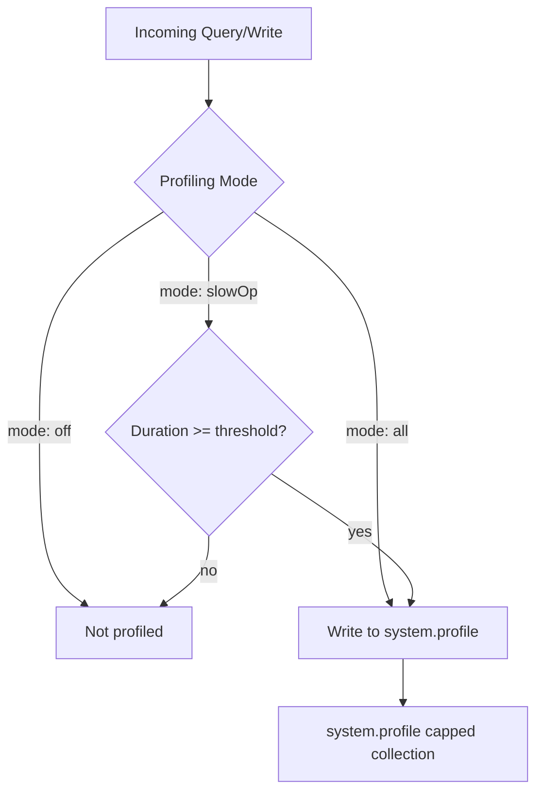

# How to Use MongoDB Profiler for Slow Query Analysis

Author: [nawazdhandala](https://www.github.com/nawazdhandala)

Tags: MongoDB, Performance, Profiling, Query Optimization, Operation

Description: Learn how to enable and use the MongoDB database profiler to capture slow queries, analyze execution stats, and identify performance bottlenecks in your collections.

---

## How the MongoDB Profiler Works

The MongoDB database profiler logs information about database operations to a capped collection called `system.profile` in each database. You can configure it to capture all operations, only slow operations (above a threshold), or nothing.



## Profiling Modes

There are three profiling levels:

- **0 (off)** - profiling disabled
- **1 (slowOp)** - log operations that exceed `slowOpThresholdMs` milliseconds
- **2 (all)** - log every operation (high overhead, use only for short diagnostic sessions)

## Enabling the Profiler

Enable profiling at level 1 with a 100ms threshold on the current database:

```javascript
db.setProfilingLevel(1, { slowms: 100 })
```

Enable profiling on all operations (level 2):

```javascript
db.setProfilingLevel(2)
```

Disable profiling:

```javascript
db.setProfilingLevel(0)
```

Check the current profiling status:

```javascript
db.getProfilingStatus()
```

Output:

```text
{ was: 1, slowms: 100, sampleRate: 1 }
```

## Enabling Profiling in mongod.conf

Set a global default that applies to all databases:

```yaml
operationProfiling:
  mode: slowOp
  slowOpThresholdMs: 100
  slowOpSampleRate: 1.0    # profile 100% of slow ops
```

Per-database settings set via `setProfilingLevel()` override the global default.

## Querying system.profile

The `system.profile` collection stores one document per profiled operation. Query it like any other collection.

Find the most recent slow operations:

```javascript
use mydb
db.system.profile.find({}).sort({ ts: -1 }).limit(10).pretty()
```

Find operations slower than 500ms:

```javascript
db.system.profile.find({ millis: { $gt: 500 } }).sort({ millis: -1 })
```

Find slow queries on a specific collection:

```javascript
db.system.profile.find({
  ns: "mydb.orders",
  op: "query"
}).sort({ millis: -1 }).limit(20)
```

## Understanding a Profile Document

A typical profile document looks like this:

```text
{
  op: "query",
  ns: "mydb.orders",
  command: {
    find: "orders",
    filter: { status: "pending", customerId: "abc123" },
    sort: { createdAt: -1 },
    limit: 50
  },
  keysExamined: 0,         // index keys scanned
  docsExamined: 150000,    // documents scanned (COLLSCAN if high)
  cursorExhausted: true,
  numYield: 120,
  nreturned: 50,
  queryHash: "AB12CD34",
  planSummary: "COLLSCAN", // IXSCAN = index used, COLLSCAN = full scan
  millis: 1240,            // execution time in ms
  ts: ISODate("2026-03-31T10:00:00Z"),
  client: "10.0.0.5:56789",
  user: "appUser"
}
```

Key fields to analyze:

- `millis` - execution time; sort descending to find worst offenders
- `docsExamined` vs `nreturned` - a high ratio means the query scans many docs to return few
- `keysExamined` - index keys scanned; high with low `nreturned` means a poorly selective index
- `planSummary: "COLLSCAN"` - no index was used; create an index for this query pattern
- `numYield` - number of times the operation yielded to other operations; high values suggest lock contention

## Aggregating Slow Queries

Find the top 10 slowest query shapes by average execution time:

```javascript
db.system.profile.aggregate([
  { $match: { op: { $in: ["query", "update", "remove"] } } },
  {
    $group: {
      _id: { ns: "$ns", queryHash: "$queryHash" },
      avgMs: { $avg: "$millis" },
      maxMs: { $max: "$millis" },
      count: { $sum: 1 },
      planSummary: { $first: "$planSummary" }
    }
  },
  { $sort: { avgMs: -1 } },
  { $limit: 10 }
])
```

Find queries performing collection scans:

```javascript
db.system.profile.find({ planSummary: /COLLSCAN/ }).sort({ millis: -1 }).limit(20)
```

Find high document-to-return ratios (inefficient queries):

```javascript
db.system.profile.aggregate([
  { $match: { op: "query", nreturned: { $gt: 0 } } },
  {
    $project: {
      ns: 1,
      millis: 1,
      nreturned: 1,
      docsExamined: 1,
      ratio: { $divide: ["$docsExamined", "$nreturned"] }
    }
  },
  { $sort: { ratio: -1 } },
  { $limit: 10 }
])
```

## Managing the system.profile Collection

`system.profile` is a capped collection with a default size of 1MB. On busy systems, it fills up quickly. Resize it by:

1. Disable profiling.
2. Drop the existing `system.profile` collection.
3. Create a new capped collection with a larger size.
4. Re-enable profiling.

```javascript
db.setProfilingLevel(0)
db.system.profile.drop()
db.createCollection("system.profile", { capped: true, size: 104857600 })  // 100MB
db.setProfilingLevel(1, { slowms: 100 })
```

## Analyzing a Query with explain()

When you find a slow query in `system.profile`, reproduce it and run `explain()` for a detailed execution plan:

```javascript
db.orders.find({ status: "pending" }).sort({ createdAt: -1 }).explain("executionStats")
```

Look for `COLLSCAN` in the winning plan and high `totalDocsExamined`. Create an index to resolve it:

```javascript
db.orders.createIndex({ status: 1, createdAt: -1 })
```

## Best Practices

- Use `slowOpThresholdMs: 100` in production as the default; lower it temporarily to `50` when investigating a specific issue.
- Avoid `mode: all` in production - it writes a profile document for every operation and can severely impact performance.
- Rotate the `system.profile` collection size to match your diagnostic needs.
- Correlate `system.profile` data with application logs using the `queryHash` field to identify recurring problem queries.
- After adding an index, run the same query again and verify `planSummary` changes from `COLLSCAN` to `IXSCAN`.

## Summary

The MongoDB profiler is the first tool to reach for when investigating slow queries. Enable it at level 1 with `db.setProfilingLevel(1, { slowms: 100 })`, query `system.profile` to find the slowest operations, and look for `COLLSCAN` and high `docsExamined/nreturned` ratios. Use `explain("executionStats")` on problem queries to understand their execution plans and create targeted indexes to fix them.
