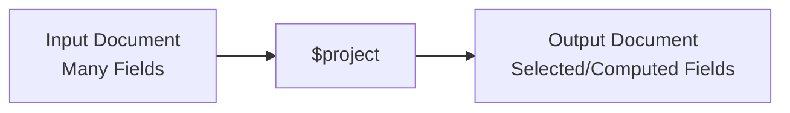

# How to Use $project Stage in MongoDB Aggregation

Author: [nawazdhandala](https://www.github.com/nawazdhandala)

Tags: MongoDB, Aggregation, $project, Pipeline, Stage, Projection

Description: Learn how to use the $project stage in MongoDB aggregation to include, exclude, rename, and compute new fields in your pipeline output.

---

## How $project Works

The `$project` stage reshapes each document in a pipeline. You can include or exclude fields, rename existing fields, add computed fields using expressions, and restructure the document shape. It is similar to the projection parameter in a `find()` query, but far more powerful because it supports full aggregation expressions.



## Syntax

```javascript
{
  $project: {
    <field>: 1,              // include field
    <field>: 0,              // exclude field
    <newField>: <expression> // computed field
  }
}
```

The `_id` field is included by default unless explicitly excluded with `_id: 0`.

## Examples

### Input Documents

```javascript
[
  {
    _id: 1,
    firstName: "Alice",
    lastName: "Smith",
    age: 30,
    email: "alice@example.com",
    scores: [85, 92, 78],
    salary: 75000
  },
  {
    _id: 2,
    firstName: "Bob",
    lastName: "Jones",
    age: 25,
    email: "bob@example.com",
    scores: [70, 88, 95],
    salary: 60000
  }
]
```

### Example 1 - Include Specific Fields

Include only `firstName`, `lastName`, and `email`, excluding `_id`:

```javascript
db.employees.aggregate([
  {
    $project: {
      _id: 0,
      firstName: 1,
      lastName: 1,
      email: 1
    }
  }
])
```

Output:

```javascript
[
  { firstName: "Alice", lastName: "Smith", email: "alice@example.com" },
  { firstName: "Bob",   lastName: "Jones", email: "bob@example.com"  }
]
```

### Example 2 - Exclude Specific Fields

Exclude only the `salary` field (all others are included):

```javascript
db.employees.aggregate([
  {
    $project: {
      salary: 0
    }
  }
])
```

### Example 3 - Rename and Compute Fields

Create a `fullName` field by concatenating `firstName` and `lastName`:

```javascript
db.employees.aggregate([
  {
    $project: {
      _id: 0,
      fullName: { $concat: ["$firstName", " ", "$lastName"] },
      age: 1,
      email: 1
    }
  }
])
```

Output:

```javascript
[
  { fullName: "Alice Smith", age: 30, email: "alice@example.com" },
  { fullName: "Bob Jones",   age: 25, email: "bob@example.com"  }
]
```

### Example 4 - Computed Numeric Fields

Calculate an annual bonus (10% of salary) and a monthly salary:

```javascript
db.employees.aggregate([
  {
    $project: {
      _id: 0,
      firstName: 1,
      salary: 1,
      annualBonus: { $multiply: ["$salary", 0.10] },
      monthlySalary: { $divide: ["$salary", 12] }
    }
  }
])
```

Output:

```javascript
[
  { firstName: "Alice", salary: 75000, annualBonus: 7500, monthlySalary: 6250 },
  { firstName: "Bob",   salary: 60000, annualBonus: 6000, monthlySalary: 5000 }
]
```

### Example 5 - Array Operations in $project

Calculate the average score for each employee:

```javascript
db.employees.aggregate([
  {
    $project: {
      _id: 0,
      firstName: 1,
      avgScore: { $avg: "$scores" },
      topScore: { $max: "$scores" }
    }
  }
])
```

Output:

```javascript
[
  { firstName: "Alice", avgScore: 85, topScore: 92 },
  { firstName: "Bob",   avgScore: 84.33, topScore: 95 }
]
```

### Example 6 - Nested Document Projection

Project a nested field within an embedded document:

```javascript
// Document shape: { name: "Alice", address: { city: "NY", zip: "10001", country: "US" } }

db.users.aggregate([
  {
    $project: {
      name: 1,
      city: "$address.city",
      country: "$address.country"
    }
  }
])
```

### Example 7 - Conditional Field with $cond

Add a `seniority` label based on age:

```javascript
db.employees.aggregate([
  {
    $project: {
      firstName: 1,
      age: 1,
      seniority: {
        $cond: {
          if: { $gte: ["$age", 30] },
          then: "Senior",
          else: "Junior"
        }
      }
    }
  }
])
```

## Use Cases

- Reducing the payload size before returning results to the application
- Computing derived fields (full name, formatted dates, calculated values)
- Reshaping documents to match a specific API response schema
- Exposing nested fields at the top level for further processing

## Summary

The `$project` stage gives you precise control over the shape of documents flowing through an aggregation pipeline. By specifying inclusion, exclusion, renames, and computed fields, you can transform raw documents into exactly the format your application needs. Use `$project` to reduce document size early in the pipeline and to add computed fields that are used by later stages.
