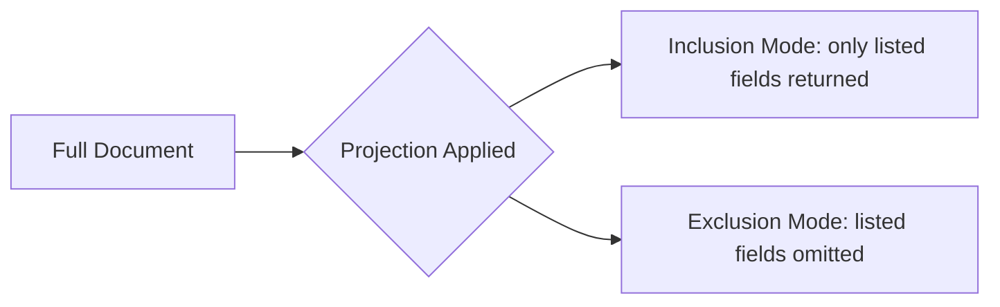

# How to Use Projection in MongoDB to Return Specific Fields

Author: [nawazdhandala](https://www.github.com/nawazdhandala)

Tags: MongoDB, Projection, Query, Performance, Find

Description: Learn how to use MongoDB projections to include or exclude specific fields from query results, reducing data transfer and improving application performance.

---

## How Projection Works

Projection is the second argument to `find()` and `findOne()`. It tells MongoDB which fields to include or exclude from the returned documents. This reduces the amount of data transferred from the database to your application, which can significantly improve performance for documents with many fields.



## Syntax

```javascript
db.collection.find(filter, projection)
```

Projection document uses `1` for inclusion and `0` for exclusion:

```javascript
{ field1: 1, field2: 1 }  // Include field1 and field2
{ field1: 0, field2: 0 }  // Exclude field1 and field2
```

## Inclusion Projection

Include only the fields you need. All unspecified fields are excluded, except `_id` which is included by default:

```javascript
// Return only name and email
db.users.find({}, { name: 1, email: 1 })
```

Result:

```javascript
[
  { _id: ObjectId("..."), name: "Alice", email: "alice@example.com" },
  { _id: ObjectId("..."), name: "Bob", email: "bob@example.com" }
]
```

## Excluding _id from Results

To suppress the `_id` field from an inclusion projection, explicitly set it to 0:

```javascript
db.users.find({}, { name: 1, email: 1, _id: 0 })
```

Result:

```javascript
[
  { name: "Alice", email: "alice@example.com" },
  { name: "Bob", email: "bob@example.com" }
]
```

## Exclusion Projection

Return all fields except the ones you specify. Useful for hiding sensitive data:

```javascript
// Return all fields except password and refreshToken
db.users.find({}, { password: 0, refreshToken: 0 })
```

## You Cannot Mix Inclusion and Exclusion

You cannot mix inclusion (`1`) and exclusion (`0`) in the same projection, except for `_id`:

```javascript
// INVALID - mixing 1 and 0 (except _id)
db.users.find({}, { name: 1, password: 0 })

// VALID - _id can always be excluded from an inclusion projection
db.users.find({}, { name: 1, email: 1, _id: 0 })

// VALID - pure exclusion
db.users.find({}, { password: 0, secretKey: 0 })
```

## Projecting Nested Fields with Dot Notation

```javascript
// Include only name and the city field from address
db.users.find(
  {},
  { name: 1, "address.city": 1, _id: 0 }
)

// Exclude only the zip code from address
db.users.find(
  {},
  { "address.zip": 0 }
)
```

## Projecting Array Fields

To return only the first element of an array, use the positional operator:

```javascript
// Find students with a Math grade and return only that grade
db.students.find(
  { "grades.subject": "Math" },
  { name: 1, "grades.$": 1 }
)
```

## Combining Projection with Sort and Limit

```javascript
// Get top 5 products by price, returning only name and price
db.products.find(
  { status: "active" },
  { name: 1, price: 1, _id: 0 }
)
.sort({ price: -1 })
.limit(5)
```

## Projection in Aggregation

In aggregation pipelines, use the `$project` stage for similar field selection:

```javascript
db.users.aggregate([
  { $match: { status: "active" } },
  {
    $project: {
      fullName: { $concat: ["$firstName", " ", "$lastName"] },
      email: 1,
      _id: 0
    }
  }
])
```

## Performance Benefits

Projections reduce the amount of data MongoDB reads from disk (when the projection can be satisfied by an index alone, a covered query occurs), and reduce network payload:

```javascript
// Create a compound index
db.users.createIndex({ status: 1, name: 1, email: 1 })

// Covered query - all fields in query and projection are in the index
db.users.find(
  { status: "active" },
  { name: 1, email: 1, _id: 0 }
)
```

## Use Cases

- API responses: return only the fields the client needs
- Security: exclude password hashes and tokens from public-facing queries
- Performance: reduce data transfer on wide documents
- Display lists: return only summary fields (name, ID, status) for list views
- Reports: select specific columns for data export

## Summary

Projection is a powerful tool for controlling which fields MongoDB returns in query results. Use inclusion projections when you want specific fields, and exclusion projections when you want everything except a few sensitive or heavy fields. You cannot mix inclusion and exclusion in the same projection (except for `_id`). Combine projection with filters, sorts, and limits for efficient, purpose-built queries. When projections align with existing indexes, MongoDB can execute covered queries that never touch the underlying documents.
