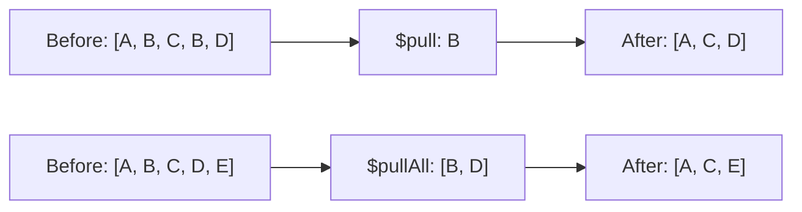

# How to Use $pull and $pullAll in MongoDB to Remove Array Elements

Author: [nawazdhandala](https://www.github.com/nawazdhandala)

Tags: MongoDB, $pull, $pullAll, Array, Update, Operator

Description: Learn how to remove specific elements from MongoDB array fields using $pull (by value or condition) and $pullAll (remove multiple exact values at once).

---

## How $pull and $pullAll Work

`$pull` removes all array elements that match a specified value or condition. `$pullAll` removes all array elements that exactly match any value in a given list. Both operators modify the array in place without creating a new document.



## $pull Syntax

```javascript
{ $pull: { arrayField: value } }
{ $pull: { arrayField: { condition } } }
```

## $pullAll Syntax

```javascript
{ $pullAll: { arrayField: [value1, value2, ...] } }
```

## Basic $pull - Remove by Exact Value

Remove all occurrences of a specific value from an array:

```javascript
// Before: { _id: 1, tags: ["mongodb", "nosql", "database", "nosql"] }

db.articles.updateOne(
  { _id: 1 },
  { $pull: { tags: "nosql" } }
)

// After: { _id: 1, tags: ["mongodb", "database"] }
// Both occurrences of "nosql" are removed
```

## $pull - Remove by Condition

Remove all elements that satisfy a condition:

```javascript
// Before: { _id: 2, scores: [55, 72, 40, 88, 30] }

db.students.updateOne(
  { _id: 2 },
  { $pull: { scores: { $lt: 60 } } }
)

// After: { _id: 2, scores: [72, 88] }
// All scores below 60 are removed
```

## $pull - Remove Embedded Documents by Condition

Remove embedded documents that match a condition:

```javascript
// Before:
// {
//   _id: 3,
//   orders: [
//     { id: "ORD-1", status: "completed" },
//     { id: "ORD-2", status: "cancelled" },
//     { id: "ORD-3", status: "completed" }
//   ]
// }

db.users.updateOne(
  { _id: 3 },
  { $pull: { orders: { status: "cancelled" } } }
)

// After: orders contains only ORD-1 and ORD-3
```

## $pull with $in for Multiple Values

Remove multiple specific values using `$in` inside the condition:

```javascript
// Before: { _id: 4, roles: ["viewer", "editor", "admin", "moderator"] }

db.users.updateOne(
  { _id: 4 },
  { $pull: { roles: { $in: ["editor", "moderator"] } } }
)

// After: { _id: 4, roles: ["viewer", "admin"] }
```

## $pullAll - Remove Exact Values from a List

`$pullAll` removes all elements that exactly match any value in the provided array:

```javascript
// Before: { _id: 5, tags: ["mongodb", "nosql", "database", "tutorial"] }

db.articles.updateOne(
  { _id: 5 },
  { $pullAll: { tags: ["nosql", "tutorial"] } }
)

// After: { _id: 5, tags: ["mongodb", "database"] }
```

## $pull vs $pullAll

```text
$pull                           $pullAll
------------------------------  ---------------------------------
Can remove by value or condition   Removes by exact value match only
Supports $gt, $lt, $regex, etc.    No condition operators supported
Remove all matching elements     Remove all exact matches
Use for complex removal logic    Use for simple multi-value removal
```

## Removing from Multiple Arrays

```javascript
db.users.updateOne(
  { _id: 6 },
  {
    $pull: {
      tags: "archived",
      roles: "temporary"
    }
  }
)
```

## Applying $pull Across All Documents

```javascript
// Remove the "beta" tag from all articles
db.articles.updateMany(
  {},
  { $pull: { tags: "beta" } }
)
```

## Use Cases

- Removing a user from a group's member list
- Deleting a specific tag from a post
- Removing cancelled or expired items from an order array
- Cleaning up stale notifications from a user's notification list
- Revoking a specific permission from a roles array

## Summary

`$pull` is the flexible array element removal operator - it removes all elements matching either an exact value or a query condition. `$pullAll` is a convenience operator for removing multiple exact values at once. Use `$pull` with `$in` for removing multiple exact values when you also want to use query operators. Both operators remove all matching occurrences (not just the first one), making them safe for arrays that may contain duplicate values.
