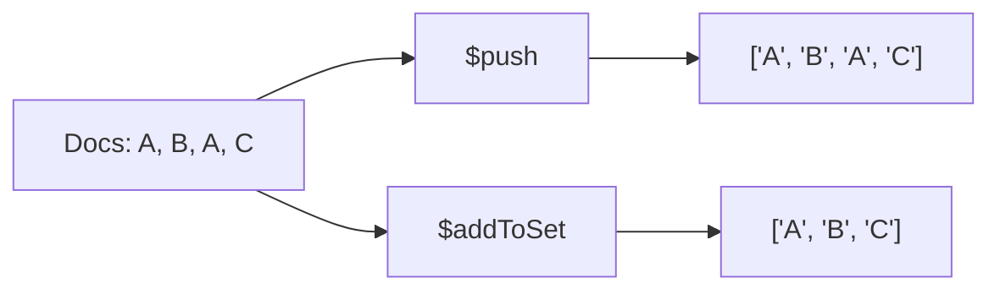

# How to Use $push and $addToSet Accumulators in MongoDB Aggregation

Author: [nawazdhandala](https://www.github.com/nawazdhandala)

Tags: MongoDB, Aggregation, $push, $addToSet, Accumulator, $group

Description: Learn how to use $push and $addToSet accumulators in MongoDB aggregation to collect field values into arrays per group.

---

## How $push and $addToSet Work

Both `$push` and `$addToSet` are accumulator operators used in the `$group` stage to collect values from multiple documents into an array.

- `$push` adds every value to the array, including duplicates.
- `$addToSet` adds only unique values, discarding duplicates. The order of elements in the resulting array is unspecified.



## Syntax

```javascript
{
  $group: {
    _id: "<groupKey>",
    allValues:    { $push: "$field" },
    uniqueValues: { $addToSet: "$field" }
  }
}
```

Both operators accept any expression, not just field references.

## Examples

### Input Documents

```javascript
[
  { _id: 1, customerId: "C1", product: "Laptop",  tag: "electronics" },
  { _id: 2, customerId: "C2", product: "Phone",   tag: "electronics" },
  { _id: 3, customerId: "C1", product: "Monitor", tag: "electronics" },
  { _id: 4, customerId: "C2", product: "Laptop",  tag: "computers"   },
  { _id: 5, customerId: "C1", product: "Laptop",  tag: "computers"   }
]
```

### Example 1 - $push: Collect All Values

Collect every product purchased by each customer (including duplicates):

```javascript
db.orders.aggregate([
  {
    $group: {
      _id: "$customerId",
      allProducts: { $push: "$product" }
    }
  }
])
```

Output:

```javascript
[
  { _id: "C1", allProducts: ["Laptop", "Monitor", "Laptop"] },
  { _id: "C2", allProducts: ["Phone", "Laptop"] }
]
```

### Example 2 - $addToSet: Collect Unique Values

Collect the unique set of products purchased by each customer:

```javascript
db.orders.aggregate([
  {
    $group: {
      _id: "$customerId",
      uniqueProducts: { $addToSet: "$product" }
    }
  }
])
```

Output:

```javascript
[
  { _id: "C1", uniqueProducts: ["Laptop", "Monitor"] },   // order may vary
  { _id: "C2", uniqueProducts: ["Phone", "Laptop"] }
]
```

### Example 3 - $push with an Expression (Build Objects)

Push entire sub-objects into the array per group:

```javascript
db.orders.aggregate([
  {
    $group: {
      _id: "$customerId",
      orderDetails: {
        $push: {
          product: "$product",
          orderId: "$_id"
        }
      }
    }
  }
])
```

Output:

```javascript
[
  {
    _id: "C1",
    orderDetails: [
      { product: "Laptop",  orderId: 1 },
      { product: "Monitor", orderId: 3 },
      { product: "Laptop",  orderId: 5 }
    ]
  },
  {
    _id: "C2",
    orderDetails: [
      { product: "Phone",  orderId: 2 },
      { product: "Laptop", orderId: 4 }
    ]
  }
]
```

### Example 4 - $addToSet for Unique Tags

Collect all unique tags used across orders per customer:

```javascript
db.orders.aggregate([
  {
    $group: {
      _id: "$customerId",
      tagSet: { $addToSet: "$tag" }
    }
  }
])
```

Output:

```javascript
[
  { _id: "C1", tagSet: ["electronics", "computers"] },
  { _id: "C2", tagSet: ["electronics", "computers"] }
]
```

### Example 5 - Combining $push with $sum

Get both the list of products and the count per customer:

```javascript
db.orders.aggregate([
  {
    $group: {
      _id: "$customerId",
      products: { $push: "$product" },
      totalOrders: { $sum: 1 }
    }
  }
])
```

Output:

```javascript
[
  { _id: "C1", products: ["Laptop", "Monitor", "Laptop"], totalOrders: 3 },
  { _id: "C2", products: ["Phone", "Laptop"],             totalOrders: 2 }
]
```

### Example 6 - $addToSet to Count Distinct Values

Count the number of unique products per customer by using `$size` on the `$addToSet` result:

```javascript
db.orders.aggregate([
  {
    $group: {
      _id: "$customerId",
      uniqueProducts: { $addToSet: "$product" }
    }
  },
  {
    $project: {
      uniqueProductCount: { $size: "$uniqueProducts" }
    }
  }
])
```

Output:

```javascript
[
  { _id: "C1", uniqueProductCount: 2 },
  { _id: "C2", uniqueProductCount: 2 }
]
```

## $push vs $addToSet

| Feature | $push | $addToSet |
|---|---|---|
| Keeps duplicates | Yes | No |
| Preserves insertion order | Yes | No (order is unspecified) |
| Memory usage | Higher (all values) | Lower (unique values only) |
| Use case | Full history, event logs | Unique value sets, tag lists |

## Use Cases

- Collecting all order IDs or products per customer (`$push`)
- Building tag sets or category lists per entity (`$addToSet`)
- Constructing array fields for document denormalization
- Finding distinct value counts by combining `$addToSet` and `$size`

## Summary

`$push` collects all values (including duplicates) into an array per group, while `$addToSet` collects only unique values. Use `$push` when you need the complete history of values and `$addToSet` when you need a distinct set. Both accept complex expressions including sub-objects, enabling you to build rich array fields from grouped documents.
