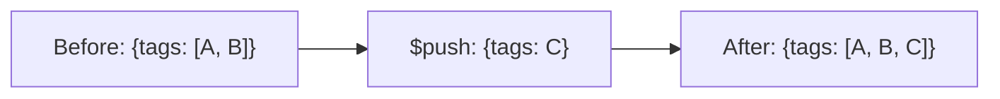

# How to Use $push Operator in MongoDB to Add Array Elements

Author: [nawazdhandala](https://www.github.com/nawazdhandala)

Tags: MongoDB, $push, Array, Update, Operator

Description: Learn how to use MongoDB's $push operator to append elements to an array field in a document, including adding single items, multiple items with $each, and sorted inserts.

---

## How $push Works

The `$push` operator appends a value to an array field. If the field does not exist, `$push` creates the array and adds the element. `$push` always appends - even if the value already exists in the array (use `$addToSet` if you want to prevent duplicates).



## Syntax

```javascript
{ $push: { arrayField: value } }
```

## Basic Push - Appending a Single Value

Append a string to an array:

```javascript
// Before: { _id: 1, title: "My Post", tags: ["mongodb", "database"] }

db.posts.updateOne(
  { _id: 1 },
  { $push: { tags: "tutorial" } }
)

// After: { _id: 1, title: "My Post", tags: ["mongodb", "database", "tutorial"] }
```

## Pushing to a Non-Existent Array

If the array field does not exist, `$push` creates it:

```javascript
// Before: { _id: 2, name: "Bob" }

db.users.updateOne(
  { _id: 2 },
  { $push: { notifications: "You have a new message" } }
)

// After: { _id: 2, name: "Bob", notifications: ["You have a new message"] }
```

## Pushing Embedded Documents

Push an object into an array:

```javascript
// Before: { _id: 3, userId: ObjectId("..."), orders: [] }

db.users.updateOne(
  { _id: 3 },
  {
    $push: {
      orders: {
        orderId: "ORD-101",
        amount: 49.99,
        status: "pending",
        createdAt: new Date()
      }
    }
  }
)
```

## Pushing Multiple Elements with $each

Use `$each` to push multiple values in one operation:

```javascript
// Before: { _id: 4, scores: [80, 90] }

db.students.updateOne(
  { _id: 4 },
  {
    $push: {
      scores: { $each: [85, 95, 70] }
    }
  }
)

// After: { _id: 4, scores: [80, 90, 85, 95, 70] }
```

## Limiting Array Size with $slice

Combine `$push` with `$slice` to cap the array at a maximum size (like a rolling window):

```javascript
// Keep only the 5 most recent log entries
db.sessions.updateOne(
  { userId: "user-123" },
  {
    $push: {
      activityLog: {
        $each: [{ action: "login", at: new Date() }],
        $slice: -5
      }
    }
  }
)
```

## Sorting After Push with $sort

Use `$sort` to keep the array sorted after pushing:

```javascript
// Push a new score and keep the array sorted in descending order
db.leaderboard.updateOne(
  { gameId: "game-001" },
  {
    $push: {
      scores: {
        $each: [{ player: "Alice", score: 850 }],
        $sort: { score: -1 }
      }
    }
  }
)
```

## Inserting at a Position with $position

Use `$position` to insert at a specific index instead of appending:

```javascript
// Insert at position 0 (prepend to the array)
db.posts.updateOne(
  { _id: 1 },
  {
    $push: {
      tags: {
        $each: ["featured"],
        $position: 0
      }
    }
  }
)
```

## Duplicate Values

Unlike `$addToSet`, `$push` does not check for duplicates:

```javascript
// Before: { tags: ["mongodb", "database"] }

db.posts.updateOne({ _id: 1 }, { $push: { tags: "mongodb" } })

// After: { tags: ["mongodb", "database", "mongodb"] }  -- duplicate allowed
```

If you want to prevent duplicates, use `$addToSet` instead.

## Use Cases

- Adding a comment to a post's comments array
- Recording a new order in a user's order history
- Appending a log entry to an activity log
- Building a queue of pending tasks
- Collecting tags, categories, or labels incrementally

## Summary

`$push` appends one or more values to an array field in MongoDB. It creates the array if it does not exist and always appends without duplicate checking. Use `$each` to push multiple values at once, `$slice` to maintain a bounded rolling window, `$sort` to keep the array sorted after insertion, and `$position` to insert at a specific index. For duplicate-free inserts, use `$addToSet` instead of `$push`.
