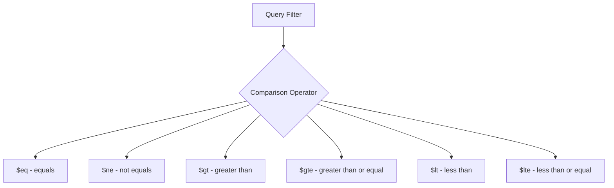

# How to Use Query Operators in MongoDB ($eq, $ne, $gt, $lt)

Author: [nawazdhandala](https://www.github.com/nawazdhandala)

Tags: MongoDB, Query, $eq, $ne, $gt, $lt, Operator, Comparison

Description: Learn how to use MongoDB comparison query operators $eq, $ne, $gt, $gte, $lt, and $lte to filter documents based on field values.

---

## How Comparison Operators Work

MongoDB provides a set of comparison operators that allow you to filter documents based on how field values compare to a given value. These operators are placed inside the filter document using the syntax `{ field: { $operator: value } }`.



## Operator Reference

```text
$eq   - Matches values equal to a specified value
$ne   - Matches values not equal to a specified value
$gt   - Matches values greater than a specified value
$gte  - Matches values greater than or equal to a specified value
$lt   - Matches values less than a specified value
$lte  - Matches values less than or equal to a specified value
```

## $eq - Equals Operator

The `$eq` operator matches documents where a field equals a specific value. For simple equality, you can use shorthand notation:

```javascript
// Explicit $eq
db.users.find({ status: { $eq: "active" } })

// Shorthand (equivalent)
db.users.find({ status: "active" })
```

The explicit form is useful when building query objects dynamically:

```javascript
const field = "role"
const value = "admin"
const filter = { [field]: { $eq: value } }
db.users.find(filter)
```

## $ne - Not Equals Operator

Matches documents where the field does not equal the specified value, including documents where the field does not exist:

```javascript
// Find all orders that are not cancelled
db.orders.find({ status: { $ne: "cancelled" } })
```

## $gt - Greater Than Operator

Matches documents where the field value is strictly greater than the specified value:

```javascript
// Products with price greater than 100
db.products.find({ price: { $gt: 100 } })

// Users older than 25
db.users.find({ age: { $gt: 25 } })

// Orders placed after a specific date
db.orders.find({ createdAt: { $gt: new Date("2024-01-01") } })
```

## $gte - Greater Than or Equal Operator

```javascript
// Products with price 100 or more
db.products.find({ price: { $gte: 100 } })

// Documents created from January 1, 2024 onward
db.events.find({ timestamp: { $gte: ISODate("2024-01-01T00:00:00Z") } })
```

## $lt - Less Than Operator

Matches documents where the field value is strictly less than the specified value:

```javascript
// Products under $50
db.products.find({ price: { $lt: 50 } })

// Find items with low stock
db.inventory.find({ quantity: { $lt: 10 } })
```

## $lte - Less Than or Equal Operator

```javascript
// Products at most $50
db.products.find({ price: { $lte: 50 } })

// Users aged 18 or younger
db.users.find({ age: { $lte: 18 } })
```

## Combining Comparisons for Range Queries

Combine `$gt` and `$lt` (or `$gte` and `$lte`) on the same field for a range query:

```javascript
// Products between $20 and $100
db.products.find({ price: { $gte: 20, $lte: 100 } })

// Orders from a specific date range
db.orders.find({
  createdAt: {
    $gte: ISODate("2024-01-01T00:00:00Z"),
    $lt:  ISODate("2024-02-01T00:00:00Z")
  }
})
```

## Combining Multiple Fields

Multiple comparison conditions across different fields are implicitly ANDed:

```javascript
// Active users older than 21 with a verified email
db.users.find({
  status: { $eq: "active" },
  age: { $gt: 21 },
  emailVerified: { $eq: true }
})
```

## Comparison on String Fields

String comparisons follow lexicographic (alphabetical) order:

```javascript
// Names starting with letters after "M"
db.contacts.find({ lastName: { $gt: "M" } })
```

## Use Cases

- Filtering products by price range
- Finding users within an age bracket
- Querying events within a time window
- Alerting when inventory falls below a threshold
- Filtering by version numbers or sequence IDs

## Summary

MongoDB's comparison operators - `$eq`, `$ne`, `$gt`, `$gte`, `$lt`, and `$lte` - are fundamental building blocks for querying collections. Use them individually for simple comparisons or combine multiple operators on the same field to create range queries. They work consistently across numeric, string, and date fields, making them versatile for a wide variety of query patterns.
