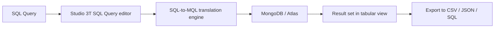

# How to Query MongoDB with SQL Using Studio 3T

Author: [nawazdhandala](https://www.github.com/nawazdhandala)

Tags: MongoDB, SQL, Studio 3T, Query, Tool

Description: Learn how to use Studio 3T's SQL Query tab to run standard SQL SELECT statements against MongoDB collections without learning MQL.

---

## What Is Studio 3T

Studio 3T is a GUI client for MongoDB that includes an SQL Query editor alongside an IntelliShell MQL editor, a visual query builder, and a document viewer. Its SQL layer translates SQL `SELECT` statements into MongoDB aggregation pipelines automatically.



## Step 1: Connect to MongoDB

1. Open Studio 3T.
2. Click **Connect** > **New Connection**.
3. Enter your connection URI (Atlas URI, localhost, or replica set).
4. Click **Test Connection** then **Save & Connect**.
5. Double-click the connection to open the database.

## Step 2: Open the SQL Query Editor

1. Expand the database and right-click a collection.
2. Choose **Open SQL Query** (or use the toolbar: **IntelliShell** dropdown > **SQL Query**).
3. The SQL tab opens with the selected collection pre-populated in a `FROM` clause.

## Step 3: Basic SELECT Queries

```sql
-- Select all documents (equivalent to db.orders.find())
SELECT * FROM orders;

-- Select specific fields (projection)
SELECT _id, customerId, total, status, createdAt
FROM orders;

-- Filter with WHERE
SELECT _id, total, status
FROM orders
WHERE status = 'shipped'
  AND total > 100;

-- ORDER BY and LIMIT
SELECT _id, customerId, total
FROM orders
WHERE status = 'pending'
ORDER BY createdAt DESC
LIMIT 20;
```

## Step 4: Aggregation Functions

```sql
-- Count documents
SELECT COUNT(*) AS total_orders FROM orders;

-- SUM, AVG, MIN, MAX
SELECT
  status,
  COUNT(*)     AS count,
  SUM(total)   AS revenue,
  AVG(total)   AS avg_order,
  MIN(total)   AS min_order,
  MAX(total)   AS max_order
FROM orders
GROUP BY status;

-- Revenue by month
SELECT
  YEAR(createdAt)  AS year,
  MONTH(createdAt) AS month,
  SUM(total)       AS monthly_revenue,
  COUNT(*)         AS order_count
FROM orders
WHERE createdAt >= '2026-01-01'
GROUP BY YEAR(createdAt), MONTH(createdAt)
ORDER BY year, month;
```

## Step 5: Querying Nested Fields

Use dot notation to access nested document fields.

```sql
-- Access nested field
SELECT
  _id,
  "shippingAddress.city"    AS city,
  "shippingAddress.country" AS country,
  total
FROM orders
WHERE "shippingAddress.country" = 'US';

-- Group by nested field
SELECT
  "metadata.sensorId" AS sensor_id,
  AVG(temperature)    AS avg_temp,
  MAX(temperature)    AS max_temp
FROM sensor_readings
WHERE ts >= '2026-03-31'
GROUP BY "metadata.sensorId"
ORDER BY avg_temp DESC;
```

## Step 6: JOIN Across Collections

Studio 3T's SQL Query supports `JOIN` between collections in the same database.

```sql
-- JOIN orders with users
SELECT
  o._id          AS order_id,
  u.name         AS customer_name,
  u.email,
  o.total,
  o.status
FROM orders o
JOIN users u ON o.customerId = u._id
WHERE o.status = 'shipped'
  AND o.createdAt >= '2026-01-01'
ORDER BY o.total DESC
LIMIT 50;

-- LEFT JOIN to include orders without a matching user
SELECT
  o._id        AS order_id,
  u.name       AS customer_name,
  o.total
FROM orders o
LEFT JOIN users u ON o.customerId = u._id;
```

## Step 7: Querying Arrays

Use `UNWIND` (or the `ANY` / `IN` SQL construct) to query array fields.

```sql
-- Find orders containing a specific SKU
SELECT _id, total
FROM orders
WHERE 'WIDGET-1' IN items[*].sku;

-- Count orders per tag (unwind the tags array)
SELECT
  tag,
  COUNT(*) AS count
FROM articles
CROSS JOIN UNNEST(tags) AS t(tag)
GROUP BY tag
ORDER BY count DESC;
```

## Step 8: View the Generated MQL

Studio 3T shows the MQL pipeline it generated from your SQL query - great for learning MongoDB aggregation syntax.

```text
After running a SQL query:
1. Click the "Code" icon (< >) in the result toolbar.
2. Studio 3T shows the equivalent aggregation pipeline, e.g.:

[
  { "$match": { "status": "shipped", "total": { "$gt": 100 } } },
  { "$project": { "_id": 1, "total": 1, "status": 1 } },
  { "$sort": { "createdAt": -1 } },
  { "$limit": 20 }
]
```

## Step 9: Export Results

```text
After running a query:
1. Click Export in the result toolbar.
2. Choose format: CSV, JSON, SQL INSERT, or Excel.
3. Choose columns and delimiter.
4. Save or copy to clipboard.
```

## SQL Functions Supported by Studio 3T

| SQL function | MongoDB equivalent |
|---|---|
| `COUNT(*)` | `$sum: 1` |
| `SUM(field)` | `$sum: "$field"` |
| `AVG(field)` | `$avg: "$field"` |
| `YEAR(date)` | `$year: "$date"` |
| `MONTH(date)` | `$month: "$date"` |
| `UPPER(str)` | `$toUpper: "$str"` |
| `CONCAT(a, b)` | `$concat: ["$a", "$b"]` |
| `IFNULL(a, b)` | `$ifNull: ["$a", b]` |

## Limitations

- `INSERT`, `UPDATE`, and `DELETE` are not supported through the SQL query interface; use the document editor or MQL for writes.
- Complex subqueries and window functions may not be supported; use the IntelliShell tab for MQL aggregations in those cases.
- Schema inference is based on sampled documents; fields that appear infrequently may not show up in autocomplete.

## Summary

Studio 3T's SQL Query editor allows you to query MongoDB using standard SQL `SELECT` statements, `GROUP BY` aggregations, `JOIN` across collections, and dot-notation access to nested fields. Every SQL query is translated to a MongoDB aggregation pipeline that you can inspect and learn from. Export results to CSV or JSON for further analysis. For writes and complex aggregations beyond SQL's reach, use Studio 3T's IntelliShell tab with full MQL support.
