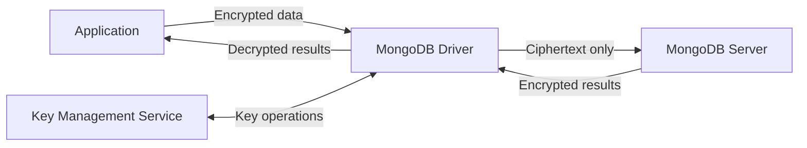
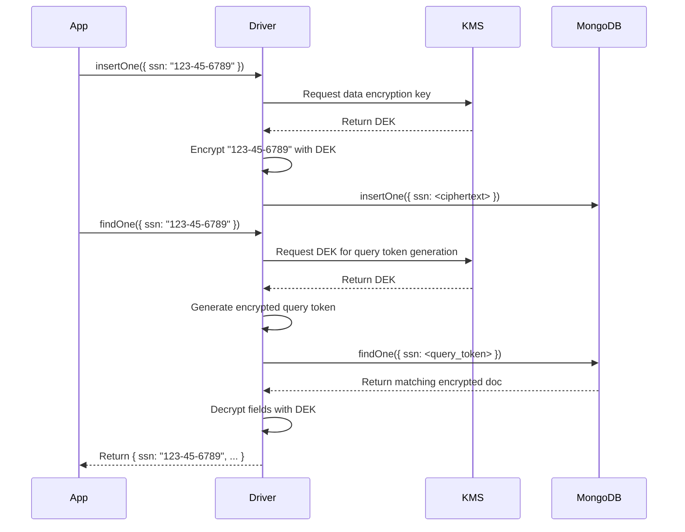

# How to Set Up Queryable Encryption in MongoDB

Author: [nawazdhandala](https://www.github.com/nawazdhandala)

Tags: MongoDB, Security, Encryption, Privacy, Database

Description: Learn how to configure MongoDB Queryable Encryption to store and query encrypted fields without exposing plaintext data to the database server.

---

## What is Queryable Encryption

Queryable Encryption (QE) is a MongoDB feature that allows client applications to encrypt sensitive fields before sending them to the server. Unlike Client-Side Field Level Encryption (CSFLE), Queryable Encryption lets you run equality and range queries directly on encrypted data without the server ever seeing the plaintext.



## Requirements

- MongoDB 7.0+ (or 6.0 Enterprise / Atlas)
- MongoDB Node.js driver 5.x or later
- A Key Management Service (AWS KMS, Azure Key Vault, GCP KMS, or local master key for development)
- `mongodb-client-encryption` library

## Install Dependencies

```bash
npm install mongodb mongodb-client-encryption
```

## Configure a Local Master Key (Development Only)

For production always use a cloud KMS. For local development you can use a 96-byte local master key:

```javascript
const crypto = require("crypto");
const fs = require("fs");

// Generate a local master key once and persist it
const localMasterKey = crypto.randomBytes(96);
fs.writeFileSync("local_master_key.bin", localMasterKey);
```

## Create the Encryption Key

```javascript
const { MongoClient, Binary } = require("mongodb");
const { ClientEncryption } = require("mongodb-client-encryption");
const fs = require("fs");

const localMasterKey = fs.readFileSync("local_master_key.bin");

const kmsProviders = {
  local: { key: localMasterKey }
};

const keyVaultNamespace = "encryption.__keyVault";

async function createEncryptionKey() {
  const client = new MongoClient("mongodb://localhost:27017");
  await client.connect();

  const encryption = new ClientEncryption(client, {
    keyVaultNamespace,
    kmsProviders
  });

  const keyId = await encryption.createDataKey("local", {
    keyAltNames: ["patientSSNKey"]
  });

  console.log("Created data key with id:", keyId.toString("base64"));
  await client.close();
  return keyId;
}

createEncryptionKey();
```

## Define an Encrypted Fields Map

The encrypted fields map tells the driver which fields to encrypt and what query types to support:

```javascript
const encryptedFieldsMap = {
  "medicalApp.patients": {
    fields: [
      {
        path: "ssn",
        bsonType: "string",
        queries: [{ queryType: "equality" }]
      },
      {
        path: "dateOfBirth",
        bsonType: "date",
        queries: [{ queryType: "range", min: new Date("1900-01-01"), max: new Date("2025-12-31") }]
      },
      {
        path: "creditCard",
        bsonType: "string"
        // No queries means the field is encrypted but not queryable
      }
    ]
  }
};
```

## Create an Auto-Encryption Client

```javascript
const { MongoClient } = require("mongodb");
const fs = require("fs");

const localMasterKey = fs.readFileSync("local_master_key.bin");

const kmsProviders = { local: { key: localMasterKey } };

const autoEncryptionOptions = {
  keyVaultNamespace: "encryption.__keyVault",
  kmsProviders,
  encryptedFieldsMap
};

async function getQEClient() {
  const client = new MongoClient("mongodb://localhost:27017", {
    autoEncryption: autoEncryptionOptions
  });
  await client.connect();
  return client;
}
```

## Create the Collection with Encrypted Fields

The collection must be created with the encrypted fields configuration before inserting data:

```javascript
async function setupCollection() {
  const client = await getQEClient();
  const db = client.db("medicalApp");

  await db.createCollection("patients", {
    encryptedFields: encryptedFieldsMap["medicalApp.patients"]
  });

  console.log("Collection created with Queryable Encryption");
  await client.close();
}

setupCollection();
```

## Insert Encrypted Documents

With the auto-encryption client, inserts look identical to normal MongoDB operations. The driver encrypts automatically:

```javascript
async function insertPatient() {
  const client = await getQEClient();
  const db = client.db("medicalApp");

  await db.collection("patients").insertOne({
    name: "Alice Smith",
    ssn: "123-45-6789",
    dateOfBirth: new Date("1985-06-15"),
    creditCard: "4111111111111111",
    diagnosis: "Hypertension"
  });

  console.log("Patient inserted with encrypted fields");
  await client.close();
}
```

## Query Encrypted Fields

Equality and range queries work on encrypted fields without the server seeing plaintext:

```javascript
async function queryPatients() {
  const client = await getQEClient();
  const db = client.db("medicalApp");

  // Equality query on encrypted SSN
  const bySSN = await db.collection("patients").findOne({
    ssn: "123-45-6789"
  });
  console.log("Found by SSN:", bySSN.name);

  // Range query on encrypted date
  const byAge = await db.collection("patients").find({
    dateOfBirth: {
      $gt: new Date("1980-01-01"),
      $lt: new Date("1990-12-31")
    }
  }).toArray();
  console.log("Patients born 1980-1990:", byAge.length);

  await client.close();
}
```

## Using AWS KMS in Production

Replace the local key provider with AWS KMS for production workloads:

```javascript
const kmsProviders = {
  aws: {
    accessKeyId: process.env.AWS_ACCESS_KEY_ID,
    secretAccessKey: process.env.AWS_SECRET_ACCESS_KEY
  }
};

const encryption = new ClientEncryption(client, {
  keyVaultNamespace: "encryption.__keyVault",
  kmsProviders
});

const keyId = await encryption.createDataKey("aws", {
  masterKey: {
    region: "us-east-1",
    key: "arn:aws:kms:us-east-1:111122223333:key/abcd1234-..."
  },
  keyAltNames: ["patientSSNKey"]
});
```

## How Queryable Encryption Works Internally



## Limitations

- Queryable Encryption requires MongoDB 7.0+ or Atlas (6.0 Enterprise).
- Encrypted fields cannot use text indexes, geospatial indexes, or array operators.
- Only equality and range query types are supported on encrypted fields.
- Aggregation pipelines can match on encrypted fields using `$match` with supported operators.
- Each encrypted field adds overhead because of the additional metadata stored alongside ciphertext.

## Summary

Queryable Encryption lets MongoDB store sensitive fields as ciphertext while still supporting equality and range queries. The database server never sees plaintext values. Set up a KMS provider, define an encrypted fields map, create collections with that map, and use an auto-encryption client for transparent encryption and decryption in application code. For production, use a managed KMS such as AWS KMS, Azure Key Vault, or GCP KMS rather than a local master key.
