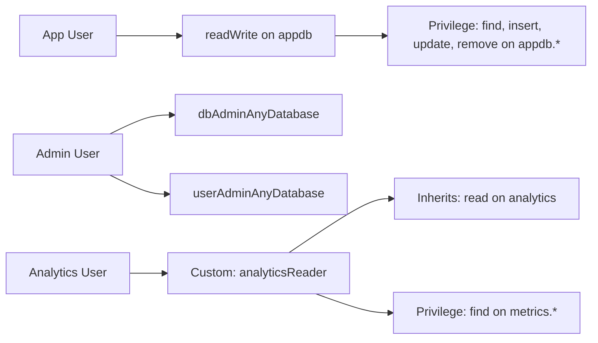
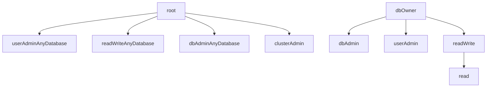

# How to Use Role-Based Access Control (RBAC) in MongoDB

Author: [nawazdhandala](https://www.github.com/nawazdhandala)

Tags: MongoDB, RBAC, Security, Authorization, Operations

Description: A comprehensive guide to MongoDB's Role-Based Access Control system, covering privilege design, role hierarchies, resource scoping, and access control best practices for production.

---

## What is RBAC in MongoDB

Role-Based Access Control (RBAC) is the security model MongoDB uses to determine what each authenticated user is allowed to do. Instead of assigning permissions directly to users, permissions are grouped into roles, and roles are assigned to users. This makes it easier to manage access at scale.



## Core RBAC Concepts

**Resource** - what the privilege applies to. A resource can be a specific collection, all collections in a database, or a cluster-wide resource.

**Action** - what operation is permitted on the resource (find, insert, update, remove, createIndex, etc.).

**Privilege** - the combination of a resource and one or more actions.

**Role** - a named set of privileges. Roles can also inherit from other roles.

**User** - an identity that has one or more roles assigned.

## Enabling RBAC

RBAC requires authentication to be enabled. Add the following to `/etc/mongod.conf`:

```yaml
security:
  authorization: enabled
```

Restart MongoDB after the change:

```bash
sudo systemctl restart mongod
```

## Role Hierarchy and Inheritance

Roles can inherit from other roles, allowing you to build layered permission structures.



## Designing a RBAC Strategy

For a typical web application with multiple services, a layered approach works well.

Define roles by function rather than by person. Example roles for an e-commerce application:

```text
Role: orderService        - readWrite on orders collection
Role: inventoryService    - readWrite on products collection
Role: reportingService    - read on orders, products, customers
Role: adminService        - dbAdmin on appdb (index management, stats)
```

Create the roles:

```javascript
use admin

// Order service role
db.createRole({
  role: "orderService",
  privileges: [
    {
      resource: { db: "ecommerce", collection: "orders" },
      actions: ["find", "insert", "update", "remove", "createIndex"]
    },
    {
      resource: { db: "ecommerce", collection: "orderEvents" },
      actions: ["find", "insert"]
    }
  ],
  roles: []
})

// Inventory service role
db.createRole({
  role: "inventoryService",
  privileges: [
    {
      resource: { db: "ecommerce", collection: "products" },
      actions: ["find", "insert", "update", "remove"]
    }
  ],
  roles: []
})

// Reporting role (read-only across multiple collections)
db.createRole({
  role: "reportingService",
  privileges: [
    {
      resource: { db: "ecommerce", collection: "" },
      actions: ["find", "listCollections", "collStats"]
    }
  ],
  roles: []
})
```

Assign roles to users:

```javascript
use ecommerce

db.createUser({
  user: "orderSvc",
  pwd: passwordPrompt(),
  roles: [{ role: "orderService", db: "admin" }]
})

db.createUser({
  user: "reportingSvc",
  pwd: passwordPrompt(),
  roles: [{ role: "reportingService", db: "admin" }]
})
```

## Scoping Roles to Specific Resources

MongoDB allows privileges at three levels of resource specificity.

A specific collection:

```javascript
{ resource: { db: "myapp", collection: "orders" }, actions: ["find"] }
```

All collections in a database (empty string for collection):

```javascript
{ resource: { db: "myapp", collection: "" }, actions: ["find"] }
```

All collections in all databases (empty strings for both):

```javascript
{ resource: { db: "", collection: "" }, actions: ["find"] }
```

Cluster-wide actions (for administrative tasks):

```javascript
{ resource: { cluster: true }, actions: ["replSetGetStatus", "serverStatus"] }
```

## Auditing RBAC Configuration

View all roles and their privileges:

```javascript
use admin
db.getRoles({ showPrivileges: true, showBuiltinRoles: false })
```

View all users and their assigned roles:

```javascript
use admin
db.getUsers({ showPrivileges: true })
```

Check what a specific user can do:

```javascript
use admin
db.getUser("orderSvc", { showPrivileges: true })
```

## Checking Effective Privileges in a Session

From an authenticated session, check what the current user can do:

```javascript
db.runCommand({ connectionStatus: 1 })
```

This returns:

```text
{
  authInfo: {
    authenticatedUsers: [{ user: "orderSvc", db: "ecommerce" }],
    authenticatedUserRoles: [{ role: "orderService", db: "admin" }]
  },
  ok: 1
}
```

## RBAC for Replica Sets and Sharded Clusters

In a replica set or sharded cluster, inter-node authentication uses a keyfile or x509 certificates. The `clusterAdmin` role is needed for managing replication and sharding.

Create a cluster admin user:

```javascript
use admin

db.createUser({
  user: "clusterAdmin",
  pwd: passwordPrompt(),
  roles: [
    { role: "clusterAdmin", db: "admin" }
  ]
})
```

Configure the keyfile in `mongod.conf` for replica set member authentication:

```yaml
security:
  authorization: enabled
  keyFile: /etc/mongodb/keyfile
```

Generate a keyfile:

```bash
openssl rand -base64 756 > /etc/mongodb/keyfile
chmod 400 /etc/mongodb/keyfile
sudo chown mongodb:mongodb /etc/mongodb/keyfile
```

## Modifying Roles

Add a privilege to an existing custom role:

```javascript
use admin
db.grantPrivilegesToRole("orderService", [
  {
    resource: { db: "ecommerce", collection: "shipments" },
    actions: ["find", "insert", "update"]
  }
])
```

Remove a privilege from a role:

```javascript
use admin
db.revokePrivilegesFromRole("orderService", [
  {
    resource: { db: "ecommerce", collection: "shipments" },
    actions: ["remove"]
  }
])
```

## Best Practices

- Design roles around application functions (order service, payment service) rather than around individuals.
- Never share credentials between services; each service gets its own user.
- Use collection-scoped privileges when possible instead of database-wide access.
- Regularly review and remove unused roles and users.
- Document your RBAC design alongside your application architecture.
- Test role permissions in a staging environment before deploying to production.
- Enable MongoDB audit logging (`auditLog` configuration) to track who does what.

## Summary

MongoDB RBAC lets you control exactly what each user can do through a system of roles, privileges, and resource scoping. Designing roles around application services rather than individuals leads to a clean, manageable permission structure. Use collection-level resource scoping for fine-grained control, regularly audit your role assignments, and follow least-privilege principles to minimize the blast radius of any compromised credential.
