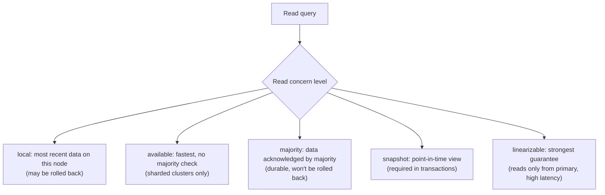

# How to Configure Read Concern in MongoDB Transactions

Author: [nawazdhandala](https://www.github.com/nawazdhandala)

Tags: MongoDB, Transaction, Read Concern, Consistency, Replica Set

Description: Learn how to choose the right read concern level for MongoDB transactions to balance data freshness, isolation, and performance.

---

## What Is Read Concern

Read concern controls the consistency and isolation properties of data returned by a read operation. In a replica set or sharded cluster, different nodes may have slightly different data at any point in time. Read concern lets you choose whether to read the most recent data (possibly not yet replicated) or only data that has been acknowledged by a majority of the replica set.



## Read Concern Levels at a Glance

| Level | Returns | Durability | Use in transactions |
|---|---|---|---|
| `local` | Most recent local data | May be rolled back | Default for non-txn reads |
| `available` | Fastest, no consistency guarantee | May be rolled back | Not for use in transactions |
| `majority` | Acknowledged by majority | Durable | Supported |
| `snapshot` | Consistent point-in-time snapshot | Durable | Recommended for transactions |
| `linearizable` | Reflects all prior writes to primary | Durable | Not supported in transactions |

## Default Read Concern for Transactions

MongoDB uses `snapshot` read concern by default for multi-document transactions. This gives all reads within the transaction a consistent view of the data as of the transaction start time.

```javascript
const { MongoClient } = require("mongodb");

const client = new MongoClient(process.env.MONGO_URI);
await client.connect();
const db = client.db("banking");

// Default: snapshot read concern
const session = client.startSession();
session.startTransaction();
// All reads in this transaction see a consistent snapshot
```

## Explicitly Setting Read Concern in a Transaction

```javascript
async function transferWithReadConcern(fromId, toId, amount) {
  const session = client.startSession();

  try {
    session.startTransaction({
      readConcern:  { level: "snapshot" },  // consistent snapshot for all reads
      writeConcern: { w: "majority" }       // durable writes
    });

    const from = await db.collection("accounts").findOne(
      { _id: fromId },
      { session }
    );

    if (!from || from.balance < amount) {
      throw new Error("Insufficient balance");
    }

    await db.collection("accounts").updateOne(
      { _id: fromId },
      { $inc: { balance: -amount } },
      { session }
    );

    await db.collection("accounts").updateOne(
      { _id: toId },
      { $inc: { balance: amount } },
      { session }
    );

    await session.commitTransaction();
    return { success: true };
  } catch (err) {
    await session.abortTransaction().catch(() => {});
    throw err;
  } finally {
    await session.endSession();
  }
}
```

## Read Concern majority vs snapshot

`majority` returns the latest data acknowledged by a majority. `snapshot` returns a consistent point-in-time view for all reads within the transaction - this means two reads of the same document within one transaction always return identical results even if a concurrent write commits between them.

```javascript
// snapshot: both reads return the same document state
session.startTransaction({ readConcern: { level: "snapshot" } });

const readOne = await db.collection("accounts").findOne({ _id: "acc-1" }, { session });
// Concurrent write to acc-1 happens here (different session)
const readTwo = await db.collection("accounts").findOne({ _id: "acc-1" }, { session });

// readOne.balance === readTwo.balance (snapshot isolation)
await session.commitTransaction();
```

## Read Concern local for Non-Critical Reads Inside a Transaction

In transactions that mix critical reads (needing `snapshot`) with non-critical lookups (reference data that rarely changes), all reads in the transaction use the transaction's read concern - you cannot mix levels within one transaction.

```javascript
// You cannot mix read concern levels within a single transaction
// All operations use the transaction-level readConcern
session.startTransaction({
  readConcern: { level: "snapshot" }
});

// Both reads below use snapshot regardless of any per-operation override
const account  = await db.collection("accounts").findOne({ _id: "acc-1" }, { session });
const currency = await db.collection("currencies").findOne({ code: "USD" }, { session });

await session.commitTransaction();
```

## Majority Read Concern for Non-Transactional Reads

Outside transactions, use `majority` when reading data that was just written to ensure you do not get a stale view from a lagging secondary.

```javascript
// Non-transactional read with majority concern
const doc = await db.collection("orders").findOne(
  { _id: orderId },
  { readConcern: { level: "majority" } }
);
```

## Linearizable Read Concern (Outside Transactions)

`linearizable` is the strictest level. It reflects all successful writes that were acknowledged before the read started. It is only supported on primary reads and is not allowed inside transactions.

```javascript
// Linearizable: only on primary, not inside transactions
const latest = await db.collection("config").findOne(
  { key: "feature_flags" },
  {
    readConcern: { level: "linearizable" },
    maxTimeMS: 5000  // required; linearizable may wait for prior writes to complete
  }
);
```

## Configuring Default Read Concern at the Client Level

```javascript
// Set a default read concern for all operations from this client
const clientWithDefaults = new MongoClient(process.env.MONGO_URI, {
  readConcernLevel: "majority"
});

// Override per-operation
const fastRead = await db.collection("cache").findOne(
  { key: "popular_products" },
  { readConcern: { level: "local" } }
);
```

## Summary

MongoDB transactions default to `snapshot` read concern, which gives all reads within the transaction a consistent point-in-time view. Use `snapshot` for financial or inventory transactions where reads must not see concurrent writes mid-transaction. Use `majority` for non-transactional reads where you need durability guarantees without full snapshot isolation. Use `linearizable` only for single-document reads on the primary when the strictest consistency is required and higher latency is acceptable.
