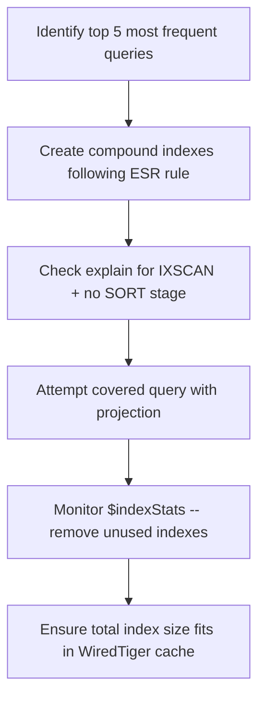

# How to Design Schemas for Read-Heavy Workloads in MongoDB

Read-heavy workloads -- where the application reads data far more often than it writes -- call for a different optimization strategy than write-heavy ones. The goal is to minimize the work MongoDB must do to satisfy each read: avoid joins, use covered queries, pre-compute aggregations, and ensure indexes fit in RAM.

## Core Principles for Read-Heavy Schema Design

1. **Denormalize** data so the most common reads are single-document fetches
2. **Pre-compute** aggregations rather than computing them at query time
3. **Design indexes** to cover the most frequent queries without document fetch
4. **Embed** data that is always read together
5. **Avoid unbounded arrays** that force full array scans

## Denormalization: Embed Read-Time Data

For a product listing page, embed all display data in the product document so no joins are needed.

```javascript
// Read-optimized product document
db.products.insertOne({
  _id: ObjectId("64a1b2c3d4e5f6789abc0001"),
  name: "Wireless Noise-Canceling Headphones",
  slug: "wireless-nc-headphones",
  price: 199.99,
  discountedPrice: 149.99,
  inStock: true,
  stockCount: 43,

  // Denormalized category hierarchy (avoids join on listing page)
  categories: [
    { _id: ObjectId("..."), name: "Electronics", slug: "electronics" },
    { _id: ObjectId("..."), name: "Audio", slug: "audio" }
  ],

  // Denormalized brand (avoids join)
  brand: {
    _id: ObjectId("..."),
    name: "SoundMax",
    logoUrl: "https://cdn.example.com/brands/soundmax.png"
  },

  // Pre-computed review summary (avoids aggregation on every read)
  reviewSummary: {
    averageRating: 4.5,
    totalReviews: 128,
    ratingDistribution: { "5": 78, "4": 32, "3": 12, "2": 4, "1": 2 }
  },

  images: [
    { url: "https://cdn.example.com/products/p1-main.jpg", alt: "Front view" },
    { url: "https://cdn.example.com/products/p1-side.jpg", alt: "Side view" }
  ],

  tags: ["wireless", "noise-canceling", "bluetooth", "headphones"],
  publishedAt: new Date("2024-01-10")
});
```

A single `findOne` returns everything needed for the product listing card and detail page -- no aggregation required.

## Pre-Computed Aggregations

Instead of computing `totalOrders` or `totalRevenue` at query time, update them with each write.

```javascript
// Pre-computed user stats
db.users.insertOne({
  _id: ObjectId("64a1b2c3d4e5f6789abc1001"),
  username: "alice",
  email: "alice@example.com",
  stats: {
    totalOrders: 45,
    totalSpent: 3452.99,
    totalReviews: 12,
    loyaltyPoints: 3452
  }
});

// Increment stats when an order is placed
async function placeOrder(db, userId, orderTotal) {
  const session = client.startSession();
  await session.withTransaction(async () => {
    await db.collection("orders").insertOne(
      { userId, total: orderTotal, placedAt: new Date() },
      { session }
    );
    await db.collection("users").updateOne(
      { _id: userId },
      {
        $inc: {
          "stats.totalOrders": 1,
          "stats.totalSpent": orderTotal,
          "stats.loyaltyPoints": Math.floor(orderTotal)
        }
      },
      { session }
    );
  });
  await session.endSession();
}
```

## Covered Queries: Serve Reads Entirely from Indexes

Design indexes so that frequently run queries never need to fetch documents from the collection.

```javascript
// Compound index that covers the product listing query
db.products.createIndex({
  "categories.slug": 1,
  publishedAt: -1,
  name: 1,
  price: 1,
  discountedPrice: 1,
  inStock: 1,
  "reviewSummary.averageRating": -1
});

// This query is fully covered -- no document fetch
const listings = await db.collection("products")
  .find(
    { "categories.slug": "electronics", inStock: true },
    {
      _id: 1,
      name: 1,
      price: 1,
      discountedPrice: 1,
      "reviewSummary.averageRating": 1
    }
  )
  .sort({ publishedAt: -1 })
  .limit(24)
  .explain("executionStats");

// Verify: executionStats.totalDocsExamined should be 0
```

## Read Replicas for Distributing Load

Distribute read queries across replica set secondaries to scale read throughput.

```javascript
const client = new MongoClient(uri, {
  readPreference: "secondaryPreferred"
});

// Analytics queries run on secondaries
const stats = await db.collection("orders")
  .aggregate(pipeline, { readPreference: "secondary" })
  .toArray();
```

## Projections: Limit Returned Data

Always project only the fields you need. Returning fewer fields reduces network transfer and deserialization time.

```javascript
// Only fetch fields needed for the inbox view
const notifications = await db.collection("notifications")
  .find({ userId, read: false })
  .projection({ title: 1, body: 1, createdAt: 1, type: 1, action: 1 })
  .sort({ createdAt: -1 })
  .limit(20)
  .toArray();
```

## Materialized Views with $merge

For expensive aggregations that power dashboards, use `$merge` to write results to a dedicated summary collection. Refresh periodically.

```javascript
// Compute and store hourly sales summary
async function refreshSalesSummary(db) {
  await db.collection("orders").aggregate([
    { $match: { status: "completed" } },
    {
      $group: {
        _id: {
          $dateTrunc: { date: "$placedAt", unit: "hour" }
        },
        totalRevenue: { $sum: "$total" },
        orderCount: { $sum: 1 },
        avgOrderValue: { $avg: "$total" }
      }
    },
    {
      $merge: {
        into: "salesSummaryHourly",
        on: "_id",
        whenMatched: "replace",
        whenNotMatched: "insert"
      }
    }
  ]).toArray();
}
```

## Index Strategy for Read-Heavy Collections



## Caching at the Application Layer

For data that changes infrequently and is read constantly (such as navigation categories, featured products, or configuration), cache in Redis or in-process memory.

```javascript
let categoryCache = null;
let cacheTtl = 0;

async function getCategories(db) {
  const now = Date.now();
  if (categoryCache && now < cacheTtl) {
    return categoryCache;
  }

  categoryCache = await db.collection("categories")
    .find({ visible: true })
    .sort({ order: 1 })
    .toArray();
  cacheTtl = now + 5 * 60 * 1000; // cache for 5 minutes
  return categoryCache;
}
```

## Summary

Read-heavy MongoDB workloads benefit from denormalized schemas that serve common reads from a single document, pre-computed aggregations that avoid recalculation on every request, and covered queries that return results entirely from indexes. Use the ESR rule when designing compound indexes, verify with `explain("executionStats")` that queries use IXSCAN without a SORT stage, and project only the fields you need. Distribute read load across replica set secondaries for analytics or reporting queries. For expensive recurring aggregations, use `$merge` to write pre-computed summaries to dedicated collections, and refresh them on a schedule.
