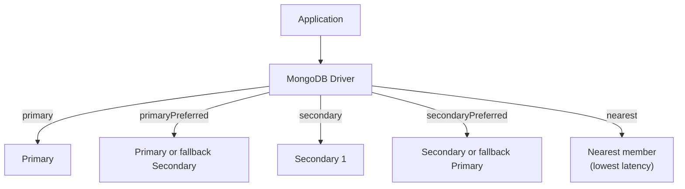

# How to Configure Read Preferences in MongoDB Replica Set

Author: [nawazdhandala](https://www.github.com/nawazdhandala)

Tags: MongoDB, Replica Set, Read Preference, Replication, Scalability

Description: Learn how to configure MongoDB read preferences to distribute reads across replica set members, reduce primary load, and balance consistency with performance.

---

## What are Read Preferences

Read preferences control which replica set member MongoDB drivers route read operations to. By default, all reads go to the primary. Routing reads to secondaries can distribute load and reduce primary overhead, but introduces the possibility of reading stale data.



## Read Preference Modes

```text
Mode                  Description
----------------------------------------------------------
primary               All reads from primary (default)
primaryPreferred      Primary preferred; secondary if unavailable
secondary             Reads from any secondary
secondaryPreferred    Secondary preferred; primary if no secondaries
nearest               Lowest network latency, any member
```

## Tag Sets

Tag sets let you route reads to specific members with matching tags. This is useful for:
- Routing analytics queries to dedicated reporting secondaries.
- Routing reads to members in the same data center as the application.

## Configuring Read Preference in Connection String

```javascript
// Read from any secondary
const uri = "mongodb://host1:27017,host2:27018,host3:27019/?replicaSet=rs0&readPreference=secondary";

// Read from nearest member
const uri2 = "mongodb://host1:27017,host2:27018,host3:27019/?replicaSet=rs0&readPreference=nearest";
```

## Configuring Read Preference in Node.js Driver

```javascript
const { MongoClient, ReadPreference } = require("mongodb");

const client = new MongoClient(
  "mongodb://host1:27017,host2:27018,host3:27019/?replicaSet=rs0",
  {
    readPreference: ReadPreference.SECONDARY_PREFERRED
  }
);
```

### Per-Operation Read Preference

Override read preference at the database, collection, or operation level:

```javascript
const { MongoClient, ReadPreference } = require("mongodb");

async function main() {
  const client = new MongoClient(
    "mongodb://localhost:27017,localhost:27018,localhost:27019/?replicaSet=rs0"
  );
  await client.connect();

  const db = client.db("myapp");

  // Default: reads from primary
  const users = db.collection("users");
  const primaryRead = await users.findOne({ email: "alice@example.com" });

  // Read from secondary for this collection
  const reportsCollection = db.collection("reports", {
    readPreference: ReadPreference.SECONDARY
  });
  const report = await reportsCollection.find({}).toArray();

  // Per-operation override
  const analytics = await db.collection("events").find(
    { date: { $gte: new Date("2026-01-01") } },
    { readPreference: ReadPreference.SECONDARY_PREFERRED }
  ).toArray();

  // Nearest - lowest latency, any member
  const cached = await db.collection("cache").findOne(
    { key: "homepage_data" },
    { readPreference: ReadPreference.NEAREST }
  );

  await client.close();
}

main().catch(console.error);
```

## Setting Up Tag Sets on Members

Add tags to replica set members using `rs.reconfig()`:

```javascript
// Get current config
const config = rs.conf();

// Tag member 0 (primary) as in the US-East data center
config.members[0].tags = { dc: "us-east", purpose: "primary" };

// Tag member 1 as secondary in US-East
config.members[1].tags = { dc: "us-east", purpose: "secondary" };

// Tag member 2 as secondary in US-West, dedicated for analytics
config.members[2].tags = { dc: "us-west", purpose: "analytics" };

config.version++;
rs.reconfig(config);
```

### Reading with Tag Sets

Route analytics queries to the analytics-tagged secondary:

```javascript
const { MongoClient, ReadPreference } = require("mongodb");

const analyticsReadPreference = new ReadPreference(
  ReadPreference.SECONDARY,
  [{ purpose: "analytics" }]   // tag set
);

const analyticsCollection = db.collection("events", {
  readPreference: analyticsReadPreference
});

// This read goes to the analytics-tagged secondary
const events = await analyticsCollection.find({ type: "purchase" }).toArray();
```

Route reads to the nearest member in the same data center:

```javascript
const localReadPreference = new ReadPreference(
  ReadPreference.NEAREST,
  [{ dc: "us-east" }]
);
```

## maxStalenessSeconds

Set a maximum staleness tolerance for secondary reads. If a secondary's data is more stale than this threshold, the driver will not use it:

```javascript
const { MongoClient, ReadPreference } = require("mongodb");

const readPref = new ReadPreference(
  ReadPreference.SECONDARY_PREFERRED,
  null,  // no tag sets
  { maxStalenessSeconds: 90 }  // reject secondaries > 90 seconds behind
);

const client = new MongoClient(uri, { readPreference: readPref });
```

Minimum allowed value is 90 seconds.

## Read Preference Trade-offs

```text
Use Case                         Recommended Mode
----------------------------------------------------------
Financial transactions           primary (strong consistency)
User profile reads               primaryPreferred
Product catalog reads            secondaryPreferred
Analytics / reporting            secondary + tag set
Geo-distributed, latency-sensitive  nearest + dc tag set
Session data                     primaryPreferred
Audit logs (write once, rarely read)  secondary
```

## Checking Which Member Served a Read

In mongosh, you can check which member handled a query:

```javascript
db.setProfilingLevel(1, { slowms: 0 })  // log all queries

// Run a query
db.users.find({ status: "active" }).toArray()

// Check system.profile for the operation
db.system.profile.findOne({}, { op: 1, ns: 1, server: 1 })
```

## Best Practices

- **Keep write-critical reads on `primary`** - user-facing reads that must be immediately consistent after a write.
- **Use `secondaryPreferred` for read-heavy workloads** where stale reads are acceptable (product listings, public content).
- **Use `secondary` + tag sets** to isolate analytics workloads from operational traffic.
- **Set `maxStalenessSeconds`** when using secondary reads to prevent reading very stale data.
- **Monitor replication lag** with `rs.printSecondaryReplicationInfo()` to understand actual staleness.
- **Use `nearest`** for global applications to reduce latency for reads that don't require consistency.

## Summary

Read preferences in MongoDB control which replica set member handles read operations. Configure them at the connection, database, collection, or operation level using the five modes: `primary`, `primaryPreferred`, `secondary`, `secondaryPreferred`, and `nearest`. Use tag sets to route specific query types to dedicated members. Set `maxStalenessSeconds` to bound acceptable replication lag for secondary reads. Choose a mode based on your consistency requirements and read load distribution needs.
