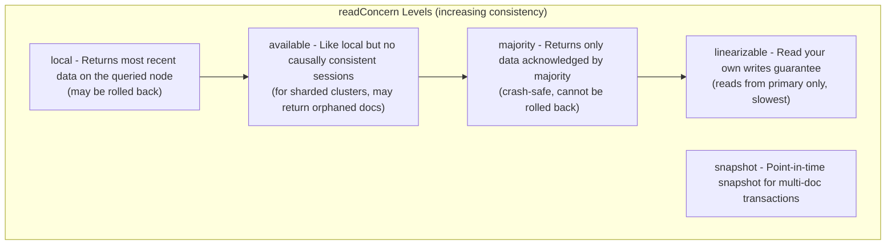

# How to Tune MongoDB readConcern for Consistency

Author: [nawazdhandala](https://www.github.com/nawazdhandala)

Tags: MongoDB, Read Concern, Consistency, Replication, Transaction

Description: Learn how to use MongoDB readConcern levels to control data consistency for reads, understand the tradeoffs, and choose the right level for your application.

---

## Introduction

`readConcern` in MongoDB controls the consistency and isolation of data returned by read operations. It lets you choose whether reads see the most recent data, only majority-committed data, or a snapshot-consistent view for transactions. Choosing the right `readConcern` level is essential for correctness in distributed deployments.

## readConcern Levels



## Default Behavior

Without specifying `readConcern`, MongoDB uses `local` for standalone and replica set reads, and `available` for sharded cluster reads.

## local readConcern

Returns the most recent data available on the queried node. Data may be rolled back if the node was a primary that stepped down without a majority of nodes acknowledging the write.

```javascript
db.orders.find(
  { status: "pending" },
  { readConcern: { level: "local" } }
).toArray()

// Same as the default
db.orders.find({ status: "pending" }).toArray()
```

Use `local` for: high-throughput reads where stale data is acceptable and rollback risk is low (e.g., analytics, counters).

## majority readConcern

Returns only data that has been acknowledged by a majority of replica set members. This data can never be rolled back.

```javascript
db.orders.find(
  { orderId: "ORD-1001" },
  { readConcern: { level: "majority" } }
).toArray()
```

In Node.js driver:

```javascript
const result = await db.collection("orders").findOne(
  { orderId: "ORD-1001" },
  { readConcern: { level: "majority" } }
)
```

Use `majority` for: financial records, inventory counts, or anything where reading a rolled-back value would cause a business error.

## linearizable readConcern

Guarantees that the read reflects the latest write from the same client (read-your-own-writes). Always reads from the primary and waits for all in-progress majority writes to complete.

```javascript
db.accounts.findOne(
  { accountId: "ACC-7777" },
  { readConcern: { level: "linearizable" }, maxTimeMS: 10000 }
)
```

**Important**: Always set `maxTimeMS` with `linearizable` to prevent the operation from hanging if the primary is unavailable.

Use `linearizable` for: read-modify-write patterns where you must see the latest committed state, such as account balance checks before debiting.

## snapshot readConcern (Multi-Document Transactions)

Provides a point-in-time snapshot consistent across all documents in a transaction:

```javascript
const session = db.getMongo().startSession()
session.startTransaction({
  readConcern: { level: "snapshot" },
  writeConcern: { w: "majority" }
})

try {
  const sessionDb = session.getDatabase("ecommerce")
  const order = sessionDb.orders.findOne({ orderId: "ORD-1001" })
  const product = sessionDb.inventory.findOne({ productId: order.productId })

  // Both reads see the same snapshot - consistent view
  sessionDb.inventory.updateOne(
    { productId: order.productId },
    { $inc: { stock: -order.quantity } }
  )

  session.commitTransaction()
} catch (e) {
  session.abortTransaction()
  throw e
} finally {
  session.endSession()
}
```

## Setting Default readConcern

Set a cluster-wide default:

```javascript
db.adminCommand({
  setDefaultRWConcern: 1,
  defaultReadConcern: { level: "majority" },
  writeConcern: { w: "majority" }
})
```

Verify the default:

```javascript
db.adminCommand({ getDefaultRWConcern: 1 })
```

## readConcern vs readPreference

These two are complementary:

| Setting | Controls |
|---|---|
| `readConcern` | Which data (committed to how many members) is returned |
| `readPreference` | Which replica set member to read from |

Example combining both:

```javascript
// Read majority-committed data from the nearest secondary
db.collection("events").find(
  { type: "purchase" },
  {
    readConcern: { level: "majority" },
    readPreference: "nearest"
  }
)
```

Note: `readConcern: majority` on secondaries returns the most recent majority-committed data as of that secondary's state.

## Causal Consistency

Use causal sessions to guarantee that reads always see your own writes, even when reading from secondaries:

```javascript
const session = db.getMongo().startSession({ causalConsistency: true })
const col = session.getDatabase("ecommerce").collection("orders")

// Write
await col.insertOne({ orderId: "ORD-9999", status: "created" })

// Read from secondary - guaranteed to see the above write
const order = await col.findOne(
  { orderId: "ORD-9999" },
  { readConcern: { level: "majority" }, readPreference: "secondary" }
)
```

## Performance Implications

| Level | Latency | Throughput | Notes |
|---|---|---|---|
| local | Lowest | Highest | Default, some rollback risk |
| available | Lowest | Highest | Sharded only, may see orphans |
| majority | Medium | Medium | Safe from rollback |
| linearizable | Highest | Lowest | Single primary reads only |
| snapshot | Varies | Varies | Transactions only |

## Summary

MongoDB's `readConcern` controls data consistency for read operations. Use `local` for high-throughput scenarios where slight staleness is acceptable, `majority` for financial or inventory data that must never reflect rolled-back writes, and `linearizable` for strict read-your-own-writes guarantees. Always pair `linearizable` with `maxTimeMS`. For multi-document atomic operations, use `snapshot` within a transaction. Set a cluster-wide default with `setDefaultRWConcern` to enforce consistency policies across your application.
