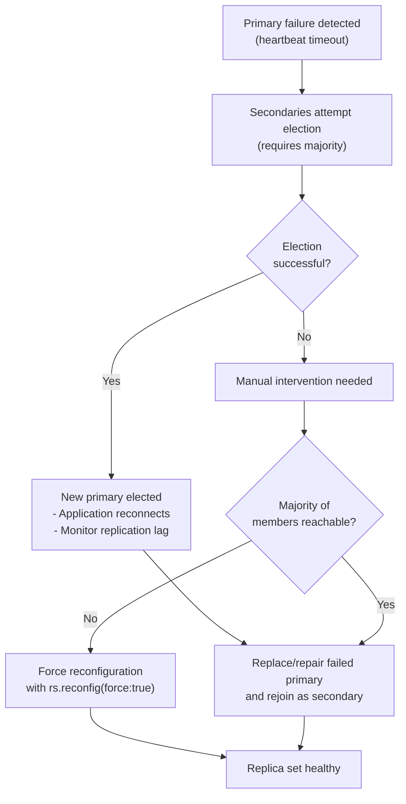

# How to Recover MongoDB from a Primary Failure

Author: [nawazdhandala](https://www.github.com/nawazdhandala)

Tags: MongoDB, Recovery, Replica Set, Failover, High Availability

Description: Learn how to diagnose and recover from a MongoDB primary failure, whether automatic election succeeds or manual intervention is required to restore the replica set.

---

## Introduction

When the primary member of a MongoDB replica set fails, the remaining secondaries attempt to elect a new primary automatically. In most cases this is transparent to the application. However, sometimes manual intervention is required - especially if fewer than a majority of members are reachable, if elections fail repeatedly, or if the failed primary had uncommitted writes that need to be investigated.

## Primary Failure Recovery Flow



## Step 1: Detect the Failure

Signs of primary failure:

```javascript
// Connect to any surviving member
rs.status()
// Primary shows: stateStr: "UNKNOWN" or health: 0
// Other members show: lastHeartbeatMessage: "Error connecting to ..."
```

Check application logs for connection errors:
```yaml
MongoServerError: not primary
MongoNotPrimaryError: not primary and secondaryOk=false
```

## Step 2: Check if Auto-Election Succeeded

```javascript
// Run from any secondary
rs.isMaster()
// Look for: "primary" field - if present, a new primary was elected
rs.isMaster().primary

// Or check rs.status() from any member
rs.status().members.find(m => m.stateStr === "PRIMARY")
```

If a primary is listed, the election was successful. Proceed to verify and monitor.

## Step 3: Automatic Recovery - Monitor and Verify

After automatic failover:

```javascript
// Check all member states
rs.status().members.forEach(m => {
  print(m.name, m.stateStr, "lag:", (new Date() - m.optimeDate) / 1000, "sec")
})

// Verify the new primary has caught up
rs.printReplicationInfo()

// Check for any replication lag on remaining secondaries
rs.printSecondaryReplicationInfo()
```

## Step 4: Manual Recovery - No Election (Minority Partition)

If fewer than a majority of voting members are reachable, no election can occur. You have two options:

**Option A: Restore the failed primary** (preferred)

```bash
# On the failed primary host
sudo systemctl start mongod

# Watch it rejoin the replica set
mongosh --eval "rs.status()"
```

**Option B: Force reconfig to remove the failed member** (emergency only)

```javascript
// Connect to a surviving secondary
// Get current config
cfg = rs.conf()

// Remove the failed member from the config
cfg.members = cfg.members.filter(m => m.host !== "failed-primary.example.com:27017")
cfg.version++

// Force reconfiguration
rs.reconfig(cfg, { force: true })

// Now the remaining members can elect a new primary
```

## Step 5: Replace the Failed Primary Node

Once the replica set has a new primary, repair or replace the failed node:

```bash
# Option A: Restart the failed node (if it's just a crash)
sudo systemctl start mongod

# Option B: Start fresh on a new node
# 1. Clear the data directory
sudo rm -rf /var/lib/mongodb/*

# 2. Restore the same mongod.conf with the same replSetName
sudo systemctl start mongod
```

Add the new node (or the repaired old node) back:

```javascript
// On the primary
rs.add("replacement-node.example.com:27017")

// Monitor initial sync progress
rs.status().members.find(m => m.name === "replacement-node.example.com:27017")
// stateStr will be "STARTUP2" during initial sync, then "SECONDARY"
```

## Step 6: Check for Rollback After Recovery

When the failed primary had writes that were not replicated to the majority before failing, MongoDB rolls back those writes when the node rejoins:

```javascript
// Check if a rollback occurred after the old primary rejoined
rs.status().members.find(m => m.name === "old-primary.example.com:27017").stateStr
// May briefly show "ROLLBACK" before becoming "SECONDARY"
```

Inspect rolled-back writes:

```bash
ls /var/lib/mongodb/rollback/
# Files are named: <db>.<collection>.<timestamp>.bson
```

If the rolled-back documents are critical, restore them manually:

```bash
bsondump /var/lib/mongodb/rollback/ecommerce.orders.2026-03-31T10-00-00.0.bson
mongorestore --db ecommerce --collection orders_recovered \
  /var/lib/mongodb/rollback/ecommerce.orders.2026-03-31T10-00-00.0.bson
```

## Step 7: Tune to Prevent Future Issues

```javascript
// Reduce election timeout for faster detection
cfg = rs.conf()
cfg.settings.heartbeatTimeoutSecs = 5      // Default: 10
cfg.settings.electionTimeoutMillis = 5000  // Default: 10000
rs.reconfig(cfg)

// Verify write concern is set to majority for critical data
db.adminCommand({ getDefaultRWConcern: 1 })
// Set if not already:
db.adminCommand({
  setDefaultRWConcern: 1,
  defaultWriteConcern: { w: "majority", j: true }
})
```

## Application Reconnection

Ensure your driver is configured to handle primary failover:

```javascript
// Node.js - driver handles reconnection automatically
const client = new MongoClient(
  "mongodb://node1:27017,node2:27017,node3:27017/?replicaSet=rs0",
  {
    serverSelectionTimeoutMS: 30000,  // Wait up to 30s for primary
    connectTimeoutMS: 10000,
    socketTimeoutMS: 45000,
    retryWrites: true,
    retryReads: true
  }
)
```

## Recovery Checklist

```javascript
// After recovery, verify:
rs.status()                           // All members healthy
rs.printReplicationInfo()             // Oplog window adequate
rs.printSecondaryReplicationInfo()    // No excessive lag
db.adminCommand({ serverStatus: 1 }).opcounters  // Operations flowing
db.adminCommand({ getDefaultRWConcern: 1 })      // Write concern is majority
```

## Summary

MongoDB replica set primary failure is typically handled automatically through election. Monitor recovery with `rs.status()` and `rs.isMaster()`. If automatic election fails due to a minority partition, force-reconfig the replica set to remove the failed member. Check for rollback files if the old primary had uncommitted writes, and restore critical rolled-back documents manually. Configure `retryWrites: true` in your driver and use `w: majority` write concern to minimize data loss risk in future failures.
