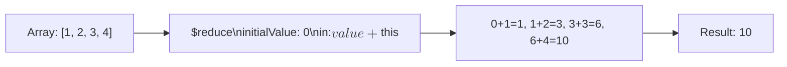

# How to Use $reduce in MongoDB Aggregation

Author: [nawazdhandala](https://www.github.com/nawazdhandala)

Tags: MongoDB, Aggregation, $reduce, Array, Pipeline

Description: Learn how to use $reduce in MongoDB aggregation to apply an expression to each element of an array and accumulate a single result value.

---

## How $reduce Works

`$reduce` iterates over an array and applies a cumulative expression that builds up a single result value. Starting from an initial value, the expression is applied to each element in order, carrying forward the accumulated result. It is the MongoDB equivalent of the functional `reduce()` / `fold` operation.



## Syntax

```javascript
{
  $reduce: {
    input: <array expression>,
    initialValue: <expression>,
    in: <expression>         // uses $$value (accumulator) and $$this (current element)
  }
}
```

- `input` - the array to iterate over
- `initialValue` - the starting value for the accumulator
- `in` - the expression applied to each element. `$$value` holds the running accumulator; `$$this` holds the current element.

## Examples

### Example 1 - Sum an Array

Sum all elements in an array:

```javascript
// Input: { _id: 1, values: [10, 20, 30, 40] }
db.data.aggregate([
  {
    $project: {
      total: {
        $reduce: {
          input: "$values",
          initialValue: 0,
          in: { $add: ["$$value", "$$this"] }
        }
      }
    }
  }
])
```

Output:

```javascript
[
  { _id: 1, total: 100 }
]
```

Note: This is equivalent to `{ $sum: "$values" }`, but `$reduce` is useful when you need custom accumulation logic.

### Example 2 - String Concatenation

Concatenate an array of strings with a separator:

```javascript
// Input: { _id: 1, words: ["Hello", "World", "from", "MongoDB"] }
db.sentences.aggregate([
  {
    $project: {
      sentence: {
        $reduce: {
          input: "$words",
          initialValue: "",
          in: {
            $cond: {
              if: { $eq: ["$$value", ""] },
              then: "$$this",
              else: { $concat: ["$$value", " ", "$$this"] }
            }
          }
        }
      }
    }
  }
])
```

Output:

```javascript
[
  { _id: 1, sentence: "Hello World from MongoDB" }
]
```

### Example 3 - Find Maximum Value

Find the maximum element in an array using `$reduce`:

```javascript
// Input: { _id: 1, temperatures: [22, 31, 18, 27, 35, 14] }
db.weather.aggregate([
  {
    $project: {
      maxTemp: {
        $reduce: {
          input: "$temperatures",
          initialValue: { $arrayElemAt: ["$temperatures", 0] },
          in: { $max: ["$$value", "$$this"] }
        }
      }
    }
  }
])
```

Output:

```javascript
[
  { _id: 1, maxTemp: 35 }
]
```

### Example 4 - Multiply All Elements (Product)

Compute the product of all numbers in an array:

```javascript
// Input: { _id: 1, factors: [2, 3, 4, 5] }
db.data.aggregate([
  {
    $project: {
      product: {
        $reduce: {
          input: "$factors",
          initialValue: 1,
          in: { $multiply: ["$$value", "$$this"] }
        }
      }
    }
  }
])
```

Output:

```javascript
[
  { _id: 1, product: 120 }
]
```

### Example 5 - Flatten a Nested Array

Combine `$reduce` with `$concatArrays` to flatten an array of arrays:

```javascript
// Input: { _id: 1, nestedArrays: [[1, 2], [3, 4], [5, 6]] }
db.data.aggregate([
  {
    $project: {
      flattened: {
        $reduce: {
          input: "$nestedArrays",
          initialValue: [],
          in: { $concatArrays: ["$$value", "$$this"] }
        }
      }
    }
  }
])
```

Output:

```javascript
[
  { _id: 1, flattened: [1, 2, 3, 4, 5, 6] }
]
```

### Example 6 - Build an Object from an Array

Accumulate key-value pairs from an array of objects into a single merged object:

```javascript
// Input: { _id: 1, pairs: [{ k: "a", v: 1 }, { k: "b", v: 2 }, { k: "c", v: 3 }] }
db.data.aggregate([
  {
    $project: {
      merged: {
        $reduce: {
          input: "$pairs",
          initialValue: {},
          in: {
            $mergeObjects: [
              "$$value",
              { $arrayToObject: [[{ k: "$$this.k", v: "$$this.v" }]] }
            ]
          }
        }
      }
    }
  }
])
```

Output:

```javascript
[
  { _id: 1, merged: { a: 1, b: 2, c: 3 } }
]
```

### Example 7 - Cumulative Sum (Running Total)

Build an array of running totals:

```javascript
// Input: { _id: 1, dailySales: [100, 200, 150, 300] }
db.data.aggregate([
  {
    $project: {
      runningTotals: {
        $reduce: {
          input: "$dailySales",
          initialValue: { total: 0, arr: [] },
          in: {
            total: { $add: ["$$value.total", "$$this"] },
            arr: {
              $concatArrays: [
                "$$value.arr",
                [{ $add: ["$$value.total", "$$this"] }]
              ]
            }
          }
        }
      }
    }
  }
])
```

Output:

```javascript
[
  { _id: 1, runningTotals: { total: 750, arr: [100, 300, 450, 750] } }
]
```

## Use Cases

- Computing products, factorials, or other cumulative numeric operations
- Building strings by joining array elements with custom separators
- Flattening nested arrays before further processing
- Constructing objects from arrays of key-value pairs

## Summary

`$reduce` is MongoDB's most flexible array accumulation operator. It iterates an array from left to right, carrying a running accumulator (`$$value`) that is updated by the `in` expression on each step using the current element (`$$this`). Use `$reduce` when built-in operators like `$sum` or `$avg` do not cover your accumulation logic, such as string building, nested array flattening, or compound accumulation.
