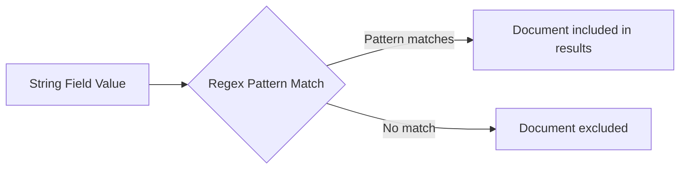

# How to Use Regular Expressions in MongoDB Queries with $regex

Author: [nawazdhandala](https://www.github.com/nawazdhandala)

Tags: MongoDB, $regex, Query, Operator, String, Pattern Matching

Description: Learn how to use the $regex operator in MongoDB to perform pattern-based string searches, including case-insensitive matching and index usage considerations.

---

## How $regex Works

The `$regex` operator allows you to query string fields using regular expression patterns. MongoDB uses Perl Compatible Regular Expressions (PCRE). You can use `$regex` in two forms: the operator syntax or the native JavaScript regex literal syntax.



## Syntax

There are two equivalent ways to use regex in a MongoDB query:

```javascript
// Operator syntax
{ field: { $regex: /pattern/, $options: "flags" } }
{ field: { $regex: "pattern", $options: "flags" } }

// JavaScript regex literal shorthand
{ field: /pattern/flags }
```

## Available Options

```text
i  - Case-insensitive matching
m  - Multiline matching (^ and $ match line boundaries)
x  - Extended mode (ignore whitespace and comments)
s  - Dot (.) matches newline characters
```

## Basic Pattern Matching

Find documents where a string field contains a substring:

```javascript
// Find users whose name contains "john" (case-sensitive)
db.users.find({ name: { $regex: "john" } })

// Using JavaScript regex literal
db.users.find({ name: /john/ })
```

## Case-Insensitive Search

Use the `i` flag for case-insensitive matching:

```javascript
// Matches "John", "JOHN", "john", etc.
db.users.find({ name: { $regex: "john", $options: "i" } })

// Shorthand with flag
db.users.find({ name: /john/i })
```

## Anchoring Patterns

Use `^` to match the beginning of a string and `$` to match the end:

```javascript
// Names that start with "A"
db.users.find({ name: /^A/i })

// Email addresses ending with @company.com
db.users.find({ email: /company\.com$/i })

// Exact prefix match (more index-friendly than contains)
db.products.find({ sku: /^ELEC/ })
```

## Searching for a Substring

```javascript
// Find all products containing "pro" in the name
db.products.find({ name: /pro/i })

// Find articles mentioning "kubernetes"
db.articles.find({ content: /kubernetes/i })
```

## Complex Patterns

```javascript
// Match phone numbers in format XXX-XXX-XXXX
db.contacts.find({ phone: /^\d{3}-\d{3}-\d{4}$/ })

// Match valid email format
db.users.find({ email: /^[a-zA-Z0-9._%+-]+@[a-zA-Z0-9.-]+\.[a-zA-Z]{2,}$/ })

// Match URLs starting with http or https
db.links.find({ url: /^https?:\/\//i })
```

## Multiline Matching

Use the `m` option when the string contains newlines and you want `^` and `$` to match line boundaries:

```javascript
db.notes.find({
  content: { $regex: "^TODO", $options: "m" }
})
```

## Using $regex in Aggregation

```javascript
db.users.aggregate([
  {
    $match: {
      email: { $regex: "@gmail\\.com$", $options: "i" }
    }
  },
  {
    $group: {
      _id: null,
      count: { $sum: 1 }
    }
  }
])
```

## Index Usage and Performance

Prefix regex patterns (anchored with `^`) can use an index on the field, making them significantly faster:

```javascript
// Index-friendly: uses the index on "name"
db.users.createIndex({ name: 1 })
db.users.find({ name: /^Alice/ })

// NOT index-friendly: requires full collection scan
db.users.find({ name: /Alice/ })       // contains
db.users.find({ name: /Alice$/i })     // ends with
db.users.find({ name: /.*Alice.*/i })  // contains with wildcard
```

For full-text search patterns, consider using MongoDB's text index instead:

```javascript
db.articles.createIndex({ content: "text" })
db.articles.find({ $text: { $search: "mongodb tutorial" } })
```

## Escaping Special Characters

Escape special regex characters with a backslash when matching them literally:

```javascript
// Match filenames ending in ".pdf"
db.files.find({ filename: /\.pdf$/i })

// Match strings containing a dollar sign
db.pricing.find({ formula: /\$total/ })
```

## Use Cases

- Autocomplete: prefix searches on names or titles
- Email validation: checking format consistency
- Tag or category filtering with partial matches
- Log parsing: finding entries matching error patterns
- Phone number format normalization queries

## Summary

MongoDB's `$regex` operator enables flexible pattern-based string queries using PCRE syntax. For best performance, use prefix-anchored patterns (starting with `^`) so that MongoDB can leverage indexes. Use the `i` flag for case-insensitive matching. For large-scale full-text search, prefer MongoDB's text indexes over `$regex` on large collections, as unanchored regex patterns require a full collection scan.
