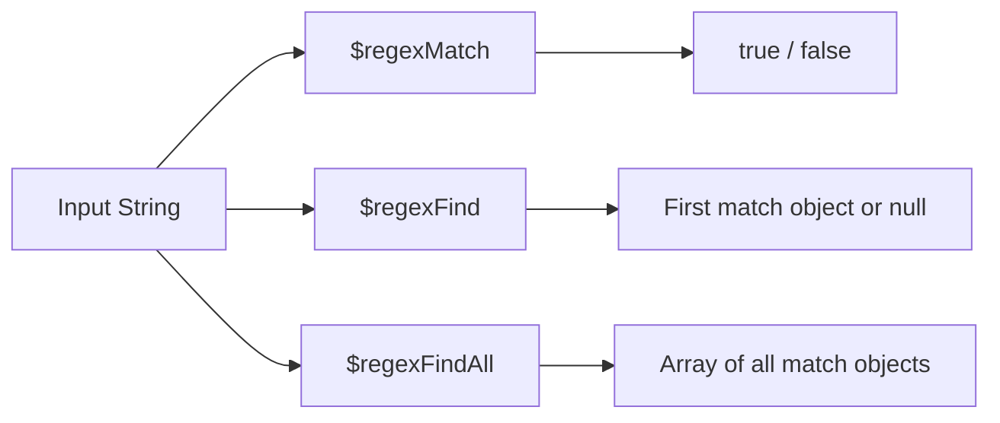

# How to Use $regexFind and $regexMatch in MongoDB Aggregation

Author: [nawazdhandala](https://www.github.com/nawazdhandala)

Tags: MongoDB, Aggregation, $regexFind, $regexMatch, $regexFindAll, Pipeline, String, Regex

Description: Learn how to use $regexFind, $regexMatch, and $regexFindAll in MongoDB aggregation to match and extract data using regular expressions.

---

## Overview

MongoDB provides three regex expression operators for use inside aggregation pipelines:

| Operator | Returns |
|---|---|
| `$regexMatch` | `true` or `false` - does the string match the pattern? |
| `$regexFind` | The first match as `{ match, idx, captures }` or `null` |
| `$regexFindAll` | An array of all matches as `{ match, idx, captures }` |

These are expression operators, not stages, so they are used inside `$project`, `$addFields`, `$match` (via `$expr`), etc.



## Syntax

### $regexMatch

```javascript
{
  $regexMatch: {
    input: <string expression>,
    regex: <regex or string>,
    options: <options string>   // optional: "i", "m", "x", "s"
  }
}
```

### $regexFind

```javascript
{
  $regexFind: {
    input: <string expression>,
    regex: <regex or string>,
    options: <options string>
  }
}
```

### $regexFindAll

```javascript
{
  $regexFindAll: {
    input: <string expression>,
    regex: <regex or string>,
    options: <options string>
  }
}
```

### Options

| Option | Description |
|---|---|
| `"i"` | Case-insensitive |
| `"m"` | Multiline (`^` and `$` match line boundaries) |
| `"x"` | Extended (ignore whitespace and comments in pattern) |
| `"s"` | Allow `.` to match newline characters |

## Examples

### Input Documents

```javascript
[
  { _id: 1, name: "Alice",   email: "alice@example.com",  log: "ERROR: timeout on port 8080" },
  { _id: 2, name: "Bob",     email: "bob_test@test.org",   log: "INFO: started successfully"  },
  { _id: 3, name: "Carol",   email: "carol@company.io",   log: "ERROR: null pointer at line 42" },
  { _id: 4, name: "Dave",    email: "not-an-email",        log: "WARN: memory threshold exceeded" }
]
```

### Example 1 - $regexMatch: Boolean Test

Check if the email looks like a valid address:

```javascript
db.users.aggregate([
  {
    $project: {
      name: 1,
      validEmail: {
        $regexMatch: {
          input: "$email",
          regex: "^[\\w.]+@[\\w.]+\\.[a-z]{2,}$",
          options: "i"
        }
      }
    }
  }
])
```

Output:

```javascript
[
  { _id: 1, name: "Alice", validEmail: true  },
  { _id: 2, name: "Bob",   validEmail: true  },
  { _id: 3, name: "Carol", validEmail: true  },
  { _id: 4, name: "Dave",  validEmail: false }
]
```

### Example 2 - $regexMatch in $match for Filtering

Filter documents where `log` starts with "ERROR":

```javascript
db.users.aggregate([
  {
    $match: {
      $expr: {
        $regexMatch: {
          input: "$log",
          regex: "^ERROR"
        }
      }
    }
  }
])
```

Output:

```javascript
[
  { _id: 1, name: "Alice", log: "ERROR: timeout on port 8080"       },
  { _id: 3, name: "Carol", log: "ERROR: null pointer at line 42" }
]
```

### Example 3 - $regexFind: Extract First Match

Extract the port number from the log using a capture group:

```javascript
db.users.aggregate([
  {
    $project: {
      name: 1,
      portMatch: {
        $regexFind: {
          input: "$log",
          regex: "port (\\d+)"
        }
      }
    }
  }
])
```

Output:

```javascript
[
  {
    _id: 1, name: "Alice",
    portMatch: { match: "port 8080", idx: 19, captures: ["8080"] }
  },
  { _id: 2, name: "Bob",   portMatch: null },
  { _id: 3, name: "Carol", portMatch: null },
  { _id: 4, name: "Dave",  portMatch: null }
]
```

- `match` - the full matched string
- `idx` - code point index of the match start
- `captures` - array of capture group values

### Example 4 - Extract Captured Group Value

Extract just the port number (first capture group):

```javascript
db.users.aggregate([
  {
    $project: {
      name: 1,
      port: {
        $let: {
          vars: {
            m: {
              $regexFind: {
                input: "$log",
                regex: "port (\\d+)"
              }
            }
          },
          in: { $arrayElemAt: ["$$m.captures", 0] }
        }
      }
    }
  }
])
```

Output:

```javascript
[
  { _id: 1, name: "Alice", port: "8080" },
  { _id: 2, name: "Bob",   port: null   },
  { _id: 3, name: "Carol", port: null   },
  { _id: 4, name: "Dave",  port: null   }
]
```

### Example 5 - $regexFindAll: Find All Numbers in a String

```javascript
db.users.aggregate([
  {
    $project: {
      name: 1,
      numbersInLog: {
        $regexFindAll: {
          input: "$log",
          regex: "\\d+"
        }
      }
    }
  }
])
```

Output:

```javascript
[
  { _id: 1, name: "Alice", numbersInLog: [{ match: "8080", idx: 23, captures: [] }] },
  { _id: 2, name: "Bob",   numbersInLog: [] },
  { _id: 3, name: "Carol", numbersInLog: [{ match: "42", idx: 34, captures: [] }] },
  { _id: 4, name: "Dave",  numbersInLog: [] }
]
```

### Example 6 - Count All Regex Matches

Use `$size` on `$regexFindAll` to count how many numbers appear in the log:

```javascript
db.users.aggregate([
  {
    $project: {
      name: 1,
      numberCount: {
        $size: {
          $regexFindAll: {
            input: "$log",
            regex: "\\d+"
          }
        }
      }
    }
  }
])
```

### Example 7 - Case-Insensitive Filter with "i" option

Find all users whose email domain ends in `.com` or `.org` (case-insensitive):

```javascript
db.users.aggregate([
  {
    $match: {
      $expr: {
        $regexMatch: {
          input: "$email",
          regex: "@.+\\.(com|org)$",
          options: "i"
        }
      }
    }
  }
])
```

## Use Cases

- Validating field formats (emails, phone numbers, URLs, IDs)
- Filtering log entries by severity level or error type
- Extracting structured data from free-text fields using capture groups
- Finding all occurrences of a pattern in a text field with `$regexFindAll`

## Summary

`$regexMatch` returns a boolean indicating whether a pattern is found, `$regexFind` returns the first match with its index and capture groups, and `$regexFindAll` returns all matches. Use `$regexMatch` in `$match` via `$expr` for filtering, and `$regexFind` / `$regexFindAll` in `$project` to extract data from strings. For simple prefix/suffix matching or containment, `$indexOfCP` and `$split` may be more efficient.
