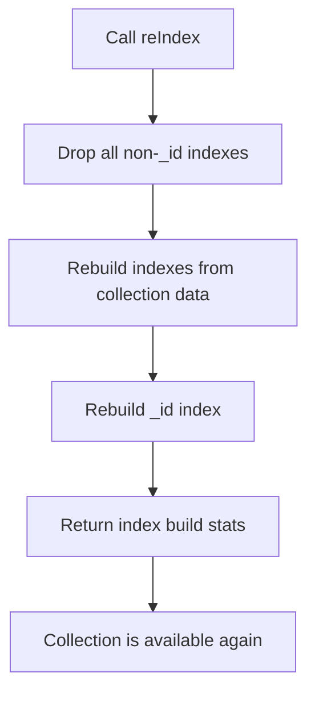
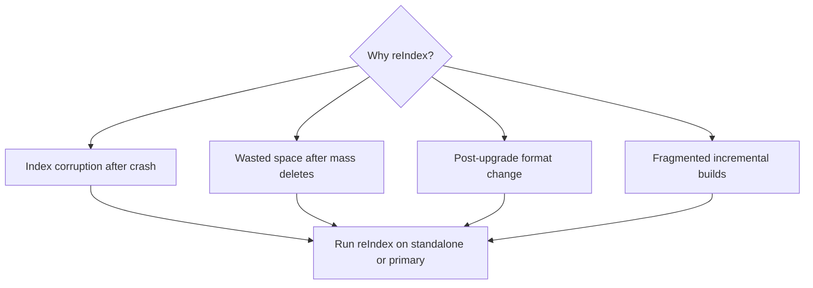

# How to Rebuild Indexes in MongoDB with reIndex()

Author: [nawazdhandala](https://www.github.com/nawazdhandala)

Tags: MongoDB, Index, reIndex, Maintenance, Performance

Description: Learn when and how to use MongoDB's reIndex() command to drop and rebuild all indexes on a collection, recover from index corruption, and reclaim wasted index space.

---

## What is reIndex()

`reIndex()` drops all indexes on a collection and rebuilds them from scratch. It is a maintenance operation used to recover from index corruption, reclaim space after heavy deletes, or force a fresh build after bulk data imports.

Starting with MongoDB 4.0, `reIndex()` on a replica set secondary is not allowed by default. The operation is typically performed on standalone instances or primaries during maintenance windows.



## Basic Usage

```javascript
// Rebuild all indexes on the orders collection
db.orders.reIndex();
```

The return value shows the number of indexes processed:

```javascript
{
  "nIndexesWas": 4,
  "nIndexes": 4,
  "indexes": [ ... ],
  "ok": 1
}
```

## When to Use reIndex()

1. **Index corruption** after an unclean shutdown where the journal did not flush.
2. **Reclaiming space** after deleting large portions of a collection (similar to why you would run `compact()`).
3. **Forcing a clean build** after upgrading MongoDB versions that change index formats.
4. **Performance regression** where an index was built incrementally and is fragmented.



## Checking Index Health Before reIndex

```javascript
// Check collection and index statistics
db.orders.stats();

// Look at index sizes
db.orders.stats().indexSizes;
// { "_id_": 12345, "status_1": 98765, ... }

// Compare data size vs index sizes
// If index sizes are disproportionately large relative to dataSize, reIndex may help
```

## Measuring the Impact

```javascript
// Record stats before
const before = db.orders.stats();
print("Index sizes before:", JSON.stringify(before.indexSizes));

// Run reIndex
db.orders.reIndex();

// Record stats after
const after = db.orders.stats();
print("Index sizes after:", JSON.stringify(after.indexSizes));
```

## reIndex() on a Standalone Server

```javascript
// Connect to the standalone mongod and run
use myDatabase
db.largeCollection.reIndex();
```

The operation blocks all reads and writes on the collection until the rebuild is complete. Plan this during a low-traffic window.

## reIndex() vs. Dropping and Re-Creating Indexes

`reIndex()` is a shortcut for dropping and recreating all indexes. You can achieve the same result manually with more control:

```javascript
// Step 1: List all indexes
const indexes = db.orders.getIndexes();
print(JSON.stringify(indexes, null, 2));

// Step 2: Drop all non-_id indexes
db.orders.dropIndexes();

// Step 3: Re-create each index individually
db.orders.createIndex({ status: 1, createdAt: -1 });
db.orders.createIndex({ customerId: 1 });
db.orders.createIndex({ totalAmount: 1 });
```

Manual rebuilding gives you the chance to add or remove indexes you no longer need.

## reIndex() in a Replica Set

On a replica set, running `reIndex()` on the primary rebuilds the indexes on the primary and the change is replicated to secondaries. However, running it on a secondary directly is restricted. The recommended approach for replica sets is:

1. Remove the secondary from the set.
2. Restart it as a standalone.
3. Run `reIndex()`.
4. Restart as a replica set member and let it sync.

```javascript
// On the primary (rebuilds and replicates)
db.orders.reIndex();

// Check replication
rs.printReplicationInfo();
```

## Monitoring Progress

In MongoDB 4.4+, you can watch index build progress in the `currentOp` output:

```javascript
db.adminCommand({ currentOp: true, "command.createIndexes": { $exists: true } });
```

## Alternative: Rebuilding a Single Index

If you only need to rebuild one specific index, drop and re-create it rather than using `reIndex()`:

```javascript
// Drop one index
db.orders.dropIndex("status_1_createdAt_-1");

// Recreate it
db.orders.createIndex(
  { status: 1, createdAt: -1 },
  { name: "status_1_createdAt_-1" }
);
```

This is faster because it leaves all other indexes intact.

## Performance Considerations

| Aspect | Detail |
|---|---|
| Blocking | Blocks all collection operations during the build |
| Duration | Proportional to collection size and number of indexes |
| Memory | Uses `maxIndexBuildMemoryUsageMegabytes` (default 200 MB) |
| Disk I/O | High during the rebuild |

```javascript
// Increase index build memory limit for faster builds on large collections
db.adminCommand({
  setParameter: 1,
  maxIndexBuildMemoryUsageMegabytes: 1024
});
```

## Summary

`reIndex()` drops and rebuilds all indexes on a collection from scratch. Use it to recover from index corruption, reclaim fragmented index space after heavy deletes, or force a clean rebuild after a major data import. Because it blocks the collection during the rebuild, run it on standalones or during scheduled maintenance. For replica sets, prefer removing a secondary, rebuilding as a standalone, and rejoining the set. If only one index needs rebuilding, drop and re-create that specific index instead.
