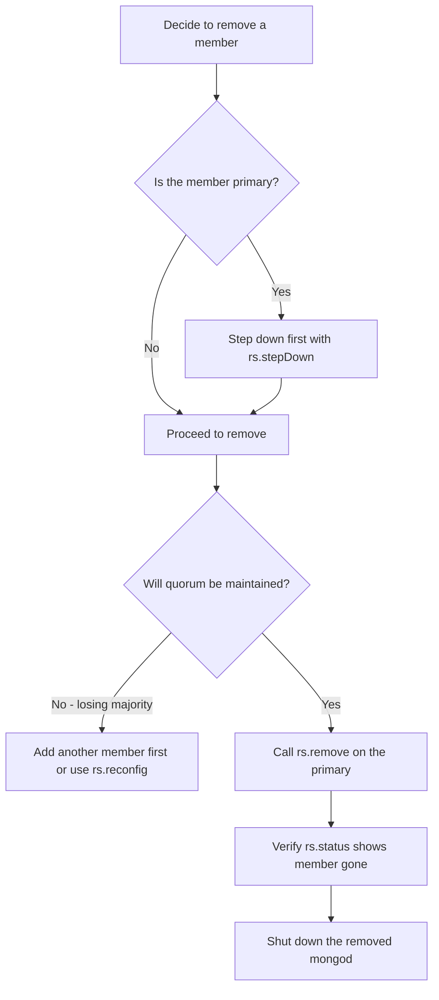
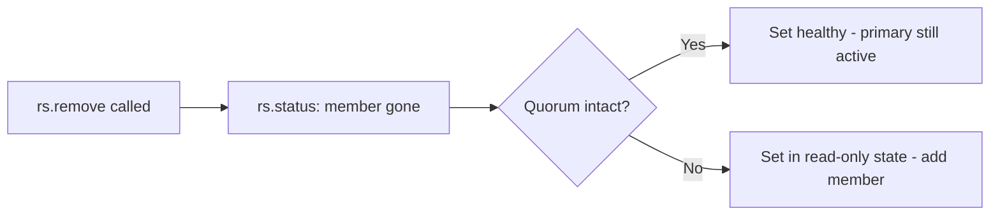

# How to Remove Members from a MongoDB Replica Set

Author: [nawazdhandala](https://www.github.com/nawazdhandala)

Tags: MongoDB, Replica Set, Administration, Replication, Maintenance

Description: Learn how to safely remove a member from a MongoDB replica set using rs.remove(), handle primaries, avoid losing quorum, and verify the set returns to a healthy state.

---

## When to Remove a Replica Set Member

You remove a member when decommissioning a server, replacing hardware, migrating to a new host, or reducing the replica set size. Removing a member decreases the number of votes in the set, so plan carefully to maintain a majority (quorum).



## Checking the Current Replica Set

Before removing, understand the current membership:

```javascript
// Connect to the primary
mongosh --host primary.example.com:27017

rs.status();
// Note the member hostnames and their roles
```

## Basic rs.remove()

```javascript
// Remove a secondary member by its host:port string
rs.remove("server3.example.com:27019");
```

Expected response:

```javascript
{
  "ok": 1,
  "$clusterTime": { ... },
  "operationTime": { ... }
}
```

## Removing the Primary

You cannot call `rs.remove()` on the primary from itself. First step down the primary, then remove it from another member:

```javascript
// Step 1: On the current primary, initiate a stepdown
rs.stepDown(60);  // 60 seconds for a secondary to catch up and win election

// Step 2: Connect to the new primary
mongosh --host newprimary.example.com:27017

// Step 3: Remove the old primary
rs.remove("oldprimary.example.com:27017");
```

## Verifying the Removal

```javascript
// Check that the member no longer appears in rs.status()
rs.status();

// Check the configuration document
rs.conf();
// The removed member should not appear in the members array
```

## Maintaining Quorum

A replica set requires a majority of its configured voting members to elect a primary and accept writes. Before removing a member, calculate the impact:

| Members Before | Majority Needed | Members After Remove | Can Still Elect? |
|---|---|---|---|
| 3 | 2 | 2 | Yes (2 >= 2) |
| 3 | 2 | 1 | No (1 < 2) |
| 5 | 3 | 4 | Yes (4 >= 3) |
| 5 | 3 | 2 | No (2 < 3) |

```javascript
// Check current vote counts
rs.conf().members.map(m => ({ host: m.host, votes: m.votes, priority: m.priority }));
```

## Removing a Member That is Down

If the member you want to remove is unreachable, you can still remove it by modifying the configuration directly:

```javascript
// Get the current config
const cfg = rs.conf();

// Find the index of the member to remove
const idx = cfg.members.findIndex(m => m.host === "server3.example.com:27019");
print("Removing member at index:", idx);

// Remove it from the array
cfg.members.splice(idx, 1);

// Apply the new config with force if necessary
rs.reconfig(cfg, { force: true });
```

Use `force: true` only when the replica set has lost quorum and the normal reconfig path is blocked. A forced reconfig can cause data loss if the removed member had writes not yet replicated.

## Replacing a Member with a New Host

To move a member to a new server, add the new server first, let it sync, then remove the old one:

```javascript
// Step 1: Add the replacement member
rs.add("newserver.example.com:27019");

// Step 2: Wait for the new member to reach SECONDARY state
rs.status();  // watch until stateStr becomes "SECONDARY"

// Step 3: Remove the old member
rs.remove("oldserver.example.com:27019");
```

This approach ensures no reduction in replica set size during the transition.

## After Removal: Shut Down the Removed mongod

After removing a member from the set, stop the `mongod` process on that host to prevent it from accumulating stale data or interfering:

```bash
# On the removed server
sudo systemctl stop mongod

# Optionally clear the data directory if decommissioning permanently
sudo rm -rf /data/db/*
```

## Removing an Arbiter

Arbiters are removed the same way as data-bearing members:

```javascript
// Remove arbiter
rs.remove("arbiter.example.com:27020");
```

After removing an arbiter, ensure the remaining set still has an odd number of voting members to avoid tie votes.

## Monitoring After Removal

```javascript
// Check replica set health after removal
rs.status();

// Check oplog window on remaining members
rs.printReplicationInfo();

// Check replication lag
rs.printSecondaryReplicationInfo();
```



## Summary

Remove a MongoDB replica set member with `rs.remove("host:port")` from the primary. If you need to remove the current primary, use `rs.stepDown()` first and then remove it from the new primary. Before any removal, verify that the remaining members constitute a quorum (majority of votes). For unreachable members, modify the configuration array via `rs.conf()` and apply with `rs.reconfig()`. Always shut down the removed `mongod` instance afterward to prevent stale data accumulation.
