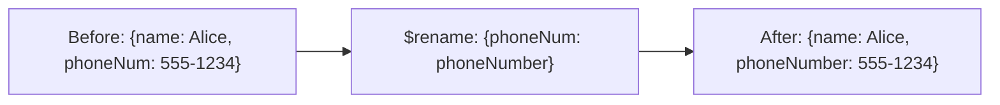

# How to Use $rename Operator in MongoDB to Rename Fields

Author: [nawazdhandala](https://www.github.com/nawazdhandala)

Tags: MongoDB, $rename, Update, Operator, Schema Migration

Description: Learn how to use MongoDB's $rename operator to rename fields in documents, including renaming nested fields and handling edge cases during schema migrations.

---

## How $rename Works

The `$rename` operator changes the name of a field in a document. It is equivalent to removing the old field and adding a new field with the same value. If the source field does not exist, the operation is a no-op. If the destination field name already exists in the document, it is overwritten.



## Syntax

```javascript
{ $rename: { "oldFieldName": "newFieldName", ... } }
```

## Basic Field Rename

Rename a single field:

```javascript
// Before: { _id: 1, name: "Alice", phoneNum: "555-1234", email: "alice@example.com" }

db.users.updateOne(
  { _id: 1 },
  { $rename: { phoneNum: "phoneNumber" } }
)

// After: { _id: 1, name: "Alice", phoneNumber: "555-1234", email: "alice@example.com" }
```

## Renaming Multiple Fields

```javascript
// Before: { _id: 2, fname: "Bob", lname: "Smith", dob: "1990-01-15" }

db.users.updateOne(
  { _id: 2 },
  {
    $rename: {
      fname: "firstName",
      lname: "lastName",
      dob: "dateOfBirth"
    }
  }
)

// After: { _id: 2, firstName: "Bob", lastName: "Smith", dateOfBirth: "1990-01-15" }
```

## Applying to All Documents with updateMany()

Schema migration: rename a field across an entire collection:

```javascript
// Rename "createdTs" to "createdAt" in all documents
db.orders.updateMany(
  { createdTs: { $exists: true } },
  { $rename: { createdTs: "createdAt" } }
)
```

## Renaming Nested Fields with Dot Notation

Target fields inside embedded documents:

```javascript
// Before: { _id: 3, contact: { ph: "555-5678", emailAddr: "carol@example.com" } }

db.users.updateOne(
  { _id: 3 },
  { $rename: { "contact.ph": "contact.phone", "contact.emailAddr": "contact.email" } }
)

// After: { _id: 3, contact: { phone: "555-5678", email: "carol@example.com" } }
```

## Moving a Field from Top-Level to Nested

`$rename` can move a field to a different path:

```javascript
// Before: { _id: 4, city: "San Francisco", name: "Dave" }

db.users.updateOne(
  { _id: 4 },
  { $rename: { city: "address.city" } }
)

// After: { _id: 4, name: "Dave", address: { city: "San Francisco" } }
```

## Moving a Field from Nested to Top-Level

```javascript
// Before: { _id: 5, meta: { views: 42 }, title: "Post A" }

db.posts.updateOne(
  { _id: 5 },
  { $rename: { "meta.views": "viewCount" } }
)

// After: { _id: 5, title: "Post A", viewCount: 42 }
// Note: if meta becomes empty, it remains as {}
```

## $rename on Non-Existent Fields

If the source field does not exist, the operation silently does nothing:

```javascript
// "oldField" doesn't exist - no error, no change
db.users.updateOne(
  { _id: 1 },
  { $rename: { oldField: "newField" } }
)
```

## $rename Cannot be Used Inside Arrays

`$rename` does not work on fields within array elements. For arrays, use `$set` and `$unset` together or use an aggregation pipeline update:

```javascript
// Use aggregation pipeline update to rename a field inside array elements
db.orders.updateMany(
  {},
  [
    {
      $set: {
        items: {
          $map: {
            input: "$items",
            as: "item",
            in: {
              $mergeObjects: [
                "$$item",
                { productName: "$$item.name" },
                { name: "$$REMOVE" }
              ]
            }
          }
        }
      }
    }
  ]
)
```

## Use Cases

- Standardizing field naming conventions (camelCase, snake_case)
- Correcting typos in field names across a collection
- Restructuring document schemas during migrations
- Moving fields between top-level and embedded documents
- Aligning field names with an updated API contract

## Summary

`$rename` is the clean, purpose-built way to rename fields in MongoDB documents. It atomically removes the old field and creates the new one with the same value. Use `updateMany()` with `$exists: true` to apply renames across an entire collection during schema migrations. Note the key limitation: `$rename` cannot target fields inside array elements - for those, use an aggregation pipeline update with `$map` and `$mergeObjects` instead.
