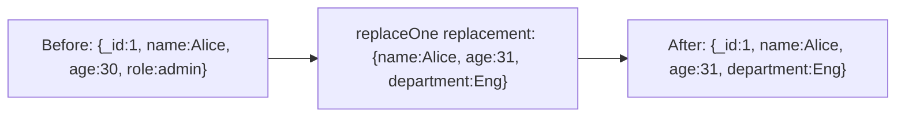

# How to Use replaceOne() in MongoDB to Replace a Document

Author: [nawazdhandala](https://www.github.com/nawazdhandala)

Tags: MongoDB, replaceOne, CRUD, Update, Document

Description: Learn how to use MongoDB's replaceOne() method to completely replace a document's content while keeping its _id, including upsert behavior and result interpretation.

---

## How replaceOne() Works

`replaceOne()` replaces the entire content of a matching document with a new document. The replacement document completely overwrites the matched document's fields, except the `_id` field which is preserved. This is different from `updateOne()`, which uses update operators to modify specific fields.



Note that `role` was completely removed because the replacement document did not include it.

## Syntax

```javascript
db.collection.replaceOne(filter, replacement, options)
```

- `filter` - Query to select the document to replace
- `replacement` - The new document (must NOT contain update operators)
- `options` - Optional settings: `upsert`, `hint`, `comment`

## Basic Replacement

Replace a user document entirely:

```javascript
// Before: { _id: ObjectId("..."), name: "Alice", age: 30, role: "admin", status: "inactive" }

db.users.replaceOne(
  { name: "Alice" },
  {
    name: "Alice Johnson",
    age: 31,
    email: "alice.johnson@example.com",
    role: "senior-admin",
    status: "active",
    updatedAt: new Date()
  }
)

// After: { _id: ObjectId("..."), name: "Alice Johnson", age: 31, email: "alice.johnson@example.com", role: "senior-admin", status: "active", updatedAt: ISODate("...") }
// The _id is preserved, all other fields are replaced
```

## The Replacement Document Must Not Use Operators

The replacement document is a plain object, not an update operator document:

```javascript
// VALID - plain replacement document
db.users.replaceOne(
  { _id: 1 },
  { name: "New Name", status: "active" }
)

// INVALID - replacement cannot contain update operators
db.users.replaceOne(
  { _id: 1 },
  { $set: { name: "New Name" } }  // This will cause an error
)
```

## Reading the Result

```javascript
const result = db.products.replaceOne(
  { sku: "ELEC-001" },
  {
    sku: "ELEC-001",
    name: "Updated Product",
    price: 299.99,
    category: "Electronics",
    updatedAt: new Date()
  }
)

print("Matched:", result.matchedCount)   // 1 if found
print("Modified:", result.modifiedCount) // 1 if actually changed
```

## Using Upsert

If `upsert: true` is set and no document matches the filter, a new document is inserted:

```javascript
db.configs.replaceOne(
  { key: "siteSettings" },
  {
    key: "siteSettings",
    theme: "dark",
    language: "en",
    createdAt: new Date()
  },
  { upsert: true }
)
```

When upserted, the `result.upsertedId` contains the `_id` of the new document.

## replaceOne() vs updateOne()

```text
replaceOne()                         updateOne()
-----------------------------------  -----------------------------------
Replaces the entire document         Modifies specific fields only
All unmentioned fields are removed   Unmentioned fields are preserved
Uses a plain document as replacement Uses update operators ($set, $inc...)
Good for full document replacement   Good for partial field updates
```

## Practical Use Case - Document Versioning

When you need to save a completely new version of a configuration:

```javascript
const newConfig = {
  key: "appConfig",
  version: 3,
  features: {
    darkMode: true,
    betaAccess: false,
    analyticsEnabled: true
  },
  updatedAt: new Date(),
  updatedBy: "admin"
}

const result = db.configurations.replaceOne(
  { key: "appConfig" },
  newConfig,
  { upsert: true }
)

if (result.upsertedCount > 0) {
  print("Config created for the first time")
} else {
  print("Config updated to version 3")
}
```

## Preserving _id in the Replacement

Do not include the `_id` field in the replacement document unless you are using the same value. Including a different `_id` will cause an error:

```javascript
// VALID - no _id in replacement (original _id is kept)
db.users.replaceOne({ name: "Alice" }, { name: "Alice", age: 31 })

// VALID - same _id value explicitly included
db.users.replaceOne({ _id: 1 }, { _id: 1, name: "Alice", age: 31 })

// INVALID - different _id causes ImmutableField error
db.users.replaceOne({ _id: 1 }, { _id: 2, name: "Alice" })
```

## Use Cases

- Replacing an entire configuration document with a new version
- Overwriting a draft document with a finalized version
- Full document replacement after external editing (e.g., form submissions)
- Resetting a document to a clean state
- Replacing a temporary or placeholder document with complete data

## Summary

`replaceOne()` performs a complete document swap, keeping the `_id` and replacing every other field with the content of the replacement document. Use it when you want to overwrite a document entirely rather than patch specific fields. For partial updates, use `updateOne()` with operators like `$set`. Enable `upsert: true` to insert the replacement document when no match is found. Never include a different `_id` in the replacement document.
