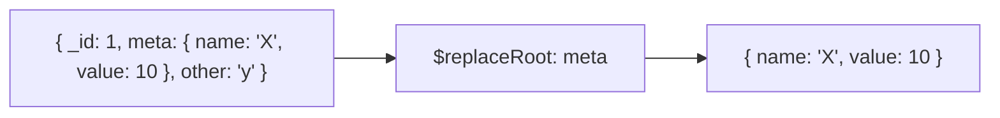

# How to Use $replaceRoot and $replaceWith in MongoDB Aggregation

Author: [nawazdhandala](https://www.github.com/nawazdhandala)

Tags: MongoDB, Aggregation, $replaceRoot, $replaceWith, Pipeline, Stage

Description: Learn how to use $replaceRoot and $replaceWith in MongoDB aggregation to promote a nested document to the top-level document in the pipeline.

---

## How $replaceRoot and $replaceWith Work

The `$replaceRoot` stage replaces the entire input document with a specified embedded document or expression. The promoted document becomes the new root (top-level) document for the rest of the pipeline.

`$replaceWith` (introduced in MongoDB 4.2) is syntactic sugar for `$replaceRoot` with `newRoot`:

```javascript
{ $replaceWith: <expression> }
// is equivalent to:
{ $replaceRoot: { newRoot: <expression> } }
```



## Syntax

```javascript
// $replaceRoot
{ $replaceRoot: { newRoot: <expression> } }

// $replaceWith
{ $replaceWith: <expression> }
```

The expression must evaluate to a document (object). If it evaluates to a non-document type, the stage throws an error.

## Examples

### Example 1 - Promote a Nested Document

Promote the `address` subdocument to the root level:

```javascript
// Input documents
[
  { _id: 1, name: "Alice", address: { city: "New York", zip: "10001", country: "US" } },
  { _id: 2, name: "Bob",   address: { city: "London",   zip: "EC1A",  country: "UK" } }
]

db.users.aggregate([
  { $replaceRoot: { newRoot: "$address" } }
])
```

Output:

```javascript
[
  { city: "New York", zip: "10001", country: "US" },
  { city: "London",   zip: "EC1A",  country: "UK" }
]
```

### Example 2 - $replaceWith (Equivalent Syntax)

```javascript
db.users.aggregate([
  { $replaceWith: "$address" }
])
```

This produces exactly the same output as Example 1.

### Example 3 - Merge Root with Nested Doc Using $mergeObjects

Promote `address` while also keeping the `name` and `_id` fields by merging the root document with the nested document:

```javascript
db.users.aggregate([
  {
    $replaceRoot: {
      newRoot: {
        $mergeObjects: ["$address", { name: "$name", _id: "$_id" }]
      }
    }
  }
])
```

Output:

```javascript
[
  { city: "New York", zip: "10001", country: "US", name: "Alice", _id: 1 },
  { city: "London",   zip: "EC1A",  country: "UK", name: "Bob",   _id: 2 }
]
```

### Example 4 - After $unwind to Promote Array Elements

After using `$unwind`, each element becomes an object inside a field. Use `$replaceRoot` to promote it:

```javascript
// Input: { _id: 1, orders: [{ id: "O1", total: 100 }, { id: "O2", total: 200 }] }
db.customers.aggregate([
  { $unwind: "$orders" },
  { $replaceRoot: { newRoot: "$orders" } }
])
```

Output:

```javascript
[
  { id: "O1", total: 100 },
  { id: "O2", total: 200 }
]
```

### Example 5 - After $lookup to Flatten Joined Data

Combine `$lookup`, `$unwind`, and `$replaceRoot` to produce flat output from joined collections:

```javascript
db.orders.aggregate([
  {
    $lookup: {
      from: "products",
      localField: "productId",
      foreignField: "_id",
      as: "productInfo"
    }
  },
  { $unwind: "$productInfo" },
  {
    $replaceRoot: {
      newRoot: {
        $mergeObjects: [
          "$productInfo",
          { orderId: "$_id", quantity: "$quantity", orderDate: "$date" }
        ]
      }
    }
  }
])
```

### Example 6 - Default Value with $ifNull

If the nested document might not exist, use `$ifNull` with `$mergeObjects` to provide a fallback:

```javascript
db.users.aggregate([
  {
    $replaceRoot: {
      newRoot: {
        $mergeObjects: [
          { city: "Unknown", country: "Unknown" },  // default values
          { $ifNull: ["$address", {}] }              // actual address or empty object
        ]
      }
    }
  }
])
```

## $replaceRoot vs $project

- Use `$replaceRoot` when you want to completely replace the document shape with a nested subdocument.
- Use `$project` when you want to pick and choose specific fields from the top-level or nested documents.

## Use Cases

- Flattening nested documents after `$unwind` to simplify further pipeline stages
- Promoting metadata subdocuments to the root for reporting
- Reshaping joined data after `$lookup` + `$unwind`
- Normalizing inconsistent schemas by merging defaults with actual data

## Summary

`$replaceRoot` and `$replaceWith` promote a nested document (or a computed expression) to become the new top-level document in the pipeline, discarding all other top-level fields. Use `$mergeObjects` inside `$replaceRoot` to combine the nested document with selected top-level fields, creating a flat document with data from multiple levels.
