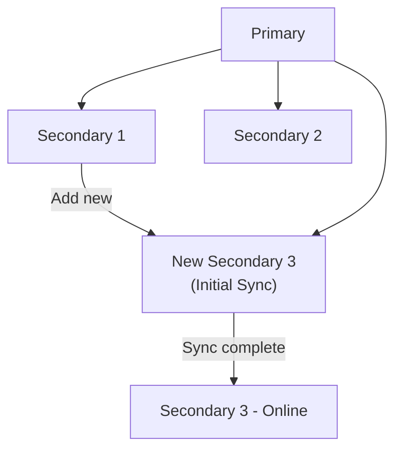

# How to Add a Secondary Node to a MongoDB Replica Set

Author: [nawazdhandala](https://www.github.com/nawazdhandala)

Tags: MongoDB, Replica Set, Secondary Node, Scaling, Replication

Description: Learn how to add a new secondary node to an existing MongoDB replica set, including starting the new mongod instance, adding it to the set, and monitoring initial sync.

---

## Why Add a Secondary

Adding a secondary to a running replica set allows you to:
- Increase read capacity (with secondary reads).
- Improve fault tolerance (more members can fail before the set loses quorum).
- Add a geographically distant member for disaster recovery.
- Create a hidden or delayed member for backup snapshots.



## Steps to Add a Secondary

### Step 1: Prepare the New Server

Install MongoDB on the new server and create the data directory:

```bash
sudo apt-get install -y mongodb-org  # or use your package manager

mkdir -p /data/db
chown -R mongodb:mongodb /data/db
```

### Step 2: Create the mongod Configuration

Create `/etc/mongod.conf` on the new server:

```yaml
storage:
  dbPath: /data/db
net:
  port: 27020
  bindIp: 0.0.0.0   # or restrict to specific IPs
replication:
  replSetName: "rs0"  # must match the existing replica set name
systemLog:
  destination: file
  path: /var/log/mongodb/mongod.log
  logAppend: true
processManagement:
  fork: true
  pidFilePath: /var/run/mongodb/mongod.pid
```

### Step 3: Start the New mongod Instance

```bash
sudo systemctl start mongod
# or
mongod --config /etc/mongod.conf
```

Verify it is running:

```bash
sudo systemctl status mongod
```

### Step 4: Connect to the Primary and Add the New Member

Connect to the current primary of the existing replica set:

```bash
mongosh "mongodb://primary-host:27017/?replicaSet=rs0"
```

Check current members:

```javascript
rs.status()
```

Add the new member:

```javascript
rs.add("new-server-hostname:27020")
```

For a server in a different data center with lower priority:

```javascript
rs.add({
  host: "new-server-hostname:27020",
  priority: 0,    // prevent this member from becoming primary
  votes: 1        // still participates in elections
})
```

For a hidden member (not visible to application drivers):

```javascript
rs.add({
  host: "new-server-hostname:27020",
  hidden: true,
  priority: 0    // hidden members must have priority 0
})
```

For a delayed member (replica with a time lag for point-in-time recovery):

```javascript
rs.add({
  host: "new-server-hostname:27020",
  priority: 0,
  hidden: true,
  secondaryDelaySecs: 3600  // 1 hour delay
})
```

### Step 5: Monitor Initial Sync

After adding the member, it will undergo initial sync - copying all data from the primary. Monitor the progress:

```javascript
rs.status()
```

The new member will show `stateStr: "STARTUP2"` during initial sync:

```javascript
{
  "_id": 3,
  "name": "new-server-hostname:27020",
  "health": 1,
  "stateStr": "STARTUP2",
  "infoMessage": "initial sync need to start",
  "initialSyncStatus": {
    "totalInitialSyncElapsedMillis": 45000,
    "remainingInitialSyncEstimatedMillis": 120000
  }
}
```

When sync completes, it transitions to `SECONDARY`:

```javascript
{ "stateStr": "SECONDARY" }
```

### Step 6: Verify the New Member

After the new member syncs, verify it is healthy:

```javascript
rs.status()
```

Check that the optime of the new secondary is close to the primary:

```javascript
rs.printReplicationInfo()
rs.printSecondaryReplicationInfo()
```

### Full Node.js Monitoring Example

```javascript
const { MongoClient } = require("mongodb");

async function addSecondaryAndMonitor(newMemberHost) {
  const uri = "mongodb://primary:27017,secondary1:27018/?replicaSet=rs0";
  const client = new MongoClient(uri);
  await client.connect();

  const admin = client.db("admin");

  // Get current status
  const statusBefore = await admin.command({ replSetGetStatus: 1 });
  console.log("Members before:", statusBefore.members.map(m => m.name));

  // Add new member
  await admin.command({
    replSetReconfig: {
      ...statusBefore,
      members: [
        ...statusBefore.members,
        {
          _id: statusBefore.members.length,
          host: newMemberHost,
          priority: 1,
          votes: 1
        }
      ],
      version: statusBefore.version + 1
    }
  });

  console.log(`Added ${newMemberHost} to replica set`);

  // Poll until new member becomes SECONDARY
  for (let i = 0; i < 60; i++) {
    await new Promise(r => setTimeout(r, 5000));  // wait 5 seconds
    const status = await admin.command({ replSetGetStatus: 1 });
    const newMember = status.members.find(m => m.name === newMemberHost);

    if (newMember) {
      console.log(`${newMemberHost} state: ${newMember.stateStr}`);
      if (newMember.stateStr === "SECONDARY") {
        console.log("Initial sync complete!");
        break;
      }
    }
  }

  await client.close();
}

addSecondaryAndMonitor("new-server:27020").catch(console.error);
```

## Modifying an Existing Member's Configuration

To change a member's priority, votes, or hidden status after it is already in the set:

```javascript
// Get current configuration
const config = rs.conf();

// Modify the member at index 2
config.members[2].priority = 0;
config.members[2].hidden = true;
config.version++;

// Apply the new configuration
rs.reconfig(config);
```

## Checking Oplog Window

Make sure the oplog is large enough to accommodate the initial sync duration of a new member:

```javascript
rs.printReplicationInfo()
```

Output:

```text
configured oplog size:   1024MB
log length start to end: 7200 secs (2 hrs)
oplog first event time:  Tue Mar 31 2026 00:00:00 GMT+0000
oplog last event time:   Tue Mar 31 2026 02:00:00 GMT+0000
```

If the initial sync takes longer than the oplog window, the sync fails and the member must restart from scratch.

## Best Practices

- **Allow off-peak hours for initial sync** on large datasets, as it reads significant data from the primary.
- **Set `priority: 0`** for new members in remote locations to prevent them from becoming primary.
- **Size the oplog appropriately** (at least 24-72 hours of operations) so members can recover from brief outages.
- **Pre-copy data with `mongodump`/`mongorestore`** before adding large members to reduce initial sync time.
- **Monitor replication lag** with `rs.printSecondaryReplicationInfo()` after adding the member.
- **Use keyfile or X.509 auth** on the new member to match the existing replica set security configuration.

## Summary

Adding a secondary to a MongoDB replica set involves starting a new mongod instance with the same `replSetName`, then calling `rs.add()` on the primary. The new member undergoes initial sync, copying all data from the primary. Monitor progress with `rs.status()` until the member transitions to `SECONDARY`. Use member options like `priority`, `hidden`, and `secondaryDelaySecs` to customize the member's role in the set.
