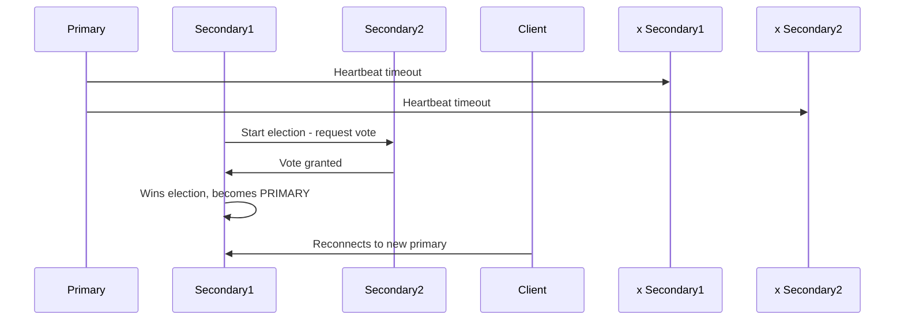

# How to Handle Replica Set Failover in MongoDB

Author: [nawazdhandala](https://www.github.com/nawazdhandala)

Tags: MongoDB, Replica Set, Failover, High Availability, Election

Description: Learn how MongoDB replica set failover works, how to trigger a manual stepdown, handle application reconnection, and tune election parameters for faster failover.

---

## How Replica Set Failover Works

When a MongoDB primary becomes unavailable, the remaining secondary members hold an election to choose a new primary. The election process:

1. A secondary detects the primary is unresponsive (after `electionTimeoutMillis`).
2. The secondary starts an election and requests votes from other members.
3. Members vote for the candidate that is most up-to-date.
4. The first candidate to receive a majority of votes becomes the new primary.
5. Clients automatically reconnect to the new primary.



## Election Timeline

The typical failover sequence:
1. `electionTimeoutMillis` (default 10 seconds) - time before detecting primary failure.
2. Election duration - usually 1-5 seconds.
3. Client reconnection - driver detects new primary via heartbeat.

Total typical failover time: 10-20 seconds with default settings.

## Automatic Failover in Practice

When a primary is unavailable, drivers automatically:
1. Detect the topology change via heartbeat.
2. Enter a state where writes are buffered or fail with `NotPrimary` errors.
3. Monitor the replica set for a new primary.
4. Resume operations once a new primary is elected.

```javascript
const { MongoClient } = require("mongodb");

async function resilientWrite(client, data) {
  const collection = client.db("myapp").collection("orders");
  const maxRetries = 3;

  for (let attempt = 1; attempt <= maxRetries; attempt++) {
    try {
      const result = await collection.insertOne(data);
      return result;
    } catch (err) {
      // Check for transient errors during failover
      if (
        err.code === 91 ||  // ShutdownInProgress
        err.code === 10107 || // NotPrimary
        err.code === 13435 || // NotPrimaryNoSecondaryOk
        err.hasErrorLabel("RetryableWriteError")
      ) {
        if (attempt < maxRetries) {
          console.log(`Attempt ${attempt} failed during failover, retrying...`);
          await new Promise(r => setTimeout(r, 1000 * attempt));
          continue;
        }
      }
      throw err;
    }
  }
}
```

## Manual Failover: Step Down the Primary

To trigger a controlled failover (e.g., for maintenance), step down the primary:

```javascript
// Connect to the primary
mongosh "mongodb://primary-host:27017/?replicaSet=rs0"

// Step down: primary becomes secondary for at least 60 seconds
rs.stepDown(60)
```

Or via the admin command:

```javascript
db.adminCommand({
  replSetStepDown: 60,        // seconds to remain secondary
  secondaryCatchUpPeriodSecs: 10  // wait up to 10s for secondaries to catch up
})
```

After stepdown, a new election occurs and one of the secondaries becomes primary.

## Checking Who is Primary

```javascript
rs.isMaster()
// or
db.runCommand({ isMaster: 1 })
```

Output includes:

```javascript
{
  "ismaster": true,  // or false if this is a secondary
  "primary": "host1:27017",
  "hosts": ["host1:27017", "host2:27018", "host3:27019"],
  "setName": "rs0"
}
```

## Freeze a Secondary During Maintenance

Prevent a secondary from being elected as primary for a specified period:

```javascript
// On the secondary you want to freeze
rs.freeze(300)  // prevent election for 300 seconds (5 minutes)
```

## Tuning Election Timeout

Reduce `electionTimeoutMillis` for faster failover detection:

```javascript
const config = rs.conf();
config.settings = {
  ...config.settings,
  electionTimeoutMillis: 5000  // detect failure in 5 seconds (default: 10000)
};
config.version++;
rs.reconfig(config);
```

Lower values detect failures faster but may cause false elections due to network hiccups. The default of 10 seconds is suitable for most deployments.

## Handling Application Retries

Configure the MongoDB driver with appropriate retry and timeout settings:

```javascript
const { MongoClient } = require("mongodb");

const client = new MongoClient(
  "mongodb://host1:27017,host2:27018,host3:27019/?replicaSet=rs0",
  {
    serverSelectionTimeoutMS: 30000,  // 30s to find a primary
    socketTimeoutMS: 45000,           // 45s socket timeout
    connectTimeoutMS: 10000,          // 10s connection timeout
    retryWrites: true,                // automatically retry retryable writes
    retryReads: true,                 // automatically retry retryable reads
    heartbeatFrequencyMS: 10000       // check member status every 10s
  }
);
```

### Retryable Writes

With `retryWrites: true` (default), the driver automatically retries the following operations once if they fail with a retryable error during failover:

- `insertOne`, `insertMany`
- `updateOne`, `replaceOne`
- `deleteOne`
- `findOneAndUpdate`, `findOneAndReplace`, `findOneAndDelete`
- Bulk writes (if `ordered: true`)

Non-retryable: `insertMany` with `ordered: false`, multi-document updates without sessions.

## Monitoring Failover Events

Set up application-level monitoring for primary change events:

```javascript
const { MongoClient } = require("mongodb");

const client = new MongoClient("mongodb://host1:27017,host2:27018,host3:27019/?replicaSet=rs0");

// Listen for topology events
client.on("commandFailed", (event) => {
  console.log("Command failed:", event.commandName, event.failure);
});

// Monitor topology changes
const topology = client.topology;
if (topology) {
  topology.on("topologyChanged", (event) => {
    const primary = event.newDescription.servers
      ? [...event.newDescription.servers.values()].find(s => s.type === "RSPrimary")
      : null;
    if (primary) {
      console.log("New primary:", primary.address);
    }
  });
}

await client.connect();
```

## Simulating Failover for Testing

```bash
# Kill the primary process (SIGTERM for graceful, SIGKILL for abrupt)
kill $(ps aux | grep mongod | grep 27017 | awk '{print $2}')

# Watch election in real-time
mongosh --port 27018 --eval "rs.status()" --quiet
```

## Best Practices

- **Enable `retryWrites: true`** in all application connection strings - it is the default but verify it is not disabled.
- **Set `serverSelectionTimeoutMS`** to at least 30 seconds so the driver has time to find a new primary.
- **Use write concern `w: majority`** for critical writes to ensure committed writes survive failover.
- **Test failover regularly** in staging by stepping down the primary and verifying applications recover.
- **Avoid long-running transactions during planned maintenance** - transactions are aborted on failover.
- **Monitor election frequency** in production - frequent unexpected elections indicate network instability.
- **Use `rs.stepDown()`** for controlled maintenance instead of killing the primary process.

## Summary

MongoDB replica set failover is automatic: when the primary becomes unavailable, secondaries elect a new primary within 10-20 seconds by default. Applications using the MongoDB driver with `retryWrites: true` automatically reconnect to the new primary and retry eligible operations. For planned maintenance, use `rs.stepDown()` for a graceful transition. Reduce `electionTimeoutMillis` for faster failure detection in latency-sensitive environments, and always test failover in staging to validate application resilience.
