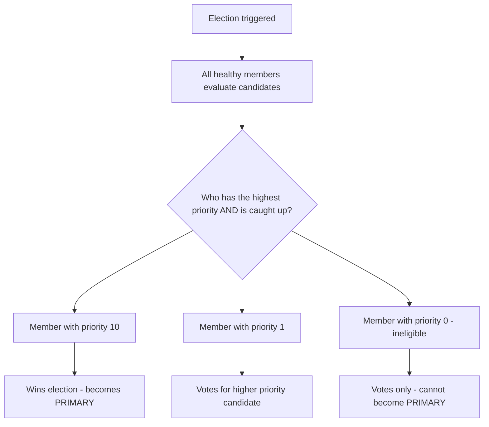
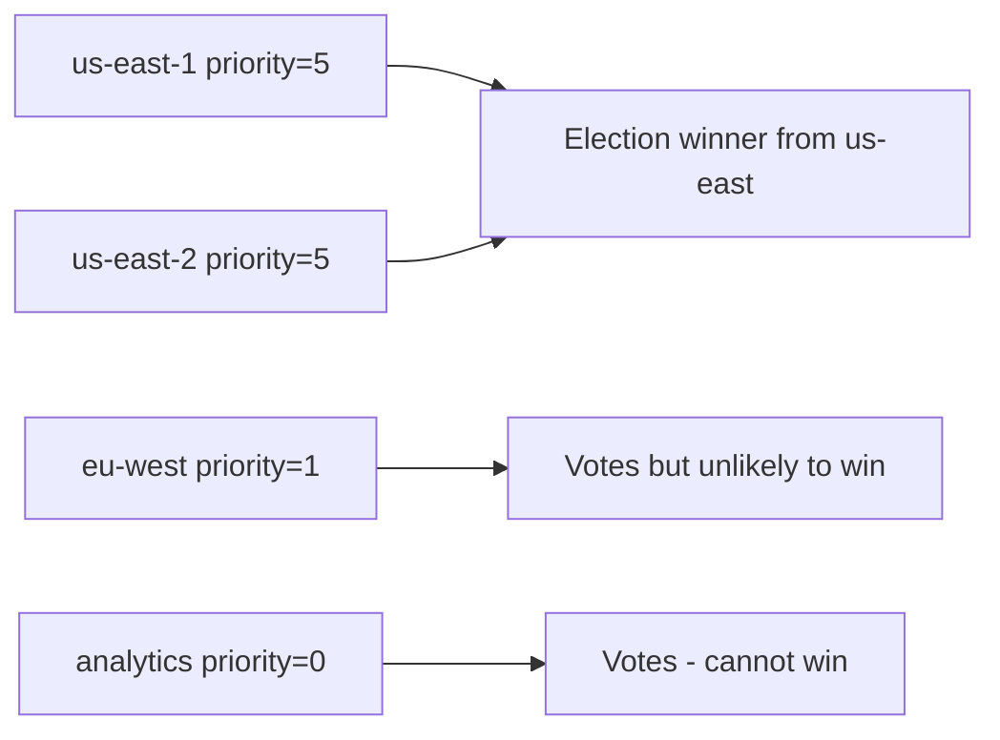

# How to Configure Priority in MongoDB Replica Set Members

Author: [nawazdhandala](https://www.github.com/nawazdhandala)

Tags: MongoDB, Replica Set, Priority, Election, Configuration

Description: Learn how to configure election priority in MongoDB replica set members to control which server becomes primary, prevent cross-region primaries, and set non-voting members.

---

## What is Priority in a MongoDB Replica Set

Each replica set member has a `priority` value between 0 and 1000 (default 1). During an election, the member with the highest priority that is caught up with the primary wins, becoming the new primary. A member with `priority: 0` can never become primary.

Priority is commonly used to:
- Designate a preferred primary (e.g., the most powerful server)
- Prevent disaster-recovery members from becoming primary
- Create analytics replicas or delayed secondaries that never serve writes



## Viewing Current Priorities

```javascript
const cfg = rs.conf();
cfg.members.forEach(m => {
  print(`${m.host}  priority: ${m.priority}  votes: ${m.votes}`);
});
```

## Setting Priority During Initialization

```javascript
rs.initiate({
  _id: "rs0",
  members: [
    { _id: 0, host: "primary.example.com:27017",  priority: 10 },
    { _id: 1, host: "secondary1.example.com:27018", priority: 1 },
    { _id: 2, host: "secondary2.example.com:27019", priority: 1 }
  ]
});
```

With `priority: 10` on the first member, it becomes the preferred primary and will reclaim the primary role whenever it is healthy.

## Changing Priority on a Running Replica Set

```javascript
// Fetch current config
const cfg = rs.conf();

// Make server1 the strongly preferred primary
cfg.members[0].priority = 10;
cfg.members[1].priority = 1;
cfg.members[2].priority = 1;

// Apply
rs.reconfig(cfg);
```

After this change, if server1 is healthy and sufficiently caught up, it will win the next election.

## Preventing a Member from Becoming Primary (priority: 0)

```javascript
const cfg = rs.conf();

// Disaster recovery node in a remote datacenter should not become primary
cfg.members[2].priority = 0;

rs.reconfig(cfg);
```

Members with `priority: 0` still replicate all data, can serve reads, and vote in elections - they simply cannot win an election and become primary.

## Rules Governing Priority

```javascript
// These rules must be followed:

// 1. Hidden members must have priority 0
cfg.members[2].hidden = true;
cfg.members[2].priority = 0;   // required for hidden members

// 2. Delayed secondaries must have priority 0
cfg.members[2].secondaryDelaySecs = 3600;
cfg.members[2].priority = 0;   // required for delayed members

// 3. Non-voting members must have priority 0
cfg.members[3].votes = 0;
cfg.members[3].priority = 0;   // required when votes is 0
```

## Multi-Datacenter Priority Configuration

A typical three-datacenter setup uses priority to keep the primary in the main datacenter:

```javascript
rs.initiate({
  _id: "rs0",
  members: [
    // Primary datacenter (us-east) - high priority
    { _id: 0, host: "us-east-1.example.com:27017", priority: 5 },
    { _id: 1, host: "us-east-2.example.com:27018", priority: 5 },
    // DR datacenter (eu-west) - low priority, won't become primary under normal conditions
    { _id: 2, host: "eu-west-1.example.com:27017", priority: 1 },
    // Analytics datacenter - never primary
    { _id: 3, host: "analytics.example.com:27017", priority: 0, hidden: true }
  ]
});
```



## Priority and Write Concern

Priority does not affect write concern. Write concern is based on acknowledgments from members regardless of priority:

```javascript
// w: "majority" waits for a majority of members to acknowledge
// regardless of their priority
db.collection.insertOne(
  { data: "important" },
  { writeConcern: { w: "majority", j: true } }
);
```

## Forcing a Specific Member to Become Primary

To trigger a failover to a specific member, step down the current primary and temporarily raise the target member's priority:

```javascript
// Step 1: Raise priority on the desired member
const cfg = rs.conf();
cfg.members.find(m => m.host === "server2.example.com:27018").priority = 100;
rs.reconfig(cfg);

// Step 2: Step down the current primary
rs.stepDown(30);  // 30s before allowed to stand again

// Step 3: server2 wins the election
// Step 4: Optionally restore priorities to original values
const cfg2 = rs.conf();
cfg2.members.find(m => m.host === "server2.example.com:27018").priority = 1;
rs.reconfig(cfg2);
```

## Verifying Priority Behavior

```javascript
// After reconfig, check current primary
rs.status().members
  .filter(m => m.stateStr === "PRIMARY")
  .forEach(m => print("Current primary:", m.name));

// Check all member priorities
rs.conf().members.forEach(m => {
  print(m.host, "priority:", m.priority, "state:", rs.status().members.find(s => s.name === m.host)?.stateStr);
});
```

## Priority vs. Votes

These are two separate properties that are often confused:

| Property | Controls |
|---|---|
| `priority` | Who wins elections (higher = more likely to become primary) |
| `votes` | Whether the member participates in elections (0 or 1) |

A member can have `votes: 1` but `priority: 0` - it votes in elections but cannot win. A member with `votes: 0` and `priority: 0` neither votes nor wins.

## Summary

Priority in a MongoDB replica set controls which member is preferred as primary during elections. Set `priority` higher on the servers you want to serve as primary (typically the most powerful or closest to your application), and set `priority: 0` on members that should never become primary (hidden nodes, delayed secondaries, analytics replicas, and DR nodes). Change priorities on a live set with `rs.reconfig()` after fetching the current config with `rs.conf()`, and verify the expected primary wins with `rs.status()`.
