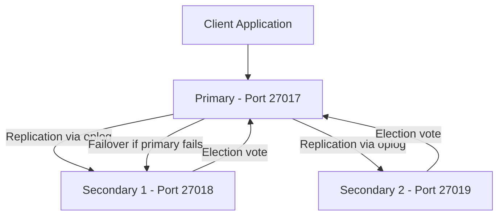

# How to Set Up MongoDB Replica Set from Scratch

Author: [nawazdhandala](https://www.github.com/nawazdhandala)

Tags: MongoDB, Replica Set, High Availability, Replication, Setup

Description: Learn how to set up a MongoDB replica set from scratch, including launching mongod instances, initiating the replica set, and verifying replication across members.

---

## What is a Replica Set

A MongoDB replica set is a group of mongod instances that maintain the same dataset. One member is the primary (accepts all writes) and the others are secondaries (replicate data from the primary). If the primary fails, the secondaries automatically elect a new primary.



A minimum of 3 members is recommended for fault tolerance (2 data-bearing members + 1 arbiter, or 3 full data members).

## Prerequisites

- MongoDB installed on each server (or locally on different ports for testing).
- Network connectivity between all replica set members.
- Synchronized clocks across all members (use NTP).

## Step-by-Step Setup

### Step 1: Create Data Directories

```bash
mkdir -p /data/rs0/db1
mkdir -p /data/rs0/db2
mkdir -p /data/rs0/db3
```

### Step 2: Create Configuration Files

Create `mongod1.conf`:

```yaml
storage:
  dbPath: /data/rs0/db1
net:
  port: 27017
  bindIp: 127.0.0.1
replication:
  replSetName: "rs0"
systemLog:
  destination: file
  path: /data/rs0/db1/mongod.log
  logAppend: true
```

Create `mongod2.conf`:

```yaml
storage:
  dbPath: /data/rs0/db2
net:
  port: 27018
  bindIp: 127.0.0.1
replication:
  replSetName: "rs0"
systemLog:
  destination: file
  path: /data/rs0/db2/mongod.log
  logAppend: true
```

Create `mongod3.conf`:

```yaml
storage:
  dbPath: /data/rs0/db3
net:
  port: 27019
  bindIp: 127.0.0.1
replication:
  replSetName: "rs0"
systemLog:
  destination: file
  path: /data/rs0/db3/mongod.log
  logAppend: true
```

### Step 3: Start All mongod Instances

```bash
mongod --config /etc/mongod1.conf --fork
mongod --config /etc/mongod2.conf --fork
mongod --config /etc/mongod3.conf --fork
```

Verify they are running:

```bash
ps aux | grep mongod
```

### Step 4: Connect to the First Instance and Initiate the Replica Set

```bash
mongosh --port 27017
```

Inside mongosh, initiate the replica set:

```javascript
rs.initiate({
  _id: "rs0",
  members: [
    { _id: 0, host: "127.0.0.1:27017", priority: 2 },  // preferred primary
    { _id: 1, host: "127.0.0.1:27018", priority: 1 },
    { _id: 2, host: "127.0.0.1:27019", priority: 1 }
  ]
})
```

Expected response:

```javascript
{ ok: 1 }
```

### Step 5: Verify Replica Set Status

```javascript
rs.status()
```

Look for output similar to:

```javascript
{
  "set": "rs0",
  "members": [
    {
      "_id": 0,
      "name": "127.0.0.1:27017",
      "health": 1,
      "stateStr": "PRIMARY",
      "optime": { ... }
    },
    {
      "_id": 1,
      "name": "127.0.0.1:27018",
      "health": 1,
      "stateStr": "SECONDARY"
    },
    {
      "_id": 2,
      "name": "127.0.0.1:27019",
      "health": 1,
      "stateStr": "SECONDARY"
    }
  ]
}
```

### Step 6: Test Replication

On the primary, insert a document:

```javascript
use testdb
db.items.insertOne({ name: "Widget", qty: 100, createdAt: new Date() })
```

Connect to a secondary and verify the document exists:

```bash
mongosh --port 27018
```

```javascript
rs.secondaryOk()  // allow reads from secondary
use testdb
db.items.findOne()
// Should return the document inserted on the primary
```

### Step 7: Connect Application to Replica Set

Connection string with replica set members:

```javascript
const { MongoClient } = require("mongodb");

const uri = "mongodb://127.0.0.1:27017,127.0.0.1:27018,127.0.0.1:27019/?replicaSet=rs0";

const client = new MongoClient(uri, {
  readPreference: "primaryPreferred"
});

async function main() {
  await client.connect();
  const db = client.db("testdb");
  const items = db.collection("items");

  await items.insertOne({ name: "Gadget", qty: 50 });
  const count = await items.countDocuments();
  console.log("Items:", count);

  await client.close();
}

main().catch(console.error);
```

## Replica Set Configuration Options

Key fields in `rs.initiate()`:

```text
Field           Description
------------------------------------------
_id             Replica set name (must match replSetName in mongod.conf)
members[].host  hostname:port of each member
members[].priority  Election priority (higher = more likely to become primary)
members[].votes     1 (default) or 0 (no vote in elections)
members[].arbiterOnly  true for arbiter members (vote but no data)
members[].hidden    true for hidden members (not visible to clients)
members[].slaveDelay  seconds of replication delay (for delayed members)
```

## Arbiter-Based Configuration (2 Data + 1 Arbiter)

```javascript
rs.initiate({
  _id: "rs0",
  members: [
    { _id: 0, host: "127.0.0.1:27017" },          // data member
    { _id: 1, host: "127.0.0.1:27018" },          // data member
    { _id: 2, host: "127.0.0.1:27019", arbiterOnly: true }  // arbiter
  ]
})
```

Arbiters participate in elections but do not store data. Use this to reach odd-member quorum without the storage cost of a third full member.

## Best Practices

- **Use 3 or more members** for fault tolerance. A 2-member set cannot elect a new primary if one goes down.
- **Deploy members across availability zones** or separate hosts to protect against server failures.
- **Set `priority: 0` for secondaries** in remote data centers to prefer local primaries.
- **Use a keyfile or X.509 certificates** to authenticate replica set members in production.
- **Monitor oplog size.** If a secondary falls behind by more than the oplog window, it needs a full resync.
- **Synchronize clocks with NTP** across all members to prevent election instability.

## Summary

A MongoDB replica set provides high availability by replicating data across multiple mongod instances. Set one up by starting multiple mongod instances with the same `replSetName`, then calling `rs.initiate()` with the member list. Verify with `rs.status()`. Connect applications with a connection string that lists all member hosts and the `replicaSet` parameter. Use at least 3 members for reliable automatic failover.
