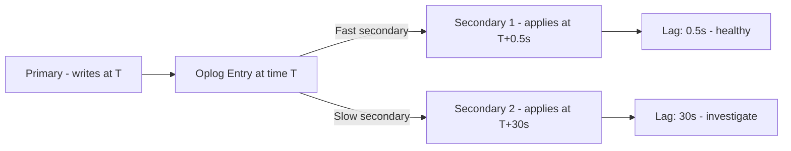
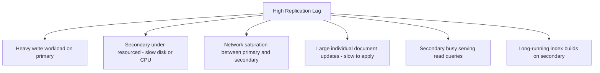

# How to Monitor Replication Lag in MongoDB

Author: [nawazdhandala](https://www.github.com/nawazdhandala)

Tags: MongoDB, Replication, Monitoring, Replica Set, Performance

Description: Learn how to measure and monitor MongoDB replication lag using rs.status(), rs.printSecondaryReplicationInfo(), $currentOp, and metrics from mongostat and MongoDB Atlas.

---

## What is Replication Lag

Replication lag is the delay between when a write is applied on the primary and when the same write is applied on a secondary. It is measured in seconds and represents how far behind a secondary is relative to the primary's oplog.

Excessive replication lag can cause:
- Stale reads from secondaries
- Risk of data loss if the primary fails before a lagging secondary catches up
- Delayed secondary falling off the oplog (requiring full resync)



## Method 1: rs.status()

`rs.status()` is the fastest way to check replication lag interactively:

```javascript
const status = rs.status();

const primary = status.members.find(m => m.stateStr === "PRIMARY");

if (!primary) {
  print("No primary found - replica set may be in election");
} else {
  status.members
    .filter(m => m.stateStr === "SECONDARY")
    .forEach(m => {
      const lagMs = primary.optimeDate - m.optimeDate;
      const lagSec = lagMs / 1000;
      print(`${m.name}: replication lag = ${lagSec.toFixed(1)}s`);
    });
}
```

## Method 2: rs.printSecondaryReplicationInfo()

This command gives a formatted, human-readable view of lag for all secondaries:

```javascript
rs.printSecondaryReplicationInfo();
```

Output:

```yaml
source: secondary1.example.com:27018
    syncedTo: Tue Mar 31 2024 11:59:58 GMT
    2 secs (0 hrs) behind the primary

source: secondary2.example.com:27019
    syncedTo: Tue Mar 31 2024 11:45:00 GMT
    900 secs (0.25 hrs) behind the primary
```

## Method 3: Oplog Comparison

For programmatic lag measurement, compare oplog timestamps directly:

```javascript
// On the primary - get the latest oplog entry
const primaryOplog = db.getSiblingDB("local").oplog.rs.find().sort({ $natural: -1 }).limit(1).next();
const primaryTs = primaryOplog.ts;

// On each secondary - get their latest applied oplog entry
// (connect directly and run the same)
const secondaryOplog = db.getSiblingDB("local").oplog.rs.find().sort({ $natural: -1 }).limit(1).next();
const secondaryTs = secondaryOplog.ts;

const lagSec = primaryTs.t - secondaryTs.t;
print("Replication lag:", lagSec, "seconds");
```

## Method 4: Using $currentOp to See Replication Operations

```javascript
// On the primary, view active replication workers
db.adminCommand({
  currentOp: true,
  "command.repl": { $exists: true }
});

// Or watch for OPLOG_BATCH_APPLY operations on secondaries
db.adminCommand({
  currentOp: true,
  "desc": "ReplBatcher"
});
```

## Method 5: serverStatus Replication Metrics

```javascript
const stats = db.adminCommand({ serverStatus: 1 });

// Replication stats on a secondary
const replStats = stats.repl;
print("Is primary:", replStats.ismaster);
print("Is secondary:", replStats.secondary);

// Optime of last applied operation
const optimes = stats.repl.opTimes;
print("Applied optime:", optimes.applied);
print("Durable optime:", optimes.durable);
print("Last committed:", optimes.lastCommitted);
```

## Method 6: mongostat

`mongostat` shows replication lag in the `repl` column on secondaries:

```bash
mongostat --host secondary.example.com:27018 \
  --username admin \
  --password "secret" \
  --authenticationDatabase admin \
  --discover \
  --rowcount 60 \
  1
```

Look for the `repl` column - it shows the replication state (PRI, SEC, REC) and the `lagms` field in newer versions.

## Method 7: Atlas and Cloud Manager

If using MongoDB Atlas, replication lag is available in the Metrics tab for each replica set member:

- Navigate to the cluster in Atlas
- Select the secondary member
- View "Replication Lag" in the charts

For self-hosted clusters, use the MongoDB Agent with Ops Manager to get the same metrics.

## Setting Up Automated Lag Monitoring

```javascript
// Monitoring script to log lag alerts
function monitorReplicationLag(thresholdSeconds) {
  const status = rs.status();
  const primary = status.members.find(m => m.stateStr === "PRIMARY");

  if (!primary) {
    print(new Date().toISOString(), "CRITICAL: No primary in replica set");
    return;
  }

  let allHealthy = true;
  status.members
    .filter(m => m.stateStr === "SECONDARY")
    .forEach(m => {
      const lagSec = (primary.optimeDate - m.optimeDate) / 1000;
      if (lagSec > thresholdSeconds) {
        print(new Date().toISOString(),
          `WARNING: ${m.name} lag=${lagSec.toFixed(0)}s exceeds threshold ${thresholdSeconds}s`);
        allHealthy = false;
      } else {
        print(new Date().toISOString(), `OK: ${m.name} lag=${lagSec.toFixed(1)}s`);
      }
    });

  return allHealthy;
}

// Alert if any secondary is more than 60 seconds behind
monitorReplicationLag(60);
```

## Causes of High Replication Lag



## Investigating Lag with explain()

If a specific type of operation is causing lag, analyze it on the secondary:

```javascript
// Connect directly to a lagging secondary
mongosh --host secondary.example.com:27018 --directConnection true

// Check for slow operations being applied from oplog
db.adminCommand({ currentOp: true, secs_running: { $gt: 5 } });
```

## Reducing Replication Lag

```javascript
// 1. Increase oplog size to prevent off-oplog situations
db.adminCommand({ replSetResizeOplog: 1, size: 20480 });  // 20 GB

// 2. Configure chained replication (secondaries can sync from other secondaries)
const cfg = rs.conf();
cfg.settings.chainingAllowed = true;
rs.reconfig(cfg);

// 3. Reduce read load on secondaries by routing reads to primary
// Change application read preference to "primary"

// 4. Upgrade secondary hardware (more RAM, faster NVMe disk)
```

## Oplog Window and Lag Relationship

If the secondary's lag exceeds the oplog window, it falls off and needs a full resync:

```javascript
rs.printReplicationInfo();
// log length start to end: 86400secs (24hrs)
// If a secondary is 25 hours behind, it has fallen off the oplog

// Detect fall-off: stateStr will be RECOVERING, not SECONDARY
rs.status().members
  .filter(m => m.stateStr === "RECOVERING")
  .forEach(m => print(`CRITICAL: ${m.name} is RECOVERING - may need resync`));
```

## Alert Thresholds

| Lag | Status | Action |
|---|---|---|
| 0-5 seconds | Healthy | No action |
| 5-30 seconds | Warning | Investigate write load and secondary resources |
| 30-120 seconds | Critical | Check disk I/O, network, and CPU on secondary |
| > oplog window | Emergency | Secondary needs full resync |

## Summary

Monitor MongoDB replication lag with `rs.status()` and `rs.printSecondaryReplicationInfo()` for interactive checks, and with `db.adminCommand({ serverStatus: 1 })` for programmatic metrics. Automate lag monitoring by comparing `optimeDate` between the primary and each secondary, and alert when lag exceeds a threshold (typically 30-60 seconds). High lag is caused by heavy primary writes, under-resourced secondaries, network congestion, or secondaries serving too many read queries. Address lag by increasing secondary hardware resources, expanding the oplog, enabling chained replication, or offloading read traffic from overburdened secondaries.
