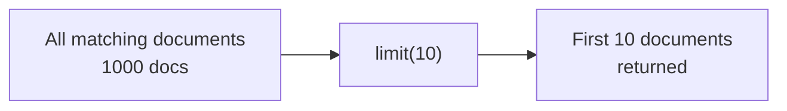

# How to Return Only the First N Results in MongoDB

Author: [nawazdhandala](https://www.github.com/nawazdhandala)

Tags: MongoDB, Limit, Query, Cursor, Performance

Description: Learn how to return only the first N documents from a MongoDB query using limit(), and how to combine it with sort() for predictable top-N results.

---

## Overview

MongoDB's `limit()` method restricts the number of documents returned by a cursor to a maximum of N. It is the primary way to return only the first N results from any query, and it is almost always combined with `sort()` to ensure a predictable order.



## Syntax

```javascript
db.collection.find(filter).limit(n)
```

- `n` must be a positive integer
- If `n` is 0, `limit(0)` is treated as no limit (all documents are returned)
- Passing a negative value is equivalent to the absolute value and closes the cursor after one batch

## Basic Examples

### Return the First 5 Documents

```javascript
db.products.find({}).limit(5)
```

Returns up to 5 documents in whatever order MongoDB chooses (usually natural/insertion order).

### Return the First N Documents Matching a Filter

```javascript
db.orders.find({ status: "pending" }).limit(10)
```

Returns up to 10 pending orders.

## Combining limit() with sort() for Top-N Queries

Without `sort()`, the documents returned by `limit()` are in natural order, which is not guaranteed to be consistent. Always add `sort()` when you need predictable top-N results:

```javascript
// Top 5 highest-scoring users
db.users.find({}).sort({ score: -1 }).limit(5)
```

```javascript
// 10 most recent orders
db.orders.find({}).sort({ createdAt: -1 }).limit(10)
```

```javascript
// Top 3 cheapest in-stock products
db.products.find({ inStock: true }).sort({ price: 1 }).limit(3)
```

## Order of Operations

Regardless of how you chain the methods in mongosh, MongoDB always applies `sort()` before `limit()` in the query execution plan:

```javascript
// Both of these are identical in execution
db.orders.find({}).sort({ createdAt: -1 }).limit(10)
db.orders.find({}).limit(10).sort({ createdAt: -1 })
```


## Combining limit() with skip() for Pagination

```javascript
// Page 1: first 10 results
db.orders.find({}).sort({ createdAt: -1 }).skip(0).limit(10)

// Page 2: next 10 results
db.orders.find({}).sort({ createdAt: -1 }).skip(10).limit(10)

// Page 3: next 10 results
db.orders.find({}).sort({ createdAt: -1 }).skip(20).limit(10)
```

Note: `skip()` becomes slow on large collections because MongoDB must scan and discard documents before the offset. For high-performance pagination, use cursor-based (keyset) pagination instead.

## Using findOne() to Return Exactly 1 Result

For retrieving a single document, `findOne()` is equivalent to `find().limit(1)` and returns the document directly (not a cursor):

```javascript
// Returns a single document object, not a cursor
db.orders.findOne({ status: "pending" })

// Equivalent using find + limit
db.orders.find({ status: "pending" }).limit(1)
```

Prefer `findOne()` when you only ever need one document.

## Aggregation Pipeline Equivalent

In aggregation pipelines, use the `$limit` stage:

```javascript
db.orders.aggregate([
  { $match: { status: "shipped" } },
  { $sort: { createdAt: -1 } },
  { $limit: 10 }
])
```

The `$limit` stage must come after `$sort` in the pipeline to get the top-N results.

## Performance Considerations

- `limit()` combined with a `sort()` on an indexed field allows MongoDB to stop scanning after finding N documents, making the query very efficient.
- Without an index on the sort field, MongoDB must sort all matching documents before applying the limit, which is slower.
- Create indexes on fields used in `sort()` to support efficient top-N queries.

```javascript
// Create an index to support top-N by createdAt
db.orders.createIndex({ createdAt: -1 })

// Now this query is fast
db.orders.find({ status: "pending" }).sort({ createdAt: -1 }).limit(10)
```

## Summary

Use `limit(n)` to cap the number of documents returned by a MongoDB query. Always combine `limit()` with `sort()` to ensure you get the correct top-N documents in a predictable order. Use `findOne()` when you need exactly one document. In aggregation pipelines, use the `$limit` stage after `$sort`. Index the sort field to make top-N queries efficient on large collections.
