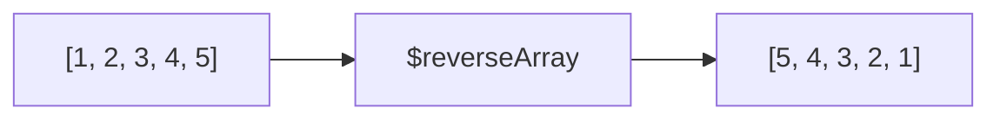

# How to Use $reverseArray in MongoDB Aggregation

Author: [nawazdhandala](https://www.github.com/nawazdhandala)

Tags: MongoDB, Aggregation, Array, Pipeline, Expression

Description: Learn how to use $reverseArray in MongoDB aggregation to reverse the order of elements in an array field within a pipeline stage.

---

## How $reverseArray Works

`$reverseArray` accepts an array expression and returns a new array with the elements in reversed order. The original document is not modified; the result is a projected copy.



## Syntax

```javascript
{ $reverseArray: <array expression> }
```

The expression must resolve to an array. If the value is `null` or the field is missing, `$reverseArray` returns `null`.

## Examples

### Example 1 - Reverse a Simple Array

```javascript
// Input: { _id: 1, scores: [10, 20, 30, 40, 50] }
db.results.aggregate([
  {
    $project: {
      reversed: { $reverseArray: "$scores" }
    }
  }
])
```

Output:

```javascript
[
  { _id: 1, reversed: [50, 40, 30, 20, 10] }
]
```

### Example 2 - Get the Last N Items by Reversing and Slicing

Retrieve the last three items without using a negative-index slice:

```javascript
// Input: { _id: 1, events: ["login", "view", "click", "purchase", "logout"] }
db.sessions.aggregate([
  {
    $project: {
      lastThree: {
        $slice: [{ $reverseArray: "$events" }, 3]
      }
    }
  }
])
```

Output:

```javascript
[
  { _id: 1, lastThree: ["logout", "purchase", "click"] }
]
```

### Example 3 - Reverse an Array Produced by $push in a $group Stage

Collect documents in insertion order then reverse so the newest item is first:

```javascript
db.orders.aggregate([
  { $sort: { createdAt: 1 } },
  {
    $group: {
      _id: "$customerId",
      orderIds: { $push: "$_id" }
    }
  },
  {
    $project: {
      latestFirst: { $reverseArray: "$orderIds" }
    }
  }
])
```

### Example 4 - Reverse an Inline Array Literal

```javascript
db.demo.aggregate([
  {
    $project: {
      reversed: { $reverseArray: [1, 2, 3, 4, 5] }
    }
  }
])
```

Output:

```javascript
[
  { reversed: [5, 4, 3, 2, 1] }
]
```

### Example 5 - Handle Null and Missing Fields Safely

```javascript
// Input: { _id: 1, tags: null }
db.items.aggregate([
  {
    $project: {
      safeReversed: {
        $cond: {
          if: { $isArray: "$tags" },
          then: { $reverseArray: "$tags" },
          else: []
        }
      }
    }
  }
])
```

Output:

```javascript
[
  { _id: 1, safeReversed: [] }
]
```

### Example 6 - Reverse After Sorting with $sortArray

Sort an array of objects and then reverse to get descending order:

```javascript
// Input: { _id: 1, items: [{name: "a", qty: 5}, {name: "b", qty: 2}, {name: "c", qty: 8}] }
db.inventory.aggregate([
  {
    $project: {
      topFirst: {
        $reverseArray: {
          $sortArray: {
            input: "$items",
            sortBy: { qty: 1 }
          }
        }
      }
    }
  }
])
```

Output:

```javascript
[
  { _id: 1, topFirst: [{name:"c",qty:8},{name:"a",qty:5},{name:"b",qty:2}] }
]
```

## Behavior Notes

| Input Value | Result |
|---|---|
| Valid array | Reversed array |
| Empty array `[]` | `[]` |
| `null` | `null` |
| Missing field | `null` |

## Use Cases

- Displaying activity timelines newest-first after an ascending sort and `$push`
- Reversing byte or character arrays for encoding operations
- Getting the last N elements without `$slice` negative indices
- Inverting sort order after `$sortArray` when descending sort is not directly available

## Summary

`$reverseArray` is a lightweight single-operator way to invert array element order in a MongoDB aggregation pipeline. It works on any array expression, handles nulls gracefully, and pairs naturally with `$slice`, `$sortArray`, and `$push` to build flexible ordering logic entirely within the aggregation framework.
