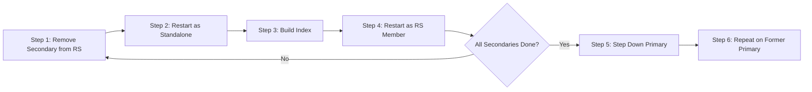

# How to Perform Rolling Index Builds in MongoDB Replica Set

Author: [nawazdhandala](https://www.github.com/nawazdhandala)

Tags: MongoDB, Index, Replica Set, Performance, Operation

Description: Learn how to build indexes one replica set member at a time to avoid write performance degradation on your MongoDB primary during large index creation.

---

## Introduction

Building an index on a large collection blocks write performance in older MongoDB versions. Even in MongoDB 4.2+ where background index builds are the default, a rolling index build - creating the index on each secondary in turn before the primary - gives you maximum control and avoids index build impact on production traffic.

A rolling build works by:
1. Stopping replication on one secondary
2. Building the index standalone
3. Restarting it as a replica set member
4. Repeating for every secondary
5. Stepping down the primary and building there last

## Prerequisites

- MongoDB 4.4 or later (recommended)
- A running replica set with at least one secondary
- Enough disk space on each node for the index

## Rolling Index Build Procedure



## Step 1: Identify the Replica Set Members

```javascript
rs.status().members.forEach(m => {
  print(m.name, m.stateStr)
})
```

Note the port number of the secondary you will work on first (e.g., `27017`).

## Step 2: Remove the Secondary from the Replica Set (Optional for Older Versions)

For MongoDB 4.4+ you do not need to remove the member. Instead, use the replica set maintenance mode:

```javascript
// Connect to the secondary
rs.secondaryOk()
db.adminCommand({ replSetMaintenance: true })
```

This puts the member in RECOVERING state, which stops it from serving reads and accepting replication, but keeps it in the replica set config.

## Step 3: Restart the Secondary as Standalone (MongoDB < 4.4)

If you are on an older version or prefer the standalone approach, edit the mongod config on the secondary:

```yaml
# Comment out replication section and change port
net:
  port: 27218   # temporary port to avoid client connections
# replication:
#   replSetName: "rs0"
```

```bash
sudo systemctl restart mongod
```

Connect to the standalone instance:

```bash
mongosh --port 27218
```

## Step 4: Build the Index

```javascript
// Connect to the standalone (or maintenance-mode secondary)
use myDatabase
db.orders.createIndex(
  { customerId: 1, createdAt: -1 },
  {
    name: "idx_customer_created",
    background: false,   // standalone always builds in foreground
    comment: "rolling index build"
  }
)
```

Monitor the build progress:

```javascript
db.adminCommand({ currentOp: 1, "command.createIndexes": { $exists: true } })
```

## Step 5: Restart the Secondary as a Replica Set Member

Restore the mongod config:

```yaml
net:
  port: 27017
replication:
  replSetName: "rs0"
```

```bash
sudo systemctl restart mongod
```

Wait for the secondary to catch up:

```javascript
// On primary
db.adminCommand({ replSetGetStatus: 1 }).members.forEach(m => {
  print(m.name, m.stateStr, m.optimeDate)
})
```

## Step 6: Repeat for All Secondaries

Perform Steps 2-5 on every secondary node before touching the primary.

## Step 7: Handle the Primary Last

Step down the primary so it becomes a secondary:

```javascript
// On the primary
rs.stepDown(120)   // give 120 seconds for a new election
```

Now perform Steps 2-5 on this node (now acting as secondary).

## Step 8: Verify the Index Exists on All Members

```javascript
// On each member
use myDatabase
db.orders.getIndexes()
```

Expected output includes your new index:

```javascript
[
  { v: 2, key: { _id: 1 }, name: "_id_" },
  {
    v: 2,
    key: { customerId: 1, createdAt: -1 },
    name: "idx_customer_created"
  }
]
```

## Avoiding Common Pitfalls

```javascript
// Check that the index is not already building on the primary
db.adminCommand({
  currentOp: 1,
  "command.createIndexes": { $exists: true }
})

// Confirm oplog window is large enough before starting
db.getReplicationInfo()
// Look for: log length start to end: Xsec (~X hrs)
// Ensure the window exceeds your expected build time
```

## Summary

Rolling index builds let you add indexes to large MongoDB replica set collections without causing a noticeable write performance dip on the primary. Process one secondary at a time, verify replication catches up before moving to the next node, and always build on the primary last by stepping it down first. In MongoDB 4.4+ you can use `replSetMaintenance` to simplify the process without a standalone restart.
