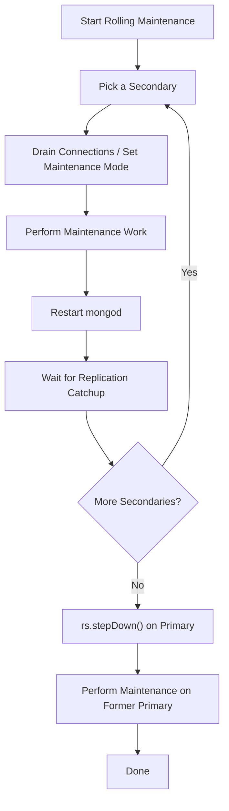

# How to Perform Rolling Maintenance on MongoDB Replica Set

Author: [nawazdhandala](https://www.github.com/nawazdhandala)

Tags: MongoDB, Replica Set, Maintenance, Operation, High Availability

Description: Learn how to perform zero-downtime rolling maintenance on a MongoDB replica set by cycling through secondaries before stepping down the primary.

---

## Introduction

Rolling maintenance lets you apply OS patches, MongoDB upgrades, configuration changes, or hardware replacements to a replica set without any application downtime. The process involves taking one member offline at a time, performing the maintenance work, bringing it back, waiting for it to catch up with replication, and then repeating on the next member. The primary is always the last node to be touched.

## Rolling Maintenance Workflow



## Step 1: Confirm Replica Set Health Before Starting

Always start from a healthy state. All members should be PRIMARY or SECONDARY - no RECOVERING or UNKNOWN members.

```javascript
rs.status().members.forEach(m => {
  print(m.name, m.stateStr, "health:", m.health)
})
```

## Step 2: Choose the First Secondary

Pick a secondary that is not the hidden or delayed member (to preserve read capacity during maintenance):

```javascript
var sec = rs.status().members.find(m => m.stateStr === "SECONDARY" && !m.hidden)
print("Working on:", sec.name)
```

## Step 3: Put the Secondary into Maintenance Mode

Maintenance mode sets the member to RECOVERING state so that clients do not route reads to it during the work:

```javascript
// Connect directly to the secondary
db.adminCommand({ replSetMaintenance: true })
```

Confirm the state has changed:

```javascript
rs.status().members.find(m => m.self).stateStr
// Expected: "RECOVERING"
```

## Step 4: Perform Maintenance

Examples of maintenance tasks:

```bash
# OS patching
sudo yum update -y    # RHEL/CentOS
sudo apt-get upgrade -y  # Ubuntu/Debian

# MongoDB config change (e.g., increase cache size)
sudo vi /etc/mongod.conf
```

```yaml
# Example: Increase WiredTiger cache
storage:
  wiredTiger:
    engineConfig:
      cacheSizeGB: 16
```

```bash
# Restart mongod after config changes
sudo systemctl restart mongod
```

## Step 5: Take the Secondary Out of Maintenance Mode

After the restart, mongod rejoins the replica set automatically. If you put it in maintenance mode without restarting:

```javascript
db.adminCommand({ replSetMaintenance: false })
```

## Step 6: Wait for Replication to Catch Up

Do not proceed to the next node until this member has fully caught up:

```javascript
// Poll until the secondary optime matches the primary
function waitForCatchup(memberHost, maxWaitSeconds) {
  var waited = 0
  while (waited < maxWaitSeconds) {
    var status = rs.status()
    var primary = status.members.find(m => m.stateStr === "PRIMARY")
    var member = status.members.find(m => m.name === memberHost)
    if (!member) { print("Member not found"); break }
    var lagMs = primary.optimeDate - member.optimeDate
    print("Lag:", lagMs, "ms")
    if (lagMs < 2000) { print("Caught up"); break }
    sleep(5000)
    waited += 5
  }
}

waitForCatchup("secondary1.example.com:27017", 600)
```

## Step 7: Repeat for All Remaining Secondaries

Follow Steps 3-6 for each secondary in turn. Always confirm the member is back to SECONDARY state and lag is minimal before moving on.

## Step 8: Step Down the Primary

Once all secondaries are patched and healthy, step down the primary:

```javascript
// On the primary
rs.stepDown(120, 10)
// First arg: seconds to wait before becoming primary again
// Second arg: seconds to wait for a secondary to catch up before stepping down
```

Verify a new primary has been elected:

```javascript
rs.isMaster().primary
```

## Step 9: Perform Maintenance on the Former Primary (Now Secondary)

Repeat Steps 3-6 on the node that was the primary. Since it is now a secondary, the maintenance process is identical.

## Step 10: Restore Normal Operation

After maintenance on all nodes is complete, check the overall health:

```javascript
rs.status()
rs.printReplicationInfo()
rs.printSecondaryReplicationInfo()
```

## Automating the Catchup Check

```javascript
// Helper to check if all secondaries are within 5 seconds of primary
function allCaughtUp() {
  var status = rs.status()
  var primary = status.members.find(m => m.stateStr === "PRIMARY")
  if (!primary) return false
  return status.members
    .filter(m => m.stateStr === "SECONDARY")
    .every(s => (primary.optimeDate - s.optimeDate) < 5000)
}

while (!allCaughtUp()) {
  print("Waiting for secondaries to catch up...")
  sleep(10000)
}
print("All secondaries caught up. Safe to proceed.")
```

## Maintenance Checklist

```javascript
// Before starting
rs.status()               // All members healthy
db.getReplicationInfo()   // Oplog window is adequate
rs.printSlaveReplicationInfo() // No excessive lag

// After each node
rs.status()               // Member back in SECONDARY
// Lag < 5 seconds before proceeding

// After all nodes
rs.status()               // All members PRIMARY or SECONDARY
```

## Summary

Rolling maintenance on a MongoDB replica set keeps your application online throughout the process. Always begin with secondaries and save the primary for last. Use maintenance mode to prevent reads from being routed to the node under maintenance, wait for full replication catchup between nodes, and confirm replica set health at each step. With this procedure you can apply patches and configuration changes with zero application downtime.
