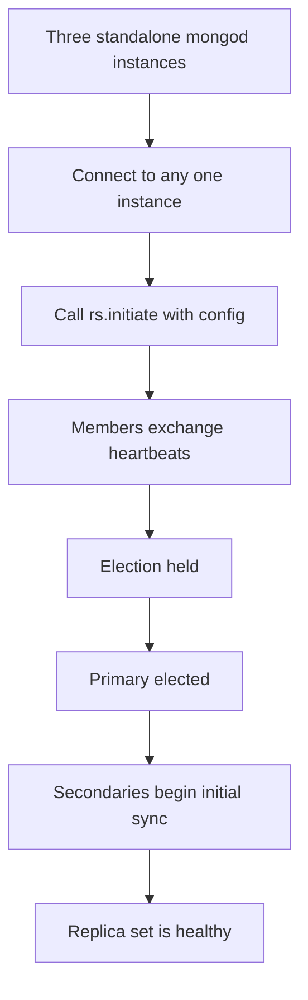
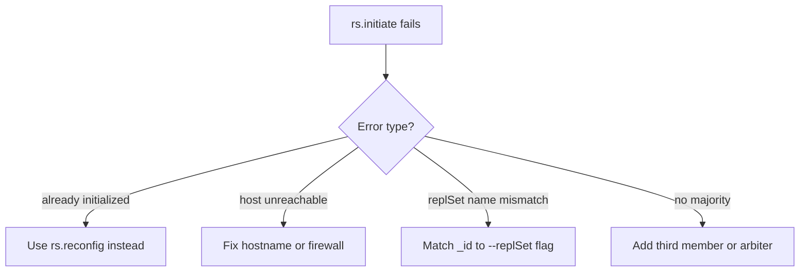

# How to Initialize a MongoDB Replica Set with rs.initiate()

Author: [nawazdhandala](https://www.github.com/nawazdhandala)

Tags: MongoDB, Replica Set, rs.initiate, Replication, High Availability

Description: Learn how to use rs.initiate() to bootstrap a MongoDB replica set from scratch, configure member roles, hostnames, and priorities in the initial configuration document.

---

## What is rs.initiate()

`rs.initiate()` is the command that turns one or more standalone `mongod` instances into a replica set. It sends the initial replica set configuration to the instance, which then contacts the other listed members, establishes communication, and elects a primary.

You call `rs.initiate()` exactly once, on any one member of the new replica set. After initialization, all future configuration changes use `rs.reconfig()` or `rs.add()` / `rs.remove()`.



## Prerequisites

Start each `mongod` with the `--replSet` flag and unique ports:

```bash
# On server1 (port 27017)
mongod --replSet "rs0" --port 27017 --dbpath /data/rs0/1 --bind_ip 0.0.0.0

# On server2 (port 27018)
mongod --replSet "rs0" --port 27018 --dbpath /data/rs0/2 --bind_ip 0.0.0.0

# On server3 (port 27019)
mongod --replSet "rs0" --port 27019 --dbpath /data/rs0/3 --bind_ip 0.0.0.0
```

Or with YAML config files:

```yaml
# /etc/mongod-rs1.conf
replication:
  replSetName: "rs0"
net:
  port: 27017
  bindIp: 0.0.0.0
storage:
  dbPath: /data/rs0/1
```

## Minimal rs.initiate() Call

Connect to any one member and call `rs.initiate()` with no arguments to create a single-member replica set using the current host:

```javascript
// Connect to the first mongod
mongosh --port 27017

// Initiate with default config (single member)
rs.initiate();
```

This creates a configuration using `localhost:27017` as the sole member. Extend it with `rs.add()` afterward.

## Full rs.initiate() with a Config Document

The better approach is to provide the complete configuration upfront:

```javascript
rs.initiate({
  _id: "rs0",
  members: [
    {
      _id: 0,
      host: "server1.example.com:27017",
      priority: 2        // preferred primary
    },
    {
      _id: 1,
      host: "server2.example.com:27018",
      priority: 1
    },
    {
      _id: 2,
      host: "server3.example.com:27019",
      priority: 1
    }
  ]
});
```

Expected response:

```javascript
{ "ok": 1 }
```

## Configuration Document Fields

```javascript
rs.initiate({
  _id: "rs0",                      // replica set name (must match --replSet)
  version: 1,                      // starts at 1, incremented by reconfig
  members: [
    {
      _id: 0,                      // unique integer per member
      host: "host:port",           // must resolve from all other members
      priority: 1,                 // 0 = cannot become primary; higher = preferred
      votes: 1,                    // 0 or 1; 1 participates in elections
      arbiterOnly: false,          // true = arbiter (no data, just votes)
      hidden: false,               // true = hidden from clients, priority must be 0
      secondaryDelaySecs: 0,       // delayed secondary (seconds behind primary)
      buildIndexes: true           // false = skip index builds (only valid if hidden)
    }
  ],
  settings: {
    electionTimeoutMillis: 10000,  // ms before election starts after primary loss
    heartbeatTimeoutSecs: 10,      // seconds between heartbeats
    chainingAllowed: true          // allow secondaries to sync from other secondaries
  }
});
```

## Verifying Initialization

```javascript
// Check replica set status after initiation
rs.status();
```

Look for these fields:

```javascript
{
  "set": "rs0",
  "members": [
    { "name": "server1:27017", "stateStr": "PRIMARY", "health": 1 },
    { "name": "server2:27018", "stateStr": "SECONDARY", "health": 1 },
    { "name": "server3:27019", "stateStr": "SECONDARY", "health": 1 }
  ],
  "ok": 1
}
```

If a member shows `STARTUP` or `STARTUP2`, it is still syncing. Wait a moment and check again.

## Using an IP Address vs. Hostname

Always use resolvable hostnames rather than `localhost` or `127.0.0.1` in the `host` field. If you use `localhost`, other members will try to connect to themselves instead of the intended server:

```javascript
// BAD: localhost is relative to each server
{ host: "localhost:27017" }

// GOOD: use the actual hostname or IP that all members can reach
{ host: "mongo1.internal.example.com:27017" }
```

## Initiating with Keyfile Authentication

When authentication is required, start each `mongod` with a shared keyfile before initiating:

```bash
# Generate keyfile
openssl rand -base64 756 > /etc/mongodb/keyfile
chmod 400 /etc/mongodb/keyfile
chown mongodb:mongodb /etc/mongodb/keyfile

# Reference in mongod.conf
security:
  keyFile: /etc/mongodb/keyfile
  authorization: enabled
```

Then create the admin user on one member before or immediately after `rs.initiate()`:

```javascript
// After initiation, create admin user on the primary
use admin
db.createUser({
  user: "admin",
  pwd: "strongpassword",
  roles: [{ role: "root", db: "admin" }]
});
```

## Troubleshooting Initiation

| Symptom | Likely Cause | Fix |
|---|---|---|
| `rs.initiate()` returns error | Wrong `--replSet` name | Match `_id` in config to `--replSet` flag |
| Members stuck in STARTUP | Hostname not resolvable | Use correct FQDNs, check DNS/hosts file |
| No primary elected | Even number of members, no majority | Add an arbiter or a third voting member |
| Connection refused on member port | `mongod` not running or wrong port | Check `systemctl status mongod` on each host |



## Summary

`rs.initiate()` bootstraps a MongoDB replica set by providing an initial configuration document to one member. Provide the full configuration including all member hostnames, priorities, and optional settings upfront rather than using the no-argument form to avoid reconfiguring later. Use fully qualified, resolvable hostnames in the `host` field, verify with `rs.status()` after initiation, and wait for all members to reach SECONDARY or PRIMARY state before directing application traffic to the set.
