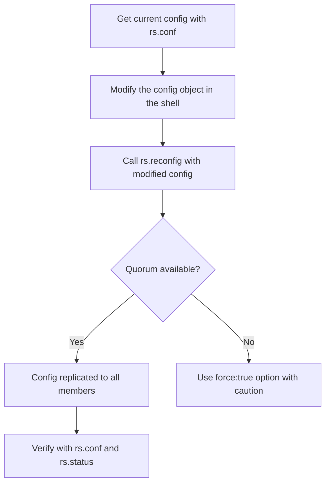
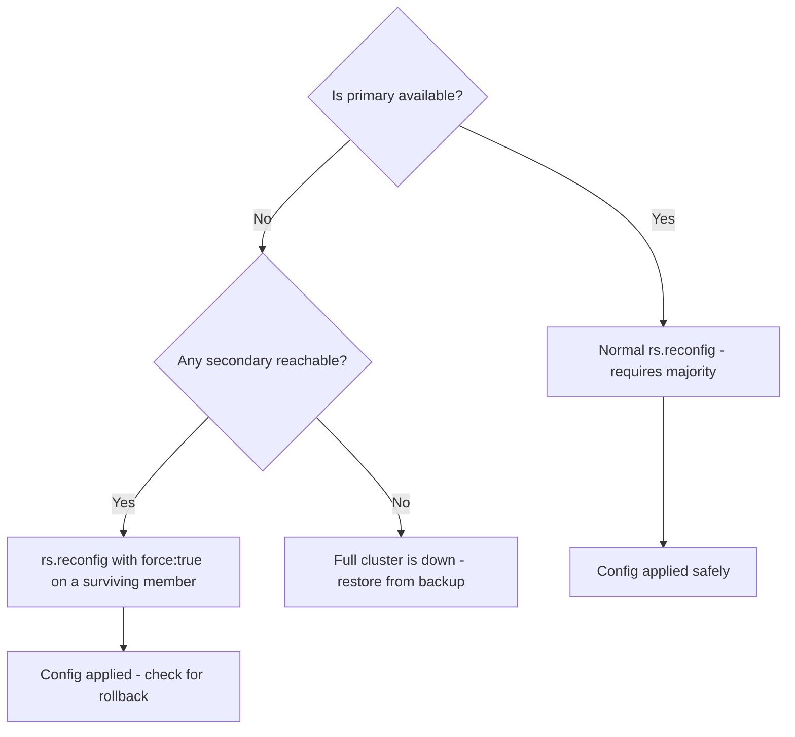

# How to Reconfigure a MongoDB Replica Set with rs.reconfig()

Author: [nawazdhandala](https://www.github.com/nawazdhandala)

Tags: MongoDB, Replica Set, rs.reconfig, Replication, Administration

Description: Learn how to use rs.reconfig() to safely modify replica set configuration, change member priorities, update hostnames, and apply forced reconfigs when quorum is lost.

---

## What is rs.reconfig()

`rs.reconfig()` applies a new configuration document to an existing MongoDB replica set. Use it when you need to change member properties (priority, votes, hidden, delay), update hostnames, add or remove members, or change replica set-level settings like election timeouts.

Changes made with `rs.reconfig()` are replicated to all members automatically. The version number in the config document is incremented by 1 on each successful reconfig.



## The Basic Workflow

```javascript
// Step 1: Fetch the current configuration
const cfg = rs.conf();

// Step 2: Modify the desired fields
cfg.members[1].priority = 2;

// Step 3: Apply the updated configuration
rs.reconfig(cfg);
```

Always start from `rs.conf()` to ensure the version number is current. Constructing a config from scratch risks a version mismatch error.

## Changing Member Priority

Higher priority increases the chance a member becomes primary during elections:

```javascript
const cfg = rs.conf();

// Print current priorities
cfg.members.forEach(m => print(m.host, "priority:", m.priority));

// Promote server2 as preferred primary
cfg.members[1].priority = 10;
cfg.members[0].priority = 1;
cfg.members[2].priority = 1;

rs.reconfig(cfg);
```

## Changing Votes

Each member can have 0 or 1 vote. Non-voting members (votes: 0) can still hold data but do not participate in elections:

```javascript
const cfg = rs.conf();

// Make server3 a non-voting member (e.g., analytics replica)
cfg.members[2].votes = 0;
cfg.members[2].priority = 0;  // non-voting members must have priority 0

rs.reconfig(cfg);
```

## Updating a Member Hostname

When migrating a member to a new server, update the hostname in the config:

```javascript
const cfg = rs.conf();

// Find the member to update
const idx = cfg.members.findIndex(m => m.host === "oldserver.example.com:27017");
cfg.members[idx].host = "newserver.example.com:27017";

rs.reconfig(cfg);
```

The new server must already be running `mongod` with the same `--replSet` name and must have its data either copied or synced before the reconfig.

## Adding and Removing Members via reconfig

While `rs.add()` and `rs.remove()` are shortcuts, `rs.reconfig()` gives you full control when making multiple changes at once:

```javascript
const cfg = rs.conf();

// Add a new member
cfg.members.push({
  _id: 3,
  host: "server4.example.com:27020",
  priority: 1,
  votes: 1
});

// Remove an old member
const removeIdx = cfg.members.findIndex(m => m.host === "server3.example.com:27019");
cfg.members.splice(removeIdx, 1);

rs.reconfig(cfg);
```

## Enabling a Delayed Secondary

Configure a delayed secondary to lag behind the primary for point-in-time recovery:

```javascript
const cfg = rs.conf();

// Configure member 2 as a delayed secondary (1 hour delay)
cfg.members[2].secondaryDelaySecs = 3600;
cfg.members[2].priority = 0;    // delayed members cannot become primary
cfg.members[2].hidden = true;   // hide from client connection strings

rs.reconfig(cfg);
```

## Hiding a Member

Hidden members replicate data but are invisible to client connection strings and do not receive read queries unless explicitly targeted:

```javascript
const cfg = rs.conf();

cfg.members[2].hidden = true;
cfg.members[2].priority = 0;  // hidden members must have priority 0

rs.reconfig(cfg);
```

## Modifying Replica Set Settings

Adjust election and heartbeat timeouts at the set level:

```javascript
const cfg = rs.conf();

// Reduce election timeout for faster failover
cfg.settings.electionTimeoutMillis = 5000;  // 5 seconds (default 10000)
cfg.settings.heartbeatTimeoutSecs = 5;       // 5 seconds (default 10)

rs.reconfig(cfg);
```

## Forced Reconfig (When Quorum is Lost)

If the replica set has lost quorum and no primary can be elected, use a forced reconfig:

```javascript
const cfg = rs.conf();

// Remove the unreachable members
cfg.members = cfg.members.filter(m => m.host !== "deadserver.example.com:27019");

// Force the reconfig - bypasses majority requirement
rs.reconfig(cfg, { force: true });
```

**Warning:** A forced reconfig can cause rollback of writes that were not yet replicated to the surviving members. Use only as a last resort during an outage.



## Verifying the Reconfiguration

```javascript
// Check the updated config
rs.conf();
// Look for the incremented version number and your changes

// Check member states
rs.status();
// All members should show SECONDARY or PRIMARY, not UNKNOWN or REMOVED
```

## Common Errors

| Error | Cause | Fix |
|---|---|---|
| `version` mismatch | Config fetched before a concurrent reconfig | Fetch a fresh `rs.conf()` and retry |
| `priority must be 0 when hidden` | Hidden member has priority > 0 | Set `priority: 0` alongside `hidden: true` |
| `votes must be 0 when priority is 0` | Non-voting member rule not followed | Set `votes: 0` when `priority: 0` or adjust priority |
| `No primary found` | Not connected to the primary | Connect to primary before calling `rs.reconfig()` |

## Summary

`rs.reconfig()` is the standard way to modify any aspect of a MongoDB replica set configuration. Always fetch the current config with `rs.conf()`, make targeted modifications to the returned object, then pass it back to `rs.reconfig()`. For changes affecting quorum (like removing members), verify vote counts beforehand. Use `force: true` only when quorum is lost and there is no alternative, then immediately verify with `rs.status()` that the set returns to a healthy state.
