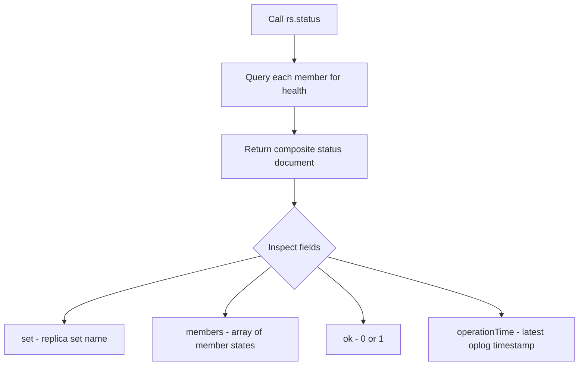
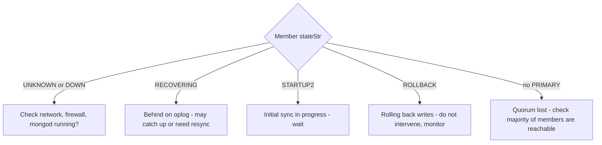

# How to Check Replica Set Status with rs.status() in MongoDB

Author: [nawazdhandala](https://www.github.com/nawazdhandala)

Tags: MongoDB, Replica Set, rs.status, Monitoring, Replication

Description: Learn how to use rs.status() to inspect replica set health, interpret member states, measure replication lag, and identify common problems from the status output.

---

## What is rs.status()

`rs.status()` returns a document describing the current state of the replica set: which member is primary, the health and replication state of each member, oplog timestamps, and election statistics. It is the first command to run when diagnosing replica set issues.



## Running rs.status()

```javascript
rs.status();
```

## Full Output Example

```javascript
{
  "set": "rs0",
  "date": ISODate("2024-03-31T12:00:00.000Z"),
  "myState": 1,
  "term": 5,
  "syncSourceHost": "",
  "syncSourceId": -1,
  "heartbeatIntervalMillis": 2000,
  "majorityVoteCount": 2,
  "writeMajorityCount": 2,
  "votingMembersCount": 3,
  "optimes": {
    "lastCommittedOpTime": { "ts": Timestamp(1711886400, 1), "t": 5 },
    "appliedOpTime": { "ts": Timestamp(1711886400, 1), "t": 5 },
    "durableOpTime": { "ts": Timestamp(1711886400, 1), "t": 5 }
  },
  "members": [
    {
      "_id": 0,
      "name": "server1.example.com:27017",
      "health": 1,
      "state": 1,
      "stateStr": "PRIMARY",
      "uptime": 86400,
      "optime": { "ts": Timestamp(1711886400, 1), "t": 5 },
      "optimeDate": ISODate("2024-03-31T12:00:00.000Z"),
      "electionTime": Timestamp(1711800000, 1),
      "electionDate": ISODate("2024-03-30T12:00:00.000Z"),
      "self": true
    },
    {
      "_id": 1,
      "name": "server2.example.com:27018",
      "health": 1,
      "state": 2,
      "stateStr": "SECONDARY",
      "uptime": 86000,
      "optime": { "ts": Timestamp(1711886398, 1), "t": 5 },
      "optimeDate": ISODate("2024-03-31T11:59:58.000Z"),
      "lastHeartbeat": ISODate("2024-03-31T12:00:00.000Z"),
      "pingMs": 2,
      "syncSourceHost": "server1.example.com:27017"
    },
    {
      "_id": 2,
      "name": "server3.example.com:27019",
      "health": 1,
      "state": 2,
      "stateStr": "SECONDARY",
      "uptime": 85900,
      "optime": { "ts": Timestamp(1711886399, 1), "t": 5 },
      "optimeDate": ISODate("2024-03-31T11:59:59.000Z"),
      "lastHeartbeat": ISODate("2024-03-31T12:00:00.000Z"),
      "pingMs": 1,
      "syncSourceHost": "server1.example.com:27017"
    }
  ],
  "ok": 1
}
```

## Key Fields Explained

| Field | Meaning |
|---|---|
| `set` | Replica set name |
| `myState` | State of the member you queried (1=primary, 2=secondary) |
| `term` | Current election term number |
| `majorityVoteCount` | Votes required for a majority |
| `health` | 1 = member reachable, 0 = unreachable |
| `stateStr` | Human-readable member state |
| `uptime` | Seconds since mongod started |
| `optime.ts` | Timestamp of last operation applied |
| `pingMs` | Heartbeat round-trip time in milliseconds |
| `syncSourceHost` | Which member this secondary syncs from |

## Member State Values

| State Number | stateStr | Meaning |
|---|---|---|
| 0 | STARTUP | Starting, not yet part of the set |
| 1 | PRIMARY | Accepts reads and writes |
| 2 | SECONDARY | Replicates from primary, can serve reads |
| 3 | RECOVERING | Syncing or behind; not ready for reads |
| 5 | STARTUP2 | Initial sync in progress |
| 6 | UNKNOWN | Not reachable from this member |
| 7 | ARBITER | Votes only, no data |
| 8 | DOWN | Unreachable |
| 9 | ROLLBACK | Rolling back writes after failover |
| 10 | REMOVED | Was removed from the replica set |

## Measuring Replication Lag

Replication lag is the difference between the primary's optime and a secondary's optime:

```javascript
const status = rs.status();

const primaryOptime = status.members.find(m => m.stateStr === "PRIMARY").optimeDate;

status.members
  .filter(m => m.stateStr === "SECONDARY")
  .forEach(m => {
    const lagMs = primaryOptime - m.optimeDate;
    print(`${m.name}: lag = ${lagMs / 1000} seconds`);
  });
```

## Checking Oplog Window

```javascript
// Check how far back the oplog goes (on primary or secondary)
rs.printReplicationInfo();
```

Output:

```yaml
configured oplog size:   5120MB
log length start to end: 86400secs (24hrs)
oplog first event time:  Mon Mar 30 2024 12:00:00
oplog last event time:   Tue Mar 31 2024 12:00:00
now:                     Tue Mar 31 2024 12:00:00
```

## Checking Secondary Sync Status

```javascript
rs.printSecondaryReplicationInfo();
```

Output:

```yaml
source: server2.example.com:27018
    syncedTo: Tue Mar 31 2024 11:59:58 GMT
    2 secs (0 hrs) behind the primary
```

## Identifying Problems from rs.status()

```javascript
const status = rs.status();

// Find unhealthy members
const unhealthy = status.members.filter(m => m.health === 0);
if (unhealthy.length > 0) {
  print("Unhealthy members:");
  unhealthy.forEach(m => print(" -", m.name, m.stateStr));
}

// Find members in unexpected states
const badStates = [0, 3, 5, 8, 9, 10];  // STARTUP, RECOVERING, STARTUP2, DOWN, ROLLBACK, REMOVED
const problematic = status.members.filter(m => badStates.includes(m.state));
if (problematic.length > 0) {
  print("Members in problematic state:");
  problematic.forEach(m => print(" -", m.name, m.stateStr));
}
```

## Common Status Problems and Fixes



```javascript
// If no primary, check election status
status.members.filter(m => m.stateStr === "PRIMARY").length === 0
  ? print("WARNING: No primary - cluster cannot accept writes")
  : print("Primary is:", status.members.find(m => m.stateStr === "PRIMARY").name);
```

## Running rs.status() on a Secondary

By default, you run `rs.status()` while connected to the primary. You can also run it on a secondary for local health information:

```javascript
// On a secondary, this still returns the full set status if the secondary is healthy
mongosh --host secondary.example.com:27018
rs.status();
```

## Automating Status Checks

```javascript
// Script to alert on lag > 30 seconds
function checkReplicationLag() {
  const status = rs.status();
  const primary = status.members.find(m => m.stateStr === "PRIMARY");
  if (!primary) {
    print("CRITICAL: No primary found");
    return;
  }
  status.members
    .filter(m => m.stateStr === "SECONDARY")
    .forEach(m => {
      const lagSec = (primary.optimeDate - m.optimeDate) / 1000;
      if (lagSec > 30) {
        print(`WARNING: ${m.name} is ${lagSec}s behind primary`);
      } else {
        print(`OK: ${m.name} lag = ${lagSec}s`);
      }
    });
}

checkReplicationLag();
```

## Summary

`rs.status()` is the primary diagnostic command for MongoDB replica sets. It reveals the health, state, and replication lag of every member. Check `stateStr` to identify members in unexpected states (DOWN, RECOVERING, ROLLBACK), calculate replication lag by comparing `optimeDate` values between the primary and secondaries, and use `rs.printReplicationInfo()` and `rs.printSecondaryReplicationInfo()` for more detailed oplog and sync information. Automate periodic status checks in your monitoring stack to catch problems before they affect application availability.
