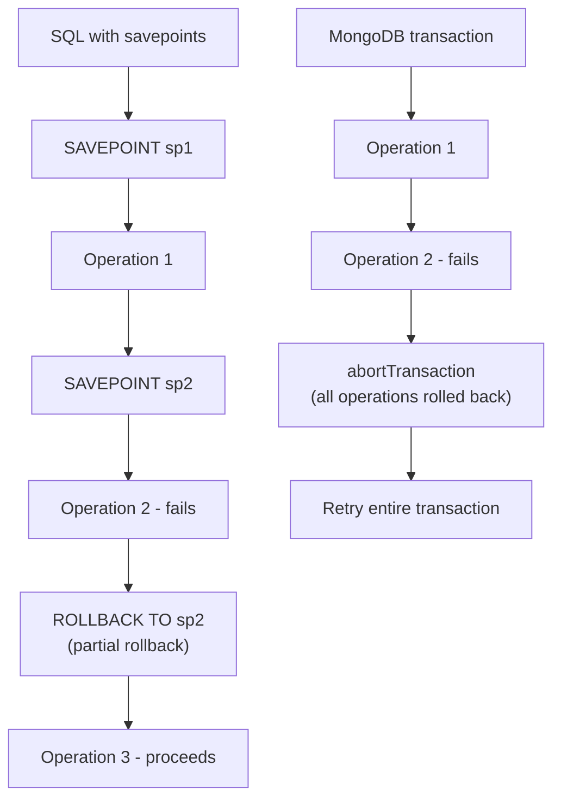

# How to Use Savepoints in MongoDB Transactions

Author: [nawazdhandala](https://www.github.com/nawazdhandala)

Tags: MongoDB, Transaction, Savepoint, ACID, Error handling

Description: Learn about savepoint behaviour in MongoDB transactions, why MongoDB does not support partial rollbacks, and patterns to achieve similar results.

---

## What Is a Savepoint

In SQL databases a SAVEPOINT marks a point within a transaction that you can roll back to without aborting the entire transaction. You can then re-try a subset of operations and continue.

MongoDB does **not** support savepoints. A MongoDB transaction is all-or-nothing: either it commits in full or it aborts entirely. There is no `SAVEPOINT` / `ROLLBACK TO SAVEPOINT` equivalent.



## Why MongoDB Omits Savepoints

MongoDB's transaction model is designed for short, targeted multi-document operations. Savepoints add state management complexity that conflicts with the distributed, multi-shard architecture. The recommended alternative is to decompose complex operations into smaller, independent transactions.

## Pattern 1: Decompose into Sequential Transactions

Split what would be one long transaction with savepoints into several smaller independent ones.

```javascript
const { MongoClient } = require("mongodb");

const client = new MongoClient(process.env.MONGO_URI);
const db = client.db("ecommerce");

// Instead of one long transaction with savepoints,
// use three independent atomic steps:
// Step 1: Reserve inventory
// Step 2: Charge payment
// Step 3: Create order

async function reserveInventory(session, orderId, items) {
  for (const item of items) {
    const result = await db.collection("inventory").updateOne(
      { sku: item.sku, reserved: { $lte: item.qty } },
      { $inc: { reserved: item.qty }, $push: { reservations: { orderId, qty: item.qty } } },
      { session }
    );
    if (result.modifiedCount === 0) {
      throw new Error(`Insufficient inventory for SKU ${item.sku}`);
    }
  }
}

async function chargePayment(session, orderId, total, paymentToken) {
  // Call payment gateway (outside transaction) then record result
  await db.collection("payments").insertOne({
    orderId,
    amount: total,
    token:  paymentToken,
    status: "captured",
    ts:     new Date()
  }, { session });
}

async function placeOrder(items, paymentToken) {
  const orderId = new ObjectId();
  const total   = items.reduce((s, i) => s + i.price * i.qty, 0);

  // Step 1: reserve inventory in its own transaction
  await runWithTransaction(client, (session) =>
    reserveInventory(session, orderId, items)
  );

  // Step 2: charge payment in its own transaction
  try {
    await runWithTransaction(client, (session) =>
      chargePayment(session, orderId, total, paymentToken)
    );
  } catch (paymentErr) {
    // Step 2 failed - undo step 1 (compensating transaction)
    await runWithTransaction(client, async (session) => {
      for (const item of items) {
        await db.collection("inventory").updateOne(
          { sku: item.sku },
          { $inc: { reserved: -item.qty }, $pull: { reservations: { orderId } } },
          { session }
        );
      }
    });
    throw paymentErr;
  }

  // Step 3: create the order
  await runWithTransaction(client, async (session) => {
    await db.collection("orders").insertOne({
      _id: orderId, items, total, status: "confirmed", createdAt: new Date()
    }, { session });
  });

  return orderId;
}
```

## Pattern 2: Compensating Transactions (Saga Pattern)

When a later step fails, a compensating transaction undoes the effect of an earlier step.

```javascript
async function runWithTransaction(client, fn) {
  const session = client.startSession();
  try {
    session.startTransaction({ writeConcern: { w: "majority" } });
    const result = await fn(session);
    await session.commitTransaction();
    return result;
  } catch (err) {
    await session.abortTransaction().catch(() => {});
    throw err;
  } finally {
    await session.endSession();
  }
}

// Saga: each step has a corresponding compensation
const saga = [
  {
    name: "create_order",
    execute: async (ctx, session) => {
      await db.collection("orders").insertOne({ _id: ctx.orderId, ...ctx.orderData }, { session });
    },
    compensate: async (ctx, session) => {
      await db.collection("orders").deleteOne({ _id: ctx.orderId }, { session });
    }
  },
  {
    name: "reserve_stock",
    execute: async (ctx, session) => {
      await db.collection("inventory").updateMany(
        { sku: { $in: ctx.skus } },
        { $inc: { available: -1 } },
        { session }
      );
    },
    compensate: async (ctx, session) => {
      await db.collection("inventory").updateMany(
        { sku: { $in: ctx.skus } },
        { $inc: { available: 1 } },
        { session }
      );
    }
  }
];

async function runSaga(client, ctx) {
  const completed = [];

  for (const step of saga) {
    try {
      await runWithTransaction(client, (session) => step.execute(ctx, session));
      completed.push(step);
    } catch (err) {
      console.error(`Saga step '${step.name}' failed: ${err.message}`);
      // Compensate in reverse order
      for (const done of completed.reverse()) {
        await runWithTransaction(client, (session) => done.compensate(ctx, session)).catch(
          (cErr) => console.error(`Compensation for '${done.name}' failed: ${cErr.message}`)
        );
      }
      throw err;
    }
  }
}
```

## Pattern 3: Try-Correct Within a Single Transaction

If the operation that "fails" is recoverable (e.g., a document already exists), handle it inside the same transaction without aborting.

```javascript
async function upsertWithFallback(db, session, userId, newPoints) {
  // Try to find the user's record
  const user = await db.collection("loyalty").findOne({ userId }, { session });

  if (!user) {
    // "savepoint-like" branch: insert if missing, no abort needed
    await db.collection("loyalty").insertOne(
      { userId, points: newPoints, createdAt: new Date() },
      { session }
    );
  } else {
    await db.collection("loyalty").updateOne(
      { userId },
      { $inc: { points: newPoints } },
      { session }
    );
  }
}
```

## Comparison: SQL Savepoints vs MongoDB Patterns

| SQL savepoint capability | MongoDB equivalent |
|---|---|
| `SAVEPOINT sp1` | Start a new independent transaction |
| `ROLLBACK TO sp1` | Abort current transaction; run compensating transaction |
| Partial state preservation | Decompose into sequential smaller transactions |
| Nested try/catch within one txn | Conditional logic inside a single transaction body |

## Summary

MongoDB does not support savepoints. The entire transaction either commits or aborts. To achieve similar partial-rollback semantics, decompose long operations into a sequence of smaller independent transactions and implement compensating transactions (the Saga pattern) to undo completed steps when a later step fails. For recoverable conditions within a single transaction, use conditional logic inside the transaction body to handle both paths without aborting.
