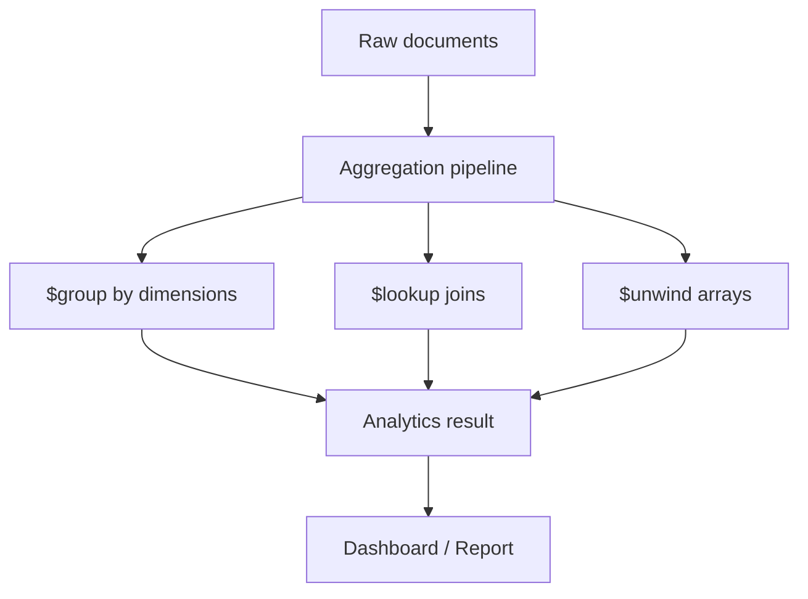
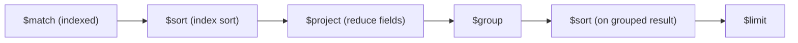

# How to Design Schemas for Aggregation-Heavy Workloads in MongoDB

Author: [nawazdhandala](https://www.github.com/nawazdhandala)

Tags: MongoDB, Schema Design, Aggregation, Performance, Index

Description: Learn schema patterns that speed up MongoDB aggregation pipelines, including pre-aggregation, computed fields, and index-backed pipeline stages.

---

## What Makes a Workload Aggregation-Heavy

An aggregation-heavy workload spends most of its time running `$group`, `$lookup`, `$unwind`, or `$facet` stages over large collections. Analytics dashboards, reporting APIs, and recommendation engines fall into this category.



The schema strategies below push work out of the pipeline and into write time, so reads stay fast.

## Strategy 1: Pre-compute Aggregated Results

Store computed summaries alongside raw data. Re-compute on every write, read the summary directly.

```javascript
// On each order write, update the daily summary atomically
async function recordOrder(db, order) {
  const session = db.client.startSession();
  try {
    await session.withTransaction(async () => {
      await db.collection("orders").insertOne(order, { session });

      const dayKey = order.createdAt.toISOString().slice(0, 10); // "2026-03-31"
      await db.collection("daily_summaries").updateOne(
        { date: dayKey, storeId: order.storeId },
        {
          $inc: {
            totalRevenue: order.total,
            orderCount: 1
          },
          $setOnInsert: { date: dayKey, storeId: order.storeId }
        },
        { upsert: true, session }
      );
    });
  } finally {
    await session.endSession();
  }
}

// Reading the dashboard costs a single indexed lookup
db.daily_summaries.find({ storeId: "store-1", date: { $gte: "2026-03-01" } });
```

## Strategy 2: Use the Computed Pattern for Derived Fields

Store frequently-aggregated values as first-class fields so `$match` and `$sort` can use indexes.

```javascript
// Avoid computing total on every read
db.orders.aggregate([
  { $unwind: "$items" },
  { $group: { _id: "$_id", total: { $sum: { $multiply: ["$items.price", "$items.qty"] } } } }
]);

// Prefer: store total at write time
db.orders.insertOne({
  _id: new ObjectId(),
  storeId: "store-1",
  items: [
    { sku: "A", price: 10, qty: 2 },
    { sku: "B", price: 5,  qty: 1 }
  ],
  total: 25,        // pre-computed
  createdAt: new Date()
});

// Index covers the aggregation query directly
db.orders.createIndex({ storeId: 1, createdAt: -1, total: 1 });
```

## Strategy 3: Avoid $lookup by Embedding Reference Data

`$lookup` is a cross-collection join done at query time. Embed stable reference fields in the document to eliminate the join.

```javascript
// Extended reference pattern: embed the fields you group/sort by
db.orders.insertOne({
  _id: new ObjectId(),
  customerId: ObjectId("64a1..."),
  // embed the fields needed in aggregation so $lookup is unnecessary
  customerName: "Alice",
  customerTier: "gold",
  items: [{ sku: "A", price: 10, qty: 2 }],
  total: 20,
  createdAt: new Date()
});

// Group by customer tier without any $lookup
db.orders.aggregate([
  { $match: { createdAt: { $gte: new Date("2026-03-01") } } },
  { $group: { _id: "$customerTier", revenue: { $sum: "$total" } } },
  { $sort: { revenue: -1 } }
]);
```

## Strategy 4: Use Indexes to Drive $match and $sort

The first stages of a pipeline should narrow the document set using an index. Stages not covered by an index force a full collection scan.

```javascript
// Create a compound index that covers the leading $match and $sort fields
db.events.createIndex({ category: 1, occurredAt: -1 });

// This pipeline uses the index for the first two stages
db.events.aggregate([
  { $match: { category: "purchase", occurredAt: { $gte: new Date("2026-01-01") } } },
  { $sort: { occurredAt: -1 } },
  { $group: { _id: "$userId", lastPurchase: { $first: "$occurredAt" }, spend: { $sum: "$amount" } } }
]);

// Verify the index is used
db.events.explain("executionStats").aggregate([
  { $match: { category: "purchase" } },
  { $sort: { occurredAt: -1 } }
]);
```

## Strategy 5: Use $facet for Multi-Dimensional Summaries in One Pass

Instead of N separate queries, one `$facet` stage runs multiple groupings in a single collection scan.

```javascript
db.products.aggregate([
  { $match: { inStock: true } },
  {
    $facet: {
      byCategory: [
        { $group: { _id: "$category", count: { $sum: 1 }, avgPrice: { $avg: "$price" } } },
        { $sort: { count: -1 } }
      ],
      priceHistogram: [
        {
          $bucket: {
            groupBy: "$price",
            boundaries: [0, 25, 50, 100, 250, 1000],
            default: "1000+",
            output: { count: { $sum: 1 } }
          }
        }
      ],
      topBrands: [
        { $group: { _id: "$brand", revenue: { $sum: "$price" } } },
        { $sort: { revenue: -1 } },
        { $limit: 5 }
      ]
    }
  }
]);
```

## Strategy 6: Use $setWindowFields for Running Totals

`$setWindowFields` (MongoDB 5.0+) computes running aggregates without a self-`$lookup` or multiple pipeline passes.

```javascript
db.sales.aggregate([
  { $match: { storeId: "store-1" } },
  { $sort: { saleDate: 1 } },
  {
    $setWindowFields: {
      partitionBy: "$storeId",
      sortBy: { saleDate: 1 },
      output: {
        runningRevenue: {
          $sum: "$amount",
          window: { documents: ["unbounded", "current"] }
        },
        movingAvg7d: {
          $avg: "$amount",
          window: { range: [-6, 0], unit: "day" }
        }
      }
    }
  }
]);
```

## Strategy 7: Use Materialized Views via $merge

Schedule a pipeline to refresh a summary collection. Applications query the summary, not the raw data.

```javascript
// Run nightly to refresh the monthly_revenue collection
db.orders.aggregate([
  {
    $group: {
      _id: { year: { $year: "$createdAt" }, month: { $month: "$createdAt" }, storeId: "$storeId" },
      totalRevenue: { $sum: "$total" },
      orderCount: { $sum: 1 },
      avgOrderValue: { $avg: "$total" }
    }
  },
  {
    $merge: {
      into: "monthly_revenue",
      on: "_id",
      whenMatched: "replace",
      whenNotMatched: "insert"
    }
  }
]);

// Fast dashboard query against the materialised view
db.monthly_revenue.find({ "_id.storeId": "store-1", "_id.year": 2026 })
  .sort({ "_id.month": 1 });
```

## Strategy 8: Minimise $unwind by Keeping Arrays Flat

`$unwind` multiplies documents. Redesign the schema to store pre-grouped data when the same unwound aggregation runs repeatedly.

```javascript
// Avoid repeated unwind over tags
db.articles.aggregate([
  { $unwind: "$tags" },
  { $group: { _id: "$tags", count: { $sum: 1 } } }
]);

// Prefer: maintain a separate tag_counts collection updated on each write
db.tag_counts.updateMany(
  { tag: { $in: article.tags } },
  { $inc: { count: 1 } },
  { upsert: false }
);
// Or use bulkWrite for multiple tags at once
const ops = article.tags.map((tag) => ({
  updateOne: {
    filter: { tag },
    update: { $inc: { count: 1 } },
    upsert: true
  }
}));
await db.collection("tag_counts").bulkWrite(ops);
```

## Pipeline Optimisation Reference



Placing `$match` and `$sort` first and `$project` early reduces the number of fields carried through each stage. Always put the most selective `$match` at the top.

## Summary

Designing schemas for aggregation-heavy MongoDB workloads means pushing computation to write time via pre-aggregated summaries, computed fields, and embedded reference data. Index-backed `$match` and `$sort` stages eliminate collection scans, `$facet` reduces round-trips, `$setWindowFields` replaces self-joins, and `$merge` builds materialised views. The goal is to make each read touch the fewest possible documents.
